# 基础信息

|      |      |
|------|------|
| 名称 | spring-ai-alibaba |
| 编码语言 | .java |
| 代码路径 | spring-ai-alibaba |
| 包名 | spring-ai-alibaba |
| 概述说明 | 该模块集成了阿里云DashScope服务，提供语音合成、音频转录、图像生成、文档管理、聊天模型等功能，支持REST和WebSocket通信，适用于复杂AI场景。 |

# 说明

## 概述

该代码模块是一个多功能AI工具集，基于阿里云DashScope服务，涵盖了语音合成、音频转录、图像生成、文档管理、聊天模型、嵌入模型、文档重排序等多种功能。模块通过多个核心类和配置选项，提供了灵活且高效的API调用机制，支持REST和WebSocket等多种通信方式。模块的设计目标是实现与DashScope API的无缝集成，确保在各种复杂的AI应用场景中能够高效处理请求和响应。

此外，该模块还包含多个子模块，分别针对不同的业务场景提供支持，如Spring AI Alibaba Core、Spring AI Alibaba Studio、Spring AI Alibaba Graph等。这些子模块通过自动配置、动态提示模板工厂、会话管理、客户端操作管理等功能，进一步增强了模块的灵活性和可扩展性。

## 主要业务场景

1. **语音合成与音频转录**：
   - 通过`DashScopeSpeechSynthesisModel`和`DashScopeAudioTranscriptionModel`类，支持语音合成和音频转录功能，适用于实时语音输出和大规模音频数据处理的场景。
   - 配置选项包括模型选择、音量调节、语速设置、词汇ID、短语ID等，确保转录和合成的精确性。

2. **图像生成**：
   - `DashScopeImageModel`类支持通过外部API生成图像，用户可以通过`DashScopeImageOptions`类配置图像数量、尺寸、艺术风格等参数。
   - 内置重试机制，确保API调用的稳定性。

3. **文档管理与检索**：
   - `DashScopeDocumentRetriever`和`DashScopeDocumentRetrievalAdvisor`类负责文档的存储、检索和引用操作，支持同步与异步调用。
   - `DashScopeDocumentTransformer`类提供文档分割功能，支持块大小、重叠大小等参数的配置。

4. **聊天模型与复杂对话管理**：
   - `DashScopeChatModel`类实现了聊天模型的核心功能，支持工具调用和重试模板，确保在多轮对话和复杂任务中的稳定性和可靠性。
   - `DashScopeChatModelObservationConvention`类增强了默认的观察约定，能够根据预设条件自动终止请求序列。

5. **嵌入模型与向量化处理**：
   - `DashScopeEmbeddingModel`类提供了将数据转换为向量表示的嵌入功能，支持多种数据类型的处理。
   - `DashScopeEmbeddingOptions`类允许用户配置模型类型、文本类型和维度等属性。

6. **文档重排序**：
   - `DashScopeRerankModel`类通过调用DashScope API对文档进行重新排序，支持模型参数配置和返回文档数量的指定。
   - 内置重试机制，确保在API调用失败时能够自动重试。

7. **WebSocket通信与实时数据处理**：
   - `DashScopeWebSocketClient`类负责管理WebSocket通信的各个环节，支持文本和二进制数据的传输，适用于实时聊天、在线协作等场景。

8. **API调用与响应管理**：
   - `DashScopeApi`类支持聊天、嵌入、文件上传、文档分割等多种功能，提供灵活的API调用方式。
   - `DashScopeResponseFormat`类支持文本或JSON对象类型的响应格式，确保API返回数据的灵活性和可读性。

9. **动态提示模板与自动配置**：
   - 通过Nacos配置信息，动态决定是否生成提示模板工厂，适应不同环境下的需求。
   - 自动配置类如`DashScopeAutoConfiguration`简化了模型的使用流程，提升开发效率。

10. **会话管理与客户端操作**：
    - 通过`GraphStreamParam`类，模块能够唯一标识会话、处理并发操作、恢复会话状态以及保存和恢复关键状态。
    - `ClientRunActionParam`类用于管理客户端操作的关键参数，确保系统在规划流程和客户端请求处理中的高效运行。

11. **图数据结构管理**：
    - `StateGraph`类管理节点和边的状态图，提供序列化功能和多种图操作方法，确保复杂状态图的有效维护和操作。
    - `ParallelNode`类支持多个任务的同时执行，提高执行效率。

12. **时间服务与工具调用**：
    - `GetCurrentLocalTimeService`类用于返回当前的本地时间，适用于需要实时时间信息的应用程序。
    - `GetCurrentTimeByTimeZoneIdService`类根据指定的时区ID获取当前时间，并记录每次请求的详细信息和响应结果。

13. **搜索引擎集成**：
    - 通过`BaiduSearchService`类，模块能够接收用户的搜索请求，执行相应的搜索操作，并获取HTML格式的搜索结果。
    - `BingSearchService`类通过调用Bing API执行查询操作，为用户提供准确和相关的搜索结果。

14. **翻译服务集成**：
    - `BaidutranslateService`类负责处理翻译请求，并将翻译后的文本返回给用户，适用于需要多语言支持的应用程序。
    - `MicroSoftTranslateService`类通过调用微软翻译API进行翻译，并将翻译结果返回给用户。

15. **地图与天气服务**：
    - `MapSearchService`类通过用户提供的地址和设施类型来获取相关的天气信息和设施信息，处理JSON格式的响应数据。
    - `WeatherSearchService`服务通过输入地址信息，自动获取该地址对应的城市编码，并查询该城市的天气情况。

16. **文档读取与解析**：
    - `PdfTablesParser`类用于解析PDF文件中的表格数据，支持用户指定特定的页码和元数据。
    - `MongoSaver`、`MemorySaver`、`RedisSaver`和`FileSystemSaver`类支持多种存储介质，确保检查点数据的高效、安全和可靠存储。

17. **向量存储与检索**：
    - `TairVectorStore`类支持基于向量相似度的搜索操作，适用于需要快速查找相似数据的场景，如推荐系统、语义搜索等。
    - `OpenSearchVectorStore`类提供了文档的添加、删除以及相似性搜索功能，支持用户高效管理和查询文档。

18. **聊天记录管理**：
    - `RedisChatMemory`类通过Redis存储和管理聊天记录，支持对聊天消息的添加、获取、清除和更新操作，确保聊天数据的持久化和高效访问。

19. **智能任务执行**：
    - `ReActAgent`和`BaseAgent`提供了通用的执行流程和基础架构，支持子类实现具体的业务逻辑，确保智能任务的灵活性和扩展性。

20. **浏览器自动化与文件操作**：
    - `BrowserAgent`负责管理浏览器的状态和执行相关任务，支持多种工具调用，确保浏览器操作的灵活性和高效性。
    - `FileAgent`负责处理文件相关操作，包括路径验证、文件处理、错误监控和任务完成跟踪，确保文件操作的安全性和可靠性。

这些业务场景共同构成了一个完整的AI工具集，适用于需要高效处理语音、图像、文档等多种数据类型的应用场景。

### 包内部结构视图

```mermaid
graph TD
    spring-ai-alibaba --> spring-ai-alibaba-core
    spring-ai-alibaba --> spring-ai-alibaba-starter
    spring-ai-alibaba --> spring-ai-alibaba-autoconfigure
    spring-ai-alibaba --> spring-ai-alibaba-studio
    spring-ai-alibaba --> spring-ai-alibaba-graph
    spring-ai-alibaba --> community
    community --> tool-calls
    community --> document-readers
    community --> document-parsers
    community --> vector-stores
    community --> memories
    community --> openmanus
    tool-calls --> spring-ai-alibaba-starter-tool-calling-time
    tool-calls --> spring-ai-alibaba-starter-tool-calling-baidusearch
    tool-calls --> spring-ai-alibaba-starter-tool-calling-baidutranslate
    tool-calls --> spring-ai-alibaba-starter-tool-calling-baidumap
    tool-calls --> spring-ai-alibaba-starter-tool-calling-bingsearch
    tool-calls --> spring-ai-alibaba-starter-tool-calling-dingtalk
    tool-calls --> spring-ai-alibaba-starter-tool-calling-amap
    tool-calls --> spring-ai-alibaba-starter-tool-calling-weather
    tool-calls --> spring-ai-alibaba-starter-tool-calling-larksuite
    tool-calls --> spring-ai-alibaba-starter-tool-calling-microsofttranslate
    tool-calls --> spring-ai-alibaba-starter-tool-calling-crawler
    tool-calls --> spring-ai-alibaba-starter-tool-calling-regex
    tool-calls --> spring-ai-alibaba-starter-tool-calling-jsonprocessor
    tool-calls --> spring-ai-alibaba-starter-tool-calling-serpapi
    tool-calls --> spring-ai-alibaba-starter-tool-calling-githubtoolkit
    tool-calls --> spring-ai-alibaba-starter-tool-calling-sinanews
    tool-calls --> spring-ai-alibaba-starter-tool-calling-toutiaonews
    tool-calls --> spring-ai-alibaba-starter-tool-calling-yuque
    tool-calls --> spring-ai-alibaba-starter-tool-calling-kuaidi100
    tool-calls --> spring-ai-alibaba-starter-tool-calling-googletranslate
    tool-calls --> spring-ai-alibaba-starter-tool-calling-alitranslate
    tool-calls --> spring-ai-alibaba-starter-tool-calling-youdaotranslate
    tool-calls --> spring-ai-alibaba-starter-tool-calling-duckduckgo
    document-readers --> spring-ai-alibaba-starter-document-reader-arxiv
    document-readers --> spring-ai-alibaba-starter-document-reader-github
    document-readers --> spring-ai-alibaba-starter-document-reader-poi
    document-readers --> spring-ai-alibaba-starter-document-reader-encent-cos
    document-readers --> spring-ai-alibaba-starter-document-reader-larksuite
    document-readers --> spring-ai-alibaba-starter-document-reader-yuque
    document-readers --> spring-ai-alibaba-starter-document-reader-obsidian
    document-readers --> spring-ai-alibaba-starter-document-reader-onenote
    document-readers --> spring-ai-alibaba-starter-document-reader-notion
    document-readers --> spring-ai-alibaba-starter-document-reader-chatgpt-data
    document-readers --> spring-ai-alibaba-starter-document-reader-gpt-repo
    document-readers --> spring-ai-alibaba-starter-document-reader-gitlab
    document-readers --> spring-ai-alibaba-starter-document-reader-gitbook
    document-readers --> spring-ai-alibaba-starter-document-reader-huggingface-fs
    document-readers --> spring-ai-alibaba-starter-document-reader-email
    document-readers --> spring-ai-alibaba-starter-document-reader-mbox
    document-readers --> spring-ai-alibaba-starter-document-reader-mongodb
    document-readers --> spring-ai-alibaba-starter-document-reader-mysql
    document-readers --> spring-ai-alibaba-starter-document-reader-bilibili
    document-readers --> spring-ai-alibaba-starter-document-reader-youtube
    document-readers --> spring-ai-alibaba-starter-document-reader-elasticsearch
    document-parsers --> spring-ai-alibaba-starter-document-parser-apache-pdfbox
    document-parsers --> spring-ai-alibaba-starter-document-parser-markdown
    document-parsers --> spring-ai-alibaba-starter-document-parser-tika
    document-parsers --> spring-ai-alibaba-starter-document-parser-pdf-tables
    document-parsers --> spring-ai-alibaba-starter-document-parser-bshtml
    document-parsers --> spring-ai-alibaba-starter-document-parser-bibtex
    document-parsers --> spring-ai-alibaba-starter-document-parser-multi-modality
    document-parsers --> spring-ai-alibaba-starter-document-parser-directory
    vector-stores --> spring-ai-alibaba-starter-tair-store
    vector-stores --> spring-ai-alibaba-starter-analyticdb-store
    vector-stores --> spring-ai-alibaba-starter-opensearch-store
    memories --> spring-ai-alibaba-redis-memory
    memories --> spring-ai-alibaba-mysql-memory
```

该流程图展示了`spring-ai-alibaba`项目的模块结构，包括核心模块、启动器、自动配置、工作室、图模块以及社区模块。社区模块下分为工具调用、文档读取器、文档解析器、向量存储、记忆模块和开放手册。每个子模块下又包含多个具体的功能模块，展示了项目的复杂性和多样性。

# 文件列表 File List

| 名称   | 类型  | 说明 |
|-------|------|-------------|
| [spring-ai-alibaba-studio](spring-ai-alibaba-studio/src/main/java/com/_module.md) | module | 代码模块包含多个类，支持会话管理、客户端操作、模型运行、数据序列化、异常处理等功能，适用于复杂业务场景。 |
| [community/tool-calls/spring-ai-alibaba-starter-tool-calling-time](community/tool-calls/spring-ai-alibaba-starter-tool-calling-time/src/main/java/com/_module.md) | module | GetCurrentLocalTimeService返回本地时间，GetCurrentTimeByTimeZoneIdService根据时区ID获取时间，ZoneUtils处理时区时间，TimeAutoConfiguration条件启用时间服务。 |
| [community/document-readers/spring-ai-alibaba-starter-document-reader-obsidian](community/document-readers/spring-ai-alibaba-starter-document-reader-obsidian/src/main/java/com/_module.md) | module | ObsidianDocumentReader解析Obsidian库Markdown文件，提取内容并支持批量处理。 |
| [community/document-readers/spring-ai-alibaba-starter-document-reader-chatgpt-data](community/document-readers/spring-ai-alibaba-starter-document-reader-chatgpt-data/src/main/java/com/_module.md) | module | ChatGptDataDocumentReader类读取JSON，处理对话，生成格式化文档。 |
| [community/document-readers/spring-ai-alibaba-starter-document-reader-gpt-repo](community/document-readers/spring-ai-alibaba-starter-document-reader-gpt-repo/src/main/java/com/_module.md) | module | GptRepoDocumentReader读取Git文件，支持合并、过滤和自定义编码，生成格式化文档。 |
| [community/document-readers/spring-ai-alibaba-starter-document-reader-poi](community/document-readers/spring-ai-alibaba-starter-document-reader-poi/src/main/java/com/_module.md) | module | PoiDocumentReader类提取文档，支持自定义格式和元数据。 |
| [community/document-readers/spring-ai-alibaba-starter-document-reader-mbox](community/document-readers/spring-ai-alibaba-starter-document-reader-mbox/src/main/java/com/_module.md) | module | MboxDocumentReader类读取Mbox文件，解析邮件并生成文档，支持自定义格式和多部分邮件处理。 |
| [community/document-parsers/spring-ai-alibaba-starter-document-parser-bshtml](community/document-parsers/spring-ai-alibaba-starter-document-parser-bshtml/src/main/java/com/_module.md) | module | BsHtmlDocumentParser类解析HTML文档，支持字符集、基础URI和解析器配置。 |
| [community/openmanus](community/openmanus/src/main/java/com/_module.md) | module | FunctionToolCallback类封装工具定义与调用，支持灵活扩展。模块基于智能体框架，管理多种任务，支持工具调用、代码执行和文件操作，提升操作效率。 |
| [community/memories/spring-ai-alibaba-mysql-memory](community/memories/spring-ai-alibaba-mysql-memory/src/main/java/com/_module.md) | module | MysqlChatMemory类实现MySQL存储聊天记录，支持增删查改。MessageDeserializer类解析JSON消息并生成相应对象。 |
| [community/memories/spring-ai-alibaba-redis-memory](community/memories/spring-ai-alibaba-redis-memory/src/main/java/com/_module.md) | module | MessageDeserializer类解析JSON为Message对象，支持USER和ASSISTANT类型。RedisChatMemory类管理聊天内存，支持Redis存储，提供添加、获取、清除和更新消息功能。 |
| [community/vector-stores/spring-ai-alibaba-starter-opensearch-store](community/vector-stores/spring-ai-alibaba-starter-opensearch-store/src/main/java/com/_module.md) | module | OpenSearch向量存储类及配置，支持索引管理、文档操作和相似性搜索。 |
| [community/document-parsers/spring-ai-alibaba-starter-document-parser-bibtex](community/document-parsers/spring-ai-alibaba-starter-document-parser-bibtex/src/main/java/com/_module.md) | module | BibtexDocumentParser解析BibTeX文档，处理元数据和文件内容，支持字符集、文档数和长度限制。 |
| [community/vector-stores/spring-ai-alibaba-starter-analyticdb-store](community/vector-stores/spring-ai-alibaba-starter-analyticdb-store/src/main/java/com/_module.md) | module | AnalyticDbVectorStore类管理向量数据库，支持初始化、命名空间创建、文档增删查。AutoConfiguration类自动配置相关Bean。Config类存储数据库连接参数。FilterExpressionConverter类处理表达式转换。Properties类配置连接参数。 |
| [community/vector-stores/spring-ai-alibaba-starter-tair-store](community/vector-stores/spring-ai-alibaba-starter-tair-store/src/main/java/com/_module.md) | module | TairVectorStore类管理向量存储，支持文档添加、相似性搜索和嵌入模型操作。TairVectorStoreOptions类定义向量存储参数，包括索引名、向量维度和算法等。TairVectorApi类扩展TairVector功能，支持单个Jedis实例或连接池初始化。 |
| [community/document-parsers/spring-ai-alibaba-starter-document-parser-directory](community/document-parsers/spring-ai-alibaba-starter-document-parser-directory/src/main/java/com/_module.md) | module | DocumentDirectoryParser类解析目录文件，支持模式匹配、隐藏文件加载、递归遍历和文件抽样。 |
| [community/document-parsers/spring-ai-alibaba-starter-document-parser-multi-modality](community/document-parsers/spring-ai-alibaba-starter-document-parser-multi-modality/src/main/java/com/_module.md) | module | ImageDashScopeParser类解析图像文本，兼容多系统路径处理。SttDashScopeParser类转换音频为文本，集成API密钥高效识别。 |
| [community/document-parsers/spring-ai-alibaba-starter-document-parser-pdf-tables](community/document-parsers/spring-ai-alibaba-starter-document-parser-pdf-tables/src/main/java/com/_module.md) | module | PdfTablesParser类解析PDF表格，支持指定页码和元数据，提取为文档列表。 |
| [community/document-parsers/spring-ai-alibaba-starter-document-parser-tika](community/document-parsers/spring-ai-alibaba-starter-document-parser-tika/src/main/java/com/_module.md) | module | TikaDocumentParser类支持自定义解析器、内容处理器、元数据和解析上下文，默认使用AutoDetectParser和BodyContentHandler。 |
| [community/document-parsers/spring-ai-alibaba-starter-document-parser-markdown](community/document-parsers/spring-ai-alibaba-starter-document-parser-markdown/src/main/java/com/_module.md) | module | Markdown文档解析器可配置解析行为，生成结构化文档，应用于文档处理与内容管理。 |
| [community/document-readers/spring-ai-alibaba-starter-document-reader-youtube](community/document-readers/spring-ai-alibaba-starter-document-reader-youtube/src/main/java/com/_module.md) | module | YoutubeDocumentReader提取YouTube视频字幕并生成文档。 |
| [community/document-parsers/spring-ai-alibaba-starter-document-parser-apache-pdfbox](community/document-parsers/spring-ai-alibaba-starter-document-parser-apache-pdfbox/src/main/java/com/_module.md) | module | PDF解析类提取段落和页面文本，添加元数据，提升文档处理效率。 |
| [community/document-readers/spring-ai-alibaba-starter-document-reader-elasticsearch](community/document-readers/spring-ai-alibaba-starter-document-reader-elasticsearch/src/main/java/com/_module.md) | module | Elasticsearch配置类管理参数，DocumentReader类初始化客户端并支持查询操作。 |
| [community/document-readers/spring-ai-alibaba-starter-document-reader-bilibili](community/document-readers/spring-ai-alibaba-starter-document-reader-bilibili/src/main/java/com/_module.md) | module | BilibiliDocumentReader类读取B站视频信息及字幕，处理异常并返回文档列表。 |
| [community/document-readers/spring-ai-alibaba-starter-document-reader-mysql](community/document-readers/spring-ai-alibaba-starter-document-reader-mysql/src/main/java/com/_module.md) | module | MySQLResource类管理MySQL连接，支持SQL查询和结果配置。MySQLDocumentReader类从MySQL读取文档，处理查询结果并生成文档列表。 |
| [community/document-readers/spring-ai-alibaba-starter-document-reader-mongodb](community/document-readers/spring-ai-alibaba-starter-document-reader-mongodb/src/main/java/com/_module.md) | module | MongodbDocumentReader实现文档读取与关闭，支持查询、分页、并行查询。DefaultDocumentConverter负责文档转换，保留元数据与内容。MongodbResource管理MongoDB连接与数据处理。 |
| [community/document-readers/spring-ai-alibaba-starter-document-reader-email](community/document-readers/spring-ai-alibaba-starter-document-reader-email/src/main/java/com/_module.md) | module | 模块用于解析MSG和EML邮件文件，提取邮件内容、元数据和附件，适用于邮件数据分析与处理。 |
| [community/document-readers/spring-ai-alibaba-starter-document-reader-huggingface-fs](community/document-readers/spring-ai-alibaba-starter-document-reader-huggingface-fs/src/main/java/com/_module.md) | module | HuggingFaceFSDocumentReader类读取并解析路径中的文件，支持gzip压缩。 |
| [community/document-readers/spring-ai-alibaba-starter-document-reader-gitbook](community/document-readers/spring-ai-alibaba-starter-document-reader-gitbook/src/main/java/com/_module.md) | module | Gitbook文档读取器通过API令牌和空间ID读取页面内容，支持自定义API URL和元数据配置。 |
| [community/document-readers/spring-ai-alibaba-starter-document-reader-gitlab](community/document-readers/spring-ai-alibaba-starter-document-reader-gitlab/src/main/java/com/_module.md) | module | GitLab相关类提供问题筛选、文档读取、仓库文件管理功能，提升GitLab数据处理效率。 |
| [community/document-readers/spring-ai-alibaba-starter-document-reader-notion](community/document-readers/spring-ai-alibaba-starter-document-reader-notion/src/main/java/com/_module.md) | module | NotionDocumentReader读取Notion资源生成文档及元数据，NotionResource处理内容提升效率。 |
| [community/document-readers/spring-ai-alibaba-starter-document-reader-onenote](community/document-readers/spring-ai-alibaba-starter-document-reader-onenote/src/main/java/com/_module.md) | module | OneNoteResource类实现Resource接口，提供资源管理和操作功能。OneNote文档读取器通过Microsoft Graph API获取内容并生成元数据。 |
| [community/document-readers/spring-ai-alibaba-starter-document-reader-yuque](community/document-readers/spring-ai-alibaba-starter-document-reader-yuque/src/main/java/com/_module.md) | module | YuQueResource类处理语雀API资源，验证路径和令牌，获取文档。YuQueDocumentReader类通过YuQueResource和DocumentParser读取并解析文档。 |
| [community/document-readers/spring-ai-alibaba-starter-document-reader-larksuite](community/document-readers/spring-ai-alibaba-starter-document-reader-larksuite/src/main/java/com/_module.md) | module | FeiShuResource类管理飞书资源，FeiShuDocumentReader类实现文档读取功能。 |
| [community/document-readers/spring-ai-alibaba-starter-document-reader-encent-cos](community/document-readers/spring-ai-alibaba-starter-document-reader-encent-cos/src/main/java/com/_module.md) | module | TencentCosResource类管理腾讯云COS资源，TencentCosDocumentReader类读取解析文档，TencentCredentials类处理凭证转换。 |
| [community/document-readers/spring-ai-alibaba-starter-document-reader-github](community/document-readers/spring-ai-alibaba-starter-document-reader-github/src/main/java/com/_module.md) | module | GitHubResource类支持文件加载和流式读取，GitHubDocumentReader提取文件信息并附加元数据。 |
| [community/document-readers/spring-ai-alibaba-starter-document-reader-arxiv](community/document-readers/spring-ai-alibaba-starter-document-reader-arxiv/src/main/java/com/_module.md) | module | 该模块用于管理和查询Arxiv论文，支持元数据存储、搜索配置、分页查询、重试机制、频率控制和PDF下载。 |
| [community/tool-calls/spring-ai-alibaba-starter-tool-calling-duckduckgo](community/tool-calls/spring-ai-alibaba-starter-tool-calling-duckduckgo/src/main/java/com/_module.md) | module | DuckDuckGoProperties类管理API密钥，DuckDuckGoQueryNewsService处理新闻查询，配置类自动启用服务。 |
| [community/tool-calls/spring-ai-alibaba-starter-tool-calling-youdaotranslate](community/tool-calls/spring-ai-alibaba-starter-tool-calling-youdaotranslate/src/main/java/com/_module.md) | module | 有道翻译API配置类管理密钥，AuthTools类计算SHA-256签名，翻译服务类处理请求与响应，配置过程优化翻译服务。 |
| [community/tool-calls/spring-ai-alibaba-starter-tool-calling-alitranslate](community/tool-calls/spring-ai-alibaba-starter-tool-calling-alitranslate/src/main/java/com/_module.md) | module | 该配置类启用阿里翻译服务，支持动态注入和多语言处理。 |
| [community/tool-calls/spring-ai-alibaba-starter-tool-calling-googletranslate](community/tool-calls/spring-ai-alibaba-starter-tool-calling-googletranslate/src/main/java/com/_module.md) | module | GoogleTranslateProperties类管理谷歌翻译API密钥，GoogleTranslateAutoConfiguration自动配置翻译服务，GoogleTranslateService通过WebClient调用API实现翻译功能。 |
| [community/tool-calls/spring-ai-alibaba-starter-tool-calling-kuaidi100](community/tool-calls/spring-ai-alibaba-starter-tool-calling-kuaidi100/src/main/java/com/_module.md) | module | 快递100服务启用需配置类存在且属性启用，提供快递查询与异常处理功能。 |
| [community/tool-calls/spring-ai-alibaba-starter-tool-calling-yuque](community/tool-calls/spring-ai-alibaba-starter-tool-calling-yuque/src/main/java/com/_module.md) | module | Yuque服务类实现文档查询、更新、删除及书籍查询功能，通过WebClient发送HTTP请求，支持自动化配置。 |
| [community/tool-calls/spring-ai-alibaba-starter-tool-calling-toutiaonews](community/tool-calls/spring-ai-alibaba-starter-tool-calling-toutiaonews/src/main/java/com/_module.md) | module | 头条新闻热搜服务通过API实时抓取并解析热搜数据，支持自定义过滤和排序。 |
| [community/tool-calls/spring-ai-alibaba-starter-tool-calling-sinanews](community/tool-calls/spring-ai-alibaba-starter-tool-calling-sinanews/src/main/java/com/_module.md) | module | SinaNewsService通过API获取新浪新闻并解析为结构化事件列表，提供实时新闻汇总。SinaNewsAutoConfiguration动态加载服务Bean，确保服务稳定运行。 |
| [community/tool-calls/spring-ai-alibaba-starter-tool-calling-githubtoolkit](community/tool-calls/spring-ai-alibaba-starter-tool-calling-githubtoolkit/src/main/java/com/_module.md) | module | 通过GitHub API实现仓库搜索、问题获取和拉取请求创建等功能。 |
| [community/tool-calls/spring-ai-alibaba-starter-tool-calling-serpapi](community/tool-calls/spring-ai-alibaba-starter-tool-calling-serpapi/src/main/java/com/_module.md) | module | SerpApiAutoConfiguration自动配置SerpApiService Bean，SerpApiService实现搜索功能，SerpApiProperties配置API参数。 |
| [community/tool-calls/spring-ai-alibaba-starter-tool-calling-jsonprocessor](community/tool-calls/spring-ai-alibaba-starter-tool-calling-jsonprocessor/src/main/java/com/_module.md) | module | JsonAutoConfiguration类配置Gson服务，实现JSON字段的插入、解析、移除和替换操作。 |
| [community/tool-calls/spring-ai-alibaba-starter-tool-calling-regex](community/tool-calls/spring-ai-alibaba-starter-tool-calling-regex/src/main/java/com/_module.md) | module | RegexService类提供正则匹配功能，支持集合返回和结果处理。RegexAutoConfiguration类在满足条件时启用正则表达式服务。 |
| [community/tool-calls/spring-ai-alibaba-starter-tool-calling-crawler](community/tool-calls/spring-ai-alibaba-starter-tool-calling-crawler/src/main/java/com/_module.md) | module | 自动配置类定义Jina和Firecrawl服务Bean，验证API令牌，确保服务初始化和安全性。 |
| [community/tool-calls/spring-ai-alibaba-starter-tool-calling-microsofttranslate](community/tool-calls/spring-ai-alibaba-starter-tool-calling-microsofttranslate/src/main/java/com/_module.md) | module | 配置类管理微软翻译API密钥，服务类处理翻译请求，自动装配简化集成。 |
| [community/tool-calls/spring-ai-alibaba-starter-tool-calling-larksuite](community/tool-calls/spring-ai-alibaba-starter-tool-calling-larksuite/src/main/java/com/_module.md) | module | LarkSuite自动配置类启用配置属性，简化文档和聊天服务创建流程。 |
| [community/tool-calls/spring-ai-alibaba-starter-tool-calling-weather](community/tool-calls/spring-ai-alibaba-starter-tool-calling-weather/src/main/java/com/_module.md) | module | WeatherService类通过API获取天气数据，支持中文转拼音，处理请求并返回响应。系统根据条件加载WeatherService，配置WeatherProperties，自动注册Bean，确保服务灵活运行。WeatherProperties类配置API密钥，访问阿里天气服务。 |
| [community/tool-calls/spring-ai-alibaba-starter-tool-calling-amap](community/tool-calls/spring-ai-alibaba-starter-tool-calling-amap/src/main/java/com/_module.md) | module | AmapProperties类管理高德地图API密钥，WeatherSearchService提供基于地址的天气查询，WeatherTools获取城市编码和天气信息，AmapAutoConfiguration自动加载天气搜索服务。 |
| [community/tool-calls/spring-ai-alibaba-starter-tool-calling-dingtalk](community/tool-calls/spring-ai-alibaba-starter-tool-calling-dingtalk/src/main/java/com/_module.md) | module | 钉钉机器人配置类管理认证参数，签名工具生成安全URL，服务类处理消息发送，配置类自动启用服务。 |
| [community/tool-calls/spring-ai-alibaba-starter-tool-calling-bingsearch](community/tool-calls/spring-ai-alibaba-starter-tool-calling-bingsearch/src/main/java/com/_module.md) | module | BingSearchProperties类配置Bing搜索token属性，确保搜索请求正确执行。BingSearchAutoConfiguration类自动注册并动态启用Bing搜索服务。BingSearchService通过Bing API执行查询，返回搜索结果。 |
| [community/tool-calls/spring-ai-alibaba-starter-tool-calling-baidumap](community/tool-calls/spring-ai-alibaba-starter-tool-calling-baidumap/src/main/java/com/_module.md) | module | 百度地图API相关类用于配置密钥、调用功能、自动加载服务及处理数据查询。 |
| [community/tool-calls/spring-ai-alibaba-starter-tool-calling-baidutranslate](community/tool-calls/spring-ai-alibaba-starter-tool-calling-baidutranslate/src/main/java/com/_module.md) | module | BaidutranslateService通过百度API实现翻译，BaidutranslateProperties配置appId和secretKey，BaidutranslateAutoConfiguration自动加载翻译服务。 |
| [community/tool-calls/spring-ai-alibaba-starter-tool-calling-baidusearch](community/tool-calls/spring-ai-alibaba-starter-tool-calling-baidusearch/src/main/java/com/_module.md) | module | 百度搜索服务类处理搜索请求，解析HTML结果，自动配置启用百度引擎，获取最新新闻，提升用户体验。 |
| [spring-ai-alibaba-graph](spring-ai-alibaba-graph/spring-ai-alibaba-graph-core/src/main/java/com/_module.md) | module | spring-ai-alibaba图处理模块，支持图状态管理、节点边操作、序列化、检查点管理、流程图生成等功能，适用于图计算和推荐系统等场景。 |
| [spring-ai-alibaba-autoconfigure](spring-ai-alibaba-autoconfigure/src/main/java/com/_module.md) | module | Spring AI Alibaba子模块集成阿里云DashScope AI服务，支持音频、图像、语音、聊天等功能，简化AI集成。另一模块通过Nacos动态配置提示模板工厂，提升系统灵活性和可维护性。 |
| [spring-ai-alibaba-core](spring-ai-alibaba-core/src/main/java/com/_module.md) | module | Agent类定义call和stream方法，支持同步和异步与聊天模型交互。文档处理模块提供JSON和文本文档解析功能。文档重排模块处理请求、响应及元数据管理。AI工具集涵盖语音、图像、文档处理等功能。提示模板模块支持动态生成和管理。评估模块自动化评估学生答案质量。检索与重排序模块优化检索结果相关性和系统性能。SentenceSplitter类按句子分割文本。 |

