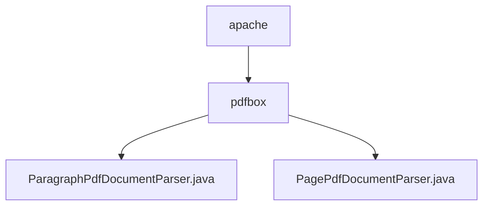

# 基础信息

|      |      |
|------|------|
| 名称 | apache |
| 编码语言 | .java |
| 代码路径 | spring-ai-alibaba/community/document-parsers/spring-ai-alibaba-starter-document-parser-apache-pdfbox/src/main/java/com/alibaba/cloud/ai/parser/apache |
| 包名 | spring-ai-alibaba.community.document-parsers.spring-ai-alibaba-starter-document-parser-apache-pdfbox.src.main.java.com.alibaba.cloud.ai.parser.apache |
| 概述说明 | PDF解析类提取段落和页面文本，添加元数据，提升文档处理效率。 |

# 说明

## 概述
该代码模块是一个基于Apache PDFBox的PDF文档解析工具，旨在从PDF文件中提取文本内容并生成结构化的文档对象。模块包含两个主要类：`ParagraphPdfDocumentParser`和`PagePdfDocumentParser`，分别用于按段落和按页提取文本内容。通过高效处理PDF文档，模块能够准确识别和分割文本，并为提取的内容附加元数据，如段落编号、位置信息等，从而提升文档处理的自动化水平和数据利用效率。

## 主要业务场景
1. **段落级文本提取**：`ParagraphPdfDocumentParser`类用于从PDF文件中提取段落内容，并为每个段落附加元数据（如段落编号、位置信息等）。适用于需要对文档内容进行精细化管理和分析的场景，例如文档内容的结构化存储、段落级别的语义分析或信息检索。
2. **页面级文本提取**：`PagePdfDocumentParser`类用于按页提取PDF文档中的文本内容，并生成相应的文档对象。适用于需要对文档进行分页处理或按页分析的场景，例如文档的批量处理、分页存储或页面级别的文本分析。
3. **文档自动化处理**：该模块通过高效解析PDF文档，支持自动化文档处理流程，能够为后续的文档分析、数据挖掘或信息提取提供基础数据支持，适用于需要大规模处理PDF文档的业务场景，如企业文档管理系统、智能文档分析工具等。

### 包内部结构视图

该流程图展示了`apache`文件夹下包含`pdfbox`子文件夹，而`pdfbox`文件夹中包含了两个Java文件：`ParagraphPdfDocumentParser.java`和`PagePdfDocumentParser.java`。这种层级关系清晰地反映了文件在项目中的组织结构，便于开发人员快速定位和管理相关代码文件。

# 文件列表 File List

| 名称   | 类型  | 说明 |
|-------|------|-------------|
| [pdfbox](pdfbox/_module.md) | package | PDF解析类提取段落和页面文本，添加元数据，提升文档处理效率。 |

