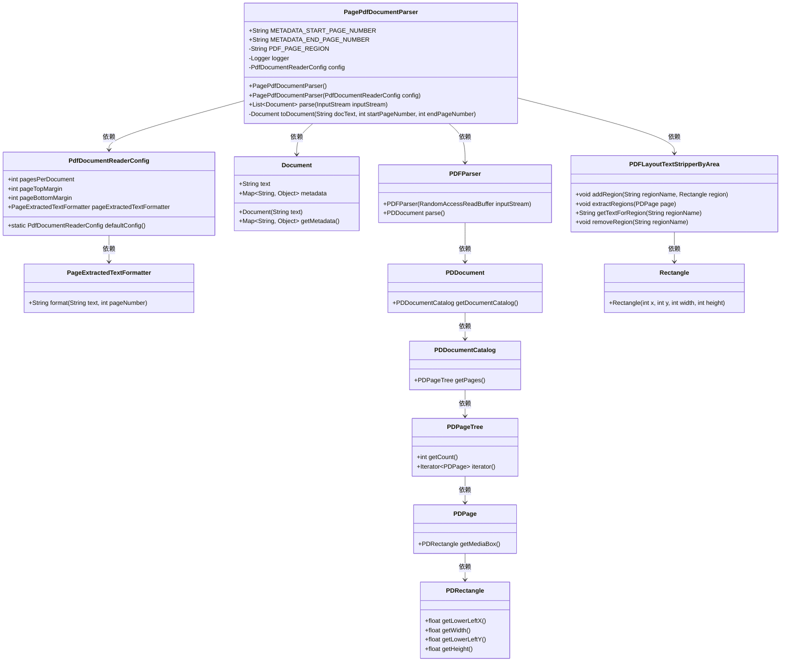

# 基础信息

|      |      |
|------|------|
| 名称 | PagePdfDocumentParser |
| 编码语言 | .java |
| 代码路径 | spring-ai-alibaba/community/document-parsers/spring-ai-alibaba-starter-document-parser-apache-pdfbox/src/main/java/com/alibaba/cloud/ai/parser/apache/pdfbox/PagePdfDocumentParser.java |
| 包名 | com.alibaba.cloud.ai.parser.apache.pdfbox |
| 依赖项 | ['java.awt.Rectangle', 'java.io.IOException', 'java.io.InputStream', 'java.util.ArrayList', 'java.util.List', 'java.util.stream.Collectors', 'com.alibaba.cloud.ai.document.DocumentParser', 'org.apache.pdfbox.pdfparser.PDFParser', 'org.apache.pdfbox.pdmodel.PDDocument', 'org.apache.pdfbox.pdmodel.PDPage', 'org.slf4j.Logger', 'org.slf4j.LoggerFactory', 'org.springframework.ai.document.Document', 'org.springframework.ai.reader.pdf.config.PdfDocumentReaderConfig', 'org.springframework.ai.reader.pdf.layout.PDFLayoutTextStripperByArea', 'org.springframework.util.CollectionUtils', 'org.springframework.util.StringUtils'] |
| 概述说明 | PagePdfDocumentParser类解析PDF文档，按页提取文本生成文档对象。 |

# 说明

PagePdfDocumentParser类专门用于解析PDF文档，其主要功能是按页提取文档中的文本内容，并生成相应的文档对象。该类能够高效地处理PDF文件，确保每一页的文本信息被准确提取和存储，为后续的文档处理和分析提供基础数据支持。

# 类列表 Class Summary

| 名称   | 类型  | 说明 |
|-------|------|-------------|
| PagePdfDocumentParser | class | PagePdfDocumentParser类解析PDF文档，按页提取文本并生成文档对象。 |

## 类 PagePdfDocumentParser

|      |      |
|------|------|
| 访问范围 | public |
| 类型 | class |
| 名称 | PagePdfDocumentParser |
| 说明 | PagePdfDocumentParser类解析PDF文档，按页提取文本并生成文档对象。 |

### UML类图

### 描述：
`PagePdfDocumentParser` 是一个用于解析PDF文档的类，它将PDF文档分割成多个页面，并根据配置将页面内容转换为 `Document` 对象。该类依赖于 `PdfDocumentReaderConfig` 来配置解析参数，使用 `PDFLayoutTextStripperByArea` 提取页面文本，并通过 `PDFParser` 解析PDF文档。最终，解析后的文本和元数据被封装在 `Document` 对象中返回。

### 内部方法调用关系图

```mermaid
graph TD
    A["类PagePdfDocumentParser"]
    B["常量: METADATA_START_PAGE_NUMBER"]
    C["常量: METADATA_END_PAGE_NUMBER"]
    D["常量: PDF_PAGE_REGION"]
    E["属性: Logger logger"]
    F["属性: PdfDocumentReaderConfig config"]
    G["构造方法: PagePdfDocumentParser()"]
    H["构造方法: PagePdfDocumentParser(PdfDocumentReaderConfig config)"]
    I["方法: List<Document> parse(InputStream inputStream)"]
    J["方法: Document toDocument(String docText, int startPageNumber, int endPageNumber)"]
    K["初始化: pdfTextStripper = new PDFLayoutTextStripperByArea()"]
    L["初始化: pageNumber = 0"]
    M["初始化: pagesPerDocument = 0"]
    N["初始化: startPageNumber = pageNumber"]
    O["初始化: pageTextGroupList = new ArrayList<>()"]
    P["初始化: pdfParser = new PDFParser(new RandomAccessReadBuffer(inputStream))"]
    Q["初始化: document = pdfParser.parse()"]
    R["获取总页数: totalPages = document.getDocumentCatalog().getPages().getCount()"]
    S["计算日志频率: logFrequency = totalPages > 10 ? totalPages / 10 : 1"]
    T["初始化: counter = 0"]
    U["初始化: lastPage = document.getDocumentCatalog().getPages().iterator().next()"]
    V["遍历页面: for (PDPage page : document.getDocumentCatalog().getPages())"]
    W["日志记录: logger.info('Processing PDF page: {}', (counter + 1))"]
    X["增加计数器: counter++"]
    Y["增加页面计数: pagesPerDocument++"]
    Z["检查是否达到每文档页数限制"]
    AA["生成文档: readDocuments.add(toDocument(aggregatedPageTextGroup, startPageNumber, pageNumber))"]
    AB["清空页面文本列表: pageTextGroupList.clear()"]
    AC["更新起始页码: startPageNumber = pageNumber + 1"]
    AD["计算页面区域: x0, xW, y0, yW"]
    AE["添加区域: pdfTextStripper.addRegion(PDF_PAGE_REGION, new Rectangle(x0, y0, xW, yW))"]
    AF["提取区域文本: pdfTextStripper.extractRegions(page)"]
    AG["获取区域文本: pageText = pdfTextStripper.getTextForRegion(PDF_PAGE_REGION)"]
    AH["格式化文本: pageText = config.pageExtractedTextFormatter.format(pageText, pageNumber)"]
    AI["添加文本到列表: pageTextGroupList.add(pageText)"]
    AJ["增加页码: pageNumber++"]
    AK["移除区域: pdfTextStripper.removeRegion(PDF_PAGE_REGION)"]
    AL["处理剩余页面文本: readDocuments.add(toDocument(pageTextGroupList.stream().collect(Collectors.joining()), startPageNumber, pageNumber))"]
    AM["日志记录: logger.info('Processing {} pages', totalPages)"]
    AN["返回结果: return readDocuments"]
    AO["捕获异常: catch (IOException e)"]
    AP["抛出异常: throw new RuntimeException(e)"]

    A --> B
    A --> C
    A --> D
    A --> E
    A --> F
    A --> G
    A --> H
    A --> I
    A --> J
    I --> K
    I --> L
    I --> M
    I --> N
    I --> O
    I --> P
    I --> Q
    I --> R
    I --> S
    I --> T
    I --> U
    I --> V
    V --> W
    V --> X
    V --> Y
    V --> Z
    Z --> AA
    Z --> AB
    Z --> AC
    V --> AD
    V --> AE
    V --> AF
    V --> AG
    V --> AH
    V --> AI
    V --> AJ
    V --> AK
    I --> AL
    I --> AM
    I --> AN
    I --> AO
    AO --> AP
```

这段代码描述了一个PDF文档解析器，它从输入流中读取PDF文件，并按照配置的页数将文档分割成多个部分。每个部分作为一个`Document`对象返回，并包含起始页码和结束页码的元数据。解析过程中，代码会记录处理进度，并在达到每文档页数限制时生成新的文档对象。最后，所有生成的文档对象会被返回。

### 字段列表 Field List

| 名称  | 类型  | 说明 |
|-------|-------|------|
| config | PdfDocumentReaderConfig | 私有常量PdfDocumentReaderConfig配置实例。 |
| PDF_PAGE_REGION = "pdfPageRegion" | String | 定义常量PDF_PAGE_REGION，值为"pdfPageRegion"。 |
| logger = LoggerFactory.getLogger(getClass()) | Logger | 私有日志记录器初始化代码。 |
| METADATA_START_PAGE_NUMBER = "page_number" | String | 常量METADATA_START_PAGE_NUMBER定义为"page_number"。 |
| METADATA_END_PAGE_NUMBER = "end_page_number" | String | 定义常量字符串METADATA_END_PAGE_NUMBER值为"end_page_number"。 |

### 方法列表 Method List

| 名称  | 类型  | 说明 |
|-------|-------|------|
| toDocument | Document | 将文本转换为文档，设置起始页码和结束页码元数据。 |
| parse | List<Document> | 解析PDF文档并提取文本，按配置分页处理，生成文档列表。 |

