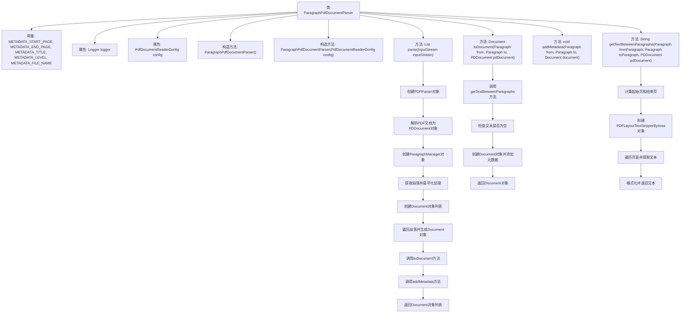

# 基础信息

|      |      |
|------|------|
| 名称 | ParagraphPdfDocumentParser |
| 编码语言 | .java |
| 代码路径 | spring-ai-alibaba/community/document-parsers/spring-ai-alibaba-starter-document-parser-apache-pdfbox/src/main/java/com/alibaba/cloud/ai/parser/apache/pdfbox/ParagraphPdfDocumentParser.java |
| 包名 | com.alibaba.cloud.ai.parser.apache.pdfbox |
| 依赖项 | ['java.awt.Rectangle', 'java.io.InputStream', 'java.util.ArrayList', 'java.util.Iterator', 'java.util.List', 'com.alibaba.cloud.ai.document.DocumentParser', 'org.apache.pdfbox.pdfparser.PDFParser', 'org.apache.pdfbox.pdmodel.PDDocument', 'org.slf4j.Logger', 'org.slf4j.LoggerFactory', 'org.springframework.ai.document.Document', 'org.springframework.ai.reader.pdf.config.ParagraphManager', 'org.springframework.ai.reader.pdf.config.ParagraphManager.Paragraph', 'org.springframework.ai.reader.pdf.config.PdfDocumentReaderConfig', 'org.springframework.ai.reader.pdf.layout.PDFLayoutTextStripperByArea', 'org.springframework.util.CollectionUtils', 'org.springframework.util.StringUtils'] |
| 概述说明 | PDF文档解析类，提取段落并附加元数据。 |

# 说明

PDF文档解析类的主要功能是从PDF文件中提取段落内容，并为每个段落添加元数据。该类的设计旨在高效处理PDF文档，确保能够准确识别和分割文本段落，同时为每个段落附加相关的元数据信息，如段落编号、位置信息等。通过这种方式，用户可以更方便地管理和分析PDF文档中的内容，提升文档处理的自动化水平和数据利用效率。

# 类列表 Class Summary

| 名称   | 类型  | 说明 |
|-------|------|-------------|
| ParagraphPdfDocumentParser | class | PDF文档解析类，提取段落并添加元数据。 |

## 类 ParagraphPdfDocumentParser

|      |      |
|------|------|
| 访问范围 | public |
| 类型 | class |
| 名称 | ParagraphPdfDocumentParser |
| 说明 | PDF文档解析类，提取段落并添加元数据。 |

### UML类图

```mermaid
classDiagram
    class ParagraphPdfDocumentParser {
        -String METADATA_START_PAGE
        -String METADATA_END_PAGE
        -String METADATA_TITLE
        -String METADATA_LEVEL
        -String METADATA_FILE_NAME
        -Logger logger
        -PdfDocumentReaderConfig config
        +ParagraphPdfDocumentParser()
        +ParagraphPdfDocumentParser(PdfDocumentReaderConfig config)
        +List~Document~ parse(InputStream inputStream)
        #Document toDocument(Paragraph from, Paragraph to, PDDocument pdDocument)
        #void addMetadata(Paragraph from, Paragraph to, Document document)
        +String getTextBetweenParagraphs(Paragraph fromParagraph, Paragraph toParagraph, PDDocument pdDocument)
    }
    class PdfDocumentReaderConfig {
        // Configuration details for PDF document processing
    }
    class Document {
        +String text
        +Map~String, Object~ metadata
        +String getText()
        +Map~String, Object~ getMetadata()
    }
    class Paragraph {
        +String title()
        +int startPageNumber()
        +int position()
        +int level()
    }
    class PDDocument {
        // Apache PDFBox document class
    }
    class PDFParser {
        +PDFParser(RandomAccessReadBuffer buffer)
        +PDDocument parse()
    }
    class ParagraphManager {
        +List~Paragraph~ flatten()
    }
    class PDFLayoutTextStripperByArea {
        +void setSortByPosition(boolean sort)
        +void addRegion(String regionName, Rectangle rect)
        +void extractRegions(PDPage page)
        +String getTextForRegion(String regionName)
        +void removeRegion(String regionName)
    }
    class Rectangle {
        // Rectangle class for defining regions
    }
    class PDPage {
        +Rectangle getMediaBox()
    }
    class RandomAccessReadBuffer {
        // Buffer class for reading PDF data
    }
    ParagraphPdfDocumentParser --> PdfDocumentReaderConfig : 依赖
    ParagraphPdfDocumentParser --> Document : 依赖
    ParagraphPdfDocumentParser --> Paragraph : 依赖
    ParagraphPdfDocumentParser --> PDDocument : 依赖
    ParagraphPdfDocumentParser --> PDFParser : 依赖
    ParagraphPdfDocumentParser --> ParagraphManager : 依赖
    ParagraphPdfDocumentParser --> PDFLayoutTextStripperByArea : 依赖
    ParagraphPdfDocumentParser --> Rectangle : 依赖
    ParagraphPdfDocumentParser --> PDPage : 依赖
    ParagraphPdfDocumentParser --> RandomAccessReadBuffer : 依赖
```

这段代码定义了一个 `ParagraphPdfDocumentParser` 类，用于从PDF文档中提取段落并将其转换为 `Document` 对象。该类通过 `PDFParser` 和 `ParagraphManager` 处理PDF文档，并使用 `PDFLayoutTextStripperByArea` 提取文本区域。`ParagraphPdfDocumentParser` 还负责将提取的段落转换为 `Document` 对象，并添加元数据，如标题、页码等。整个流程涉及多个类的协作，包括PDF文档的解析、段落管理和文本提取。

### 内部方法调用关系图

这段代码定义了一个`ParagraphPdfDocumentParser`类，用于解析PDF文档并提取段落。类中包含多个常量、属性和方法，主要功能包括解析PDF文档、提取段落、生成`Document`对象以及添加元数据。流程图展示了类中各个方法之间的调用关系，以及处理PDF文档的详细步骤。

### 字段列表 Field List

| 名称  | 类型  | 说明 |
|-------|-------|------|
| logger = LoggerFactory.getLogger(getClass()) | Logger | 私有日志记录器实例初始化。 |
| METADATA_FILE_NAME = "file_name" | String | 定义了一个私有静态常量字符串，用于存储元数据文件名。 |
| METADATA_END_PAGE = "end_page_number" | String | 定义常量字符串"end_page_number"。 |
| METADATA_START_PAGE = "page_number" | String | 定义静态常量METADATA_START_PAGE，值为"page_number"。 |
| config | PdfDocumentReaderConfig | 包含私有最终配置的PdfDocumentReader类。 |
| METADATA_TITLE = "title" | String | 定义私有静态常量字符串METADATA_TITLE，值为"title"。 |
| METADATA_LEVEL = "level" | String | 定义私有静态常量METADATA_LEVEL，值为"level"。 |

### 方法列表 Method List

| 名称  | 类型  | 说明 |
|-------|-------|------|
| getTextBetweenParagraphs | String | 提取PDF文档中指定段落间的文本内容。 |
| parse | List<Document> | 解析PDF流并提取段落生成文档列表。 |
| toDocument | Document | 将段落间文本转换为文档对象，添加元数据后返回。 |
| addMetadata | void | 将段落元数据添加到文档中，包括标题、起始页、结束页和层级。 |

