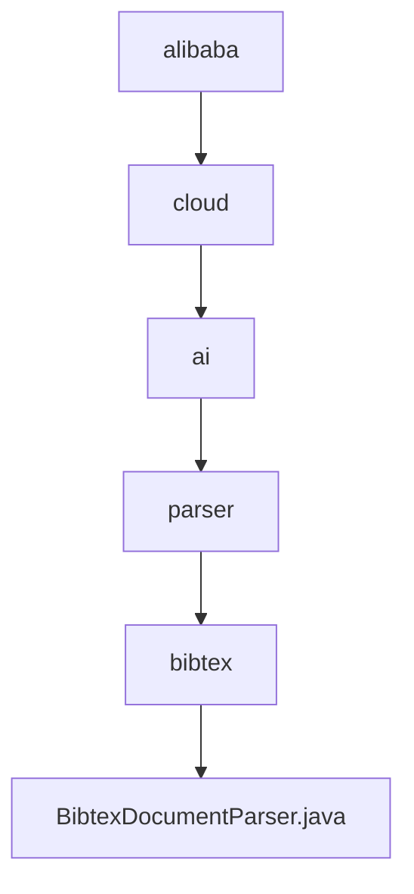

# 基础信息

|      |      |
|------|------|
| 名称 | alibaba |
| 编码语言 | .java |
| 代码路径 | spring-ai-alibaba/community/document-parsers/spring-ai-alibaba-starter-document-parser-bibtex/src/main/java/com/alibaba |
| 包名 | spring-ai-alibaba.community.document-parsers.spring-ai-alibaba-starter-document-parser-bibtex.src.main.java.com.alibaba |
| 概述说明 | BibtexDocumentParser解析BibTeX文档，处理元数据和文件内容，支持字符集、文档数和长度限制。 |

# 说明

BibtexDocumentParser是一款用于解析BibTeX文档的工具，能够处理文档中的元数据和文件内容。该工具支持多种字符集，允许用户设置最大文档数和内容长度限制，确保解析过程的灵活性和可控性。通过精确捕捉关键信息，BibtexDocumentParser为用户提供全面详尽的文档解析服务。

### 包内部结构视图

该流程图展示了从`alibaba`到`BibtexDocumentParser.java`的层级关系。首先，`alibaba`包含`cloud`，`cloud`包含`ai`，`ai`包含`parser`，`parser`包含`bibtex`，最后`bibtex`包含`BibtexDocumentParser.java`。每个节点代表路径的最后一级元素，清晰地展示了文件的嵌套结构。

# 文件列表 File List

| 名称   | 类型  | 说明 |
|-------|------|-------------|
| [cloud](cloud/_module.md) | package | BibtexDocumentParser解析BibTeX文档，处理元数据和文件内容，支持字符集、文档数和长度限制。 |

