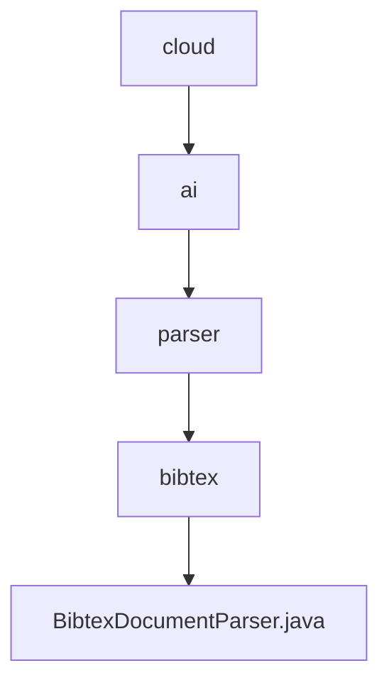

# 基础信息

|      |      |
|------|------|
| 名称 | cloud |
| 编码语言 | .java |
| 代码路径 | spring-ai-alibaba/community/document-parsers/spring-ai-alibaba-starter-document-parser-bibtex/src/main/java/com/alibaba/cloud |
| 包名 | spring-ai-alibaba.community.document-parsers.spring-ai-alibaba-starter-document-parser-bibtex.src.main.java.com.alibaba.cloud |
| 概述说明 | BibtexDocumentParser解析BibTeX文档，处理元数据和文件内容，支持字符集、文档数和长度限制。 |

# 说明

BibtexDocumentParser是一款用于解析BibTeX文档的工具，能够处理文档中的元数据和文件内容。该工具支持多种字符集，允许用户设置最大文档数和内容长度限制，确保解析过程的灵活性和可控性。通过精确捕捉关键信息，BibtexDocumentParser为用户提供全面详尽的文档解析服务。

### 包内部结构视图

该流程图展示了从 `cloud` 到 `BibtexDocumentParser.java` 的层级关系。路径从 `cloud` 开始，依次经过 `ai`、`parser` 和 `bibtex`，最终到达 `BibtexDocumentParser.java` 文件。每个节点代表路径中的一个层级，清晰地展示了文件在项目中的组织结构。

# 文件列表 File List

| 名称   | 类型  | 说明 |
|-------|------|-------------|
| [ai](ai/_module.md) | package | BibtexDocumentParser解析BibTeX文档，处理元数据和文件内容，支持字符集、文档数和长度限制。 |

