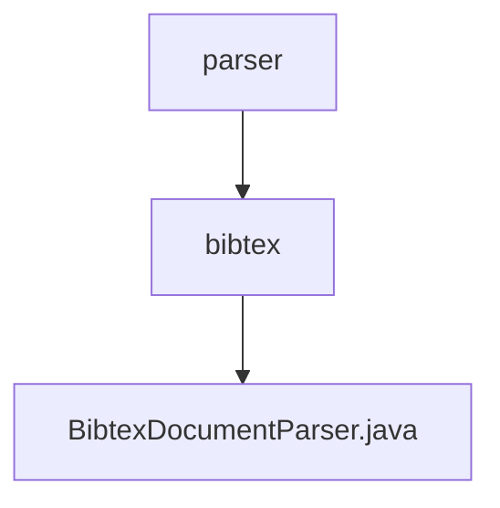

# 基础信息

|      |      |
|------|------|
| 名称 | parser |
| 编码语言 | .java |
| 代码路径 | spring-ai-alibaba/community/document-parsers/spring-ai-alibaba-starter-document-parser-bibtex/src/main/java/com/alibaba/cloud/ai/parser |
| 包名 | spring-ai-alibaba.community.document-parsers.spring-ai-alibaba-starter-document-parser-bibtex.src.main.java.com.alibaba.cloud.ai.parser |
| 概述说明 | BibtexDocumentParser解析BibTeX文档，处理元数据和文件内容，支持字符集、文档数和长度限制。 |

# 说明

BibtexDocumentParser是一款用于解析BibTeX文档的工具，能够处理文档中的元数据和文件内容。该工具支持多种字符集，允许用户设置最大文档数和内容长度限制，确保解析过程的灵活性和可控性。通过精确捕捉关键信息，BibtexDocumentParser为用户提供全面详尽的文档解析服务。

### 包内部结构视图

该流程图展示了`spring-ai-alibaba`项目中`document-parsers`模块的层级关系。`parser`文件夹包含`bibtex`子文件夹，而`bibtex`文件夹中则包含`BibtexDocumentParser.java`文件。这种结构清晰地反映了文件在项目中的组织方式，便于开发者理解和维护代码。

# 文件列表 File List

| 名称   | 类型  | 说明 |
|-------|------|-------------|
| [bibtex](bibtex/_module.md) | package | BibtexDocumentParser解析BibTeX文档，处理元数据和文件内容，支持字符集、文档数和长度限制。 |

