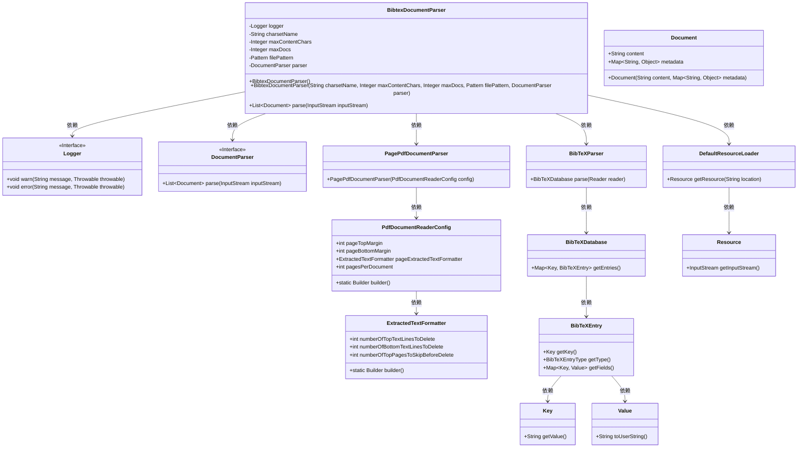
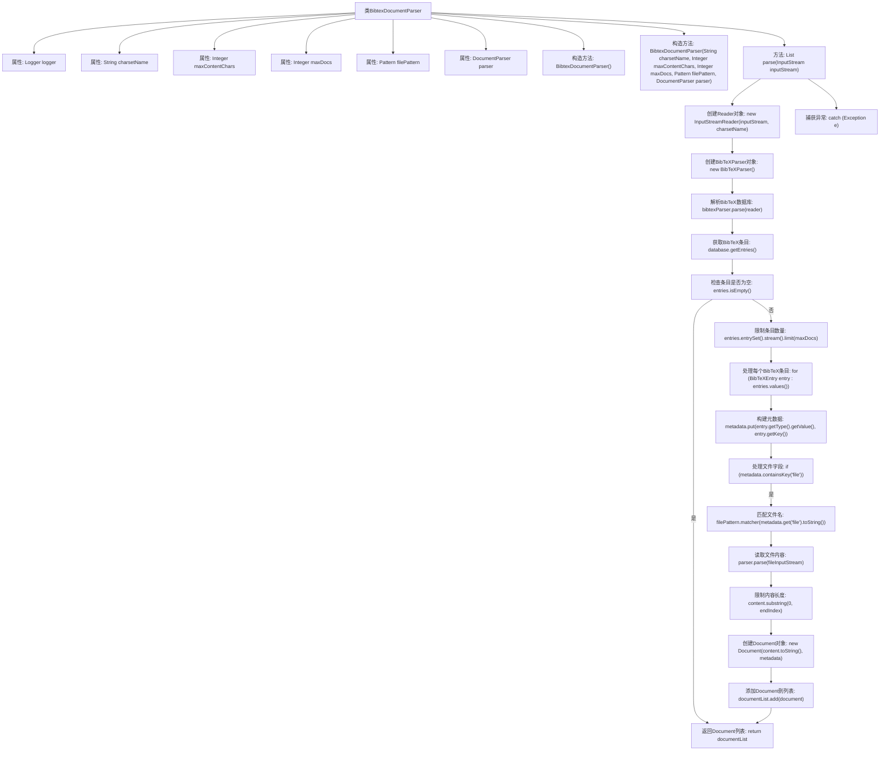

# 基础信息

|      |      |
|------|------|
| 名称 | BibtexDocumentParser |
| 编码语言 | .java |
| 代码路径 | spring-ai-alibaba/community/document-parsers/spring-ai-alibaba-starter-document-parser-bibtex/src/main/java/com/alibaba/cloud/ai/parser/bibtex/BibtexDocumentParser.java |
| 包名 | com.alibaba.cloud.ai.parser.bibtex |
| 依赖项 | ['com.alibaba.cloud.ai.document.DocumentParser', 'com.alibaba.cloud.ai.parser.apache.pdfbox.PagePdfDocumentParser', 'org.jbibtex.BibTeXDatabase', 'org.jbibtex.BibTeXEntry', 'org.jbibtex.BibTeXParser', 'org.jbibtex.Key', 'org.jbibtex.Value', 'org.slf4j.Logger', 'org.slf4j.LoggerFactory', 'org.springframework.ai.document.Document', 'org.springframework.ai.reader.ExtractedTextFormatter', 'org.springframework.ai.reader.pdf.config.PdfDocumentReaderConfig', 'org.springframework.core.io.DefaultResourceLoader', 'java.io.IOException', 'java.io.InputStream', 'java.io.InputStreamReader', 'java.io.Reader', 'java.util.ArrayList', 'java.util.Collections', 'java.util.HashMap', 'java.util.List', 'java.util.Map', 'java.util.Objects', 'java.util.regex.Matcher', 'java.util.regex.Pattern', 'java.util.stream.Collectors'] |
| 概述说明 | BibtexDocumentParser解析BibTeX文档，处理元数据和文件内容，支持字符集、文档数和长度限制。 |

# 说明

BibtexDocumentParser是一款用于解析BibTeX文档的工具，能够处理文档中的元数据和文件内容。该工具支持多种字符集，允许用户设置最大文档数和内容长度限制，确保解析过程的灵活性和可控性。通过精确捕捉关键信息，BibtexDocumentParser为用户提供全面详尽的文档解析服务。

# 类列表 Class Summary

| 名称   | 类型  | 说明 |
|-------|------|-------------|
| BibtexDocumentParser | class | BibtexDocumentParser解析BibTeX文档，处理元数据和文件内容，支持字符集、最大文档数和内容长度限制。 |

## 类 BibtexDocumentParser

|      |      |
|------|------|
| 访问范围 | public |
| 类型 | class |
| 名称 | BibtexDocumentParser |
| 说明 | BibtexDocumentParser解析BibTeX文档，处理元数据和文件内容，支持字符集、最大文档数和内容长度限制。 |

### UML类图

**类图描述：**

`BibtexDocumentParser` 是一个用于解析 BibTeX 文档的类，它依赖于 `Logger` 接口进行日志记录，并通过 `DocumentParser` 接口进一步解析文档内容。`BibtexDocumentParser` 使用了 `PagePdfDocumentParser` 来解析 PDF 文档，而 `PagePdfDocumentParser` 又依赖于 `PdfDocumentReaderConfig` 和 `ExtractedTextFormatter` 来配置解析过程。`BibtexDocumentParser` 还通过 `BibTeXParser` 解析 BibTeX 文件，并生成 `BibTeXDatabase`，其中包含多个 `BibTeXEntry`，每个 `BibTeXEntry` 包含 `Key` 和 `Value`。此外，`BibtexDocumentParser` 使用 `DefaultResourceLoader` 加载资源文件，并通过 `Resource` 获取输入流。整个类图展示了 `BibtexDocumentParser` 如何通过多个依赖组件完成文档解析任务。

### 内部方法调用关系图

这段代码的流程图描述了`BibtexDocumentParser`类的结构和工作流程。该类用于解析BibTeX格式的文档，首先通过构造函数初始化相关属性，然后在`parse`方法中读取输入流并解析BibTeX数据库。流程包括创建Reader对象、解析BibTeX数据库、获取条目、处理每个条目的元数据和文件字段，最终生成Document对象并返回。整个流程中还包括异常处理和日志记录。

### 字段列表 Field List

| 名称  | 类型  | 说明 |
|-------|-------|------|
| charsetName | String | 私有常量字符集名称。 |
| logger = LoggerFactory.getLogger(getClass()) | Logger | 私有日志记录器实例化，用于记录类日志。 |
| parser | DocumentParser | 私有且不可变的文档解析器实例。 |
| maxContentChars | Integer | 私有整型变量maxContentChars，用于存储最大字符数。 |
| filePattern | Pattern | 私有常量filePattern为Pattern类型。 |
| maxDocs | Integer | 私有整型变量maxDocs用于存储最大文档数量。 |

### 方法列表 Method List

| 名称  | 类型  | 说明 |
|-------|-------|------|
| parse | List<Document> | 解析输入流生成文档列表，处理BibTeX数据，提取元数据，合并文件内容，限制文档数量和字符长度。 |

