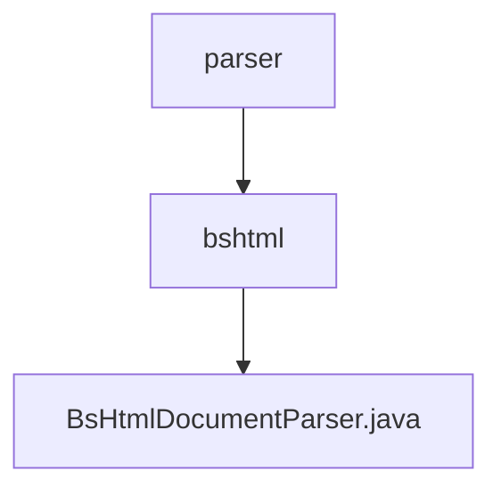

# 基础信息

|      |      |
|------|------|
| 名称 | parser |
| 编码语言 | .java |
| 代码路径 | spring-ai-alibaba/community/document-parsers/spring-ai-alibaba-starter-document-parser-bshtml/src/main/java/com/alibaba/cloud/ai/parser |
| 包名 | spring-ai-alibaba.community.document-parsers.spring-ai-alibaba-starter-document-parser-bshtml.src.main.java.com.alibaba.cloud.ai.parser |
| 概述说明 | BsHtmlDocumentParser类解析HTML文档，支持字符集、基础URI和解析器配置。 |

# 说明

BsHtmlDocumentParser类是一个专门用于解析HTML文档的工具，它具备多种功能，包括支持不同的字符集、基础URI以及灵活的解析器配置。通过该工具，用户可以有效地处理和解析HTML文档内容，确保在不同场景下能够准确获取所需信息。其设计旨在提供高效且灵活的解析能力，适用于各种复杂的HTML文档处理需求。

### 包内部结构视图

该流程图展示了`spring-ai-alibaba-starter-document-parser-bshtml`模块中的文件层级关系。`parser`目录下包含`bshtml`子目录，而`bshtml`目录中则包含`BsHtmlDocumentParser.java`文件。这种结构清晰地反映了代码的组织方式，便于开发者理解和维护。

# 文件列表 File List

| 名称   | 类型  | 说明 |
|-------|------|-------------|
| [bshtml](bshtml/_module.md) | package | BsHtmlDocumentParser类解析HTML文档，支持字符集、基础URI和解析器配置。 |

