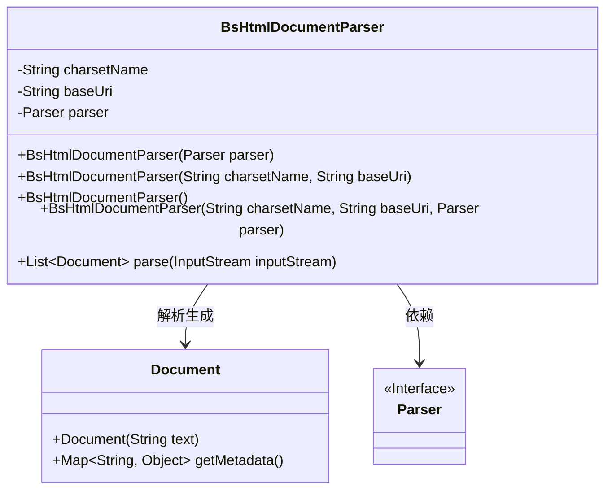
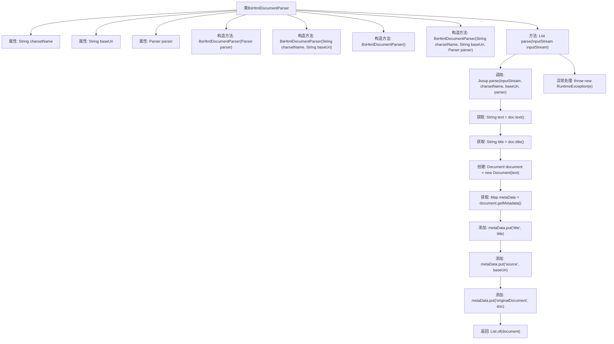

# 基础信息

|      |      |
|------|------|
| 名称 | BsHtmlDocumentParser |
| 编码语言 | .java |
| 代码路径 | spring-ai-alibaba/community/document-parsers/spring-ai-alibaba-starter-document-parser-bshtml/src/main/java/com/alibaba/cloud/ai/parser/bshtml/BsHtmlDocumentParser.java |
| 包名 | com.alibaba.cloud.ai.parser.bshtml |
| 依赖项 | ['com.alibaba.cloud.ai.document.DocumentParser', 'org.jsoup.Jsoup', 'org.jsoup.parser.Parser', 'org.springframework.ai.document.Document', 'java.io.InputStream', 'java.util.List', 'java.util.Map'] |
| 概述说明 | BsHtmlDocumentParser类解析HTML文档，支持字符集、基础URI和解析器配置。 |

# 说明

BsHtmlDocumentParser类是一个专门用于解析HTML文档的工具，它具备多种功能，包括支持不同的字符集、基础URI以及灵活的解析器配置。通过该工具，用户可以有效地处理和解析HTML文档内容，确保在不同场景下能够准确获取所需信息。其设计旨在提供高效且灵活的解析能力，适用于各种复杂的HTML文档处理需求。

# 类列表 Class Summary

| 名称   | 类型  | 说明 |
|-------|------|-------------|
| BsHtmlDocumentParser | class | BsHtmlDocumentParser类用于解析HTML文档，支持字符集、基础URI和解析器配置。 |

## 类 BsHtmlDocumentParser

|      |      |
|------|------|
| 访问范围 | public |
| 类型 | class |
| 名称 | BsHtmlDocumentParser |
| 说明 | BsHtmlDocumentParser类用于解析HTML文档，支持字符集、基础URI和解析器配置。 |

### UML类图

类图描述：`BsHtmlDocumentParser` 类用于解析 HTML 文档，包含字符集名称、基础 URI 和解析器三个私有属性。它提供了多个构造函数以适应不同的初始化需求，并实现了 `parse` 方法，该方法将输入流解析为 `Document` 对象，并提取文档的文本、标题等元数据。`Document` 类用于存储解析后的文档内容及其元数据。`Parser` 是一个接口，`BsHtmlDocumentParser` 依赖于它来进行文档解析。

### 内部方法调用关系图

这段代码定义了一个`BsHtmlDocumentParser`类，用于解析HTML文档。类中包含多个构造方法，用于初始化字符集、基础URI和解析器。`parse`方法通过`Jsoup`库解析输入的HTML流，提取文本和标题，并将其封装为`Document`对象。该方法还处理了异常情况，并在出错时抛出运行时异常。

### 字段列表 Field List

| 名称  | 类型  | 说明 |
|-------|-------|------|
| charsetName | String | 私有字符串常量charsetName。 |
| baseUri | String | 私有不可变字符串变量baseUri。 |
| parser | Parser | 定义了一个私有且不可变的解析器实例。 |

### 方法列表 Method List

| 名称  | 类型  | 说明 |
|-------|-------|------|
| parse | List<Document> | 解析输入流为文档，提取文本和标题，存储元数据并返回文档列表。 |

