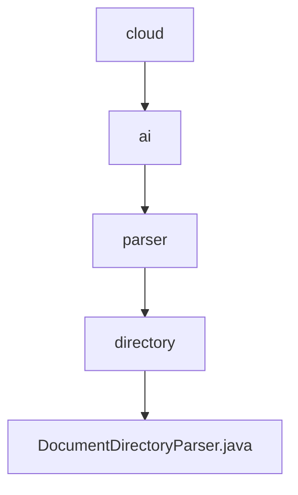

# 基础信息

|      |      |
|------|------|
| 名称 | cloud |
| 编码语言 | .java |
| 代码路径 | spring-ai-alibaba/community/document-parsers/spring-ai-alibaba-starter-document-parser-directory/src/main/java/com/alibaba/cloud |
| 包名 | spring-ai-alibaba.community.document-parsers.spring-ai-alibaba-starter-document-parser-directory.src.main.java.com.alibaba.cloud |
| 概述说明 | DocumentDirectoryParser类解析目录文件，支持模式匹配、隐藏文件加载、递归遍历和文件抽样。 |

# 说明

DocumentDirectoryParser类是一个用于解析目录文件的工具，具备多种功能。它支持模式匹配，可以根据特定模式筛选文件。此外，该类能够加载隐藏文件，确保不遗漏任何重要数据。递归遍历功能使其能够深入子目录，全面解析所有文件。文件抽样功能则允许用户从大量文件中抽取部分样本进行分析。这些特性使得DocumentDirectoryParser类在处理复杂目录结构时非常高效和灵活。

### 包内部结构视图

该流程图展示了`spring-ai-alibaba`项目中`DocumentDirectoryParser.java`文件的层级结构。从`cloud`目录开始，逐级深入到`ai`、`parser`和`directory`，最终指向`DocumentDirectoryParser.java`文件。这种结构清晰地反映了文件的组织方式，便于开发者理解和维护代码。

# 文件列表 File List

| 名称   | 类型  | 说明 |
|-------|------|-------------|
| [ai](ai/_module.md) | package | DocumentDirectoryParser类解析目录文件，支持模式匹配、隐藏文件加载、递归遍历和文件抽样。 |

