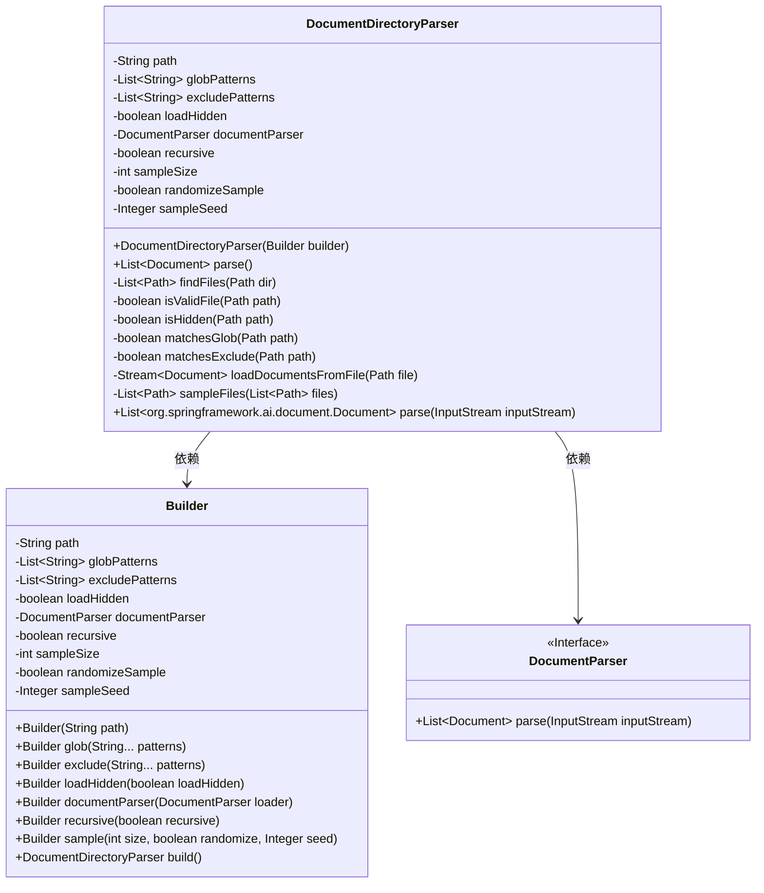

# 基础信息

|      |      |
|------|------|
| 名称 | DocumentDirectoryParser |
| 编码语言 | .java |
| 代码路径 | spring-ai-alibaba/community/document-parsers/spring-ai-alibaba-starter-document-parser-directory/src/main/java/com/alibaba/cloud/ai/parser/directory/DocumentDirectoryParser.java |
| 包名 | com.alibaba.cloud.ai.parser.directory |
| 依赖项 | ['com.alibaba.cloud.ai.document.DocumentParser', 'org.springframework.ai.document.Document', 'java.io.FileInputStream', 'java.io.IOException', 'java.io.InputStream', 'java.nio.file.FileSystems', 'java.nio.file.Files', 'java.nio.file.Path', 'java.nio.file.Paths', 'java.util.ArrayList', 'java.util.Arrays', 'java.util.Collections', 'java.util.List', 'java.util.Objects', 'java.util.Random', 'java.util.stream.Collectors', 'java.util.stream.Stream'] |
| 概述说明 | DocumentDirectoryParser类解析目录文件，支持模式匹配、隐藏文件加载、递归遍历和文件抽样。 |

# 说明

DocumentDirectoryParser类是一个用于解析目录文件的工具，具备多种功能。它支持模式匹配，可以根据特定模式筛选文件。此外，该类能够加载隐藏文件，确保不遗漏任何重要数据。递归遍历功能使其能够深入子目录，全面解析所有文件。文件抽样功能则允许用户从大量文件中抽取部分样本进行分析。这些特性使得DocumentDirectoryParser类在处理复杂目录结构时非常高效和灵活。

# 类列表 Class Summary

| 名称   | 类型  | 说明 |
|-------|------|-------------|
| DocumentDirectoryParser | class | DocumentDirectoryParser类解析目录文件，支持模式匹配、隐藏文件加载、递归遍历和文件抽样。 |

## 类 DocumentDirectoryParser

|      |      |
|------|------|
| 访问范围 | public |
| 类型 | class |
| 名称 | DocumentDirectoryParser |
| 说明 | DocumentDirectoryParser类解析目录文件，支持模式匹配、隐藏文件加载、递归遍历和文件抽样。 |

### UML类图

**描述：**
`DocumentDirectoryParser` 类用于解析指定目录中的文档，支持文件过滤、隐藏文件加载、递归搜索、文件采样等功能。`Builder` 类用于构建 `DocumentDirectoryParser` 实例，提供了灵活的配置选项。`DocumentParser` 是一个接口，定义了文档解析的通用方法。`DocumentDirectoryParser` 依赖于 `Builder` 和 `DocumentParser` 来实现其功能。

### 内部方法调用关系图

```mermaid
graph TD
    A["类DocumentDirectoryParser"]
    B["属性: String path"]
    C["属性: List<String> globPatterns"]
    D["属性: List<String> excludePatterns"]
    E["属性: boolean loadHidden"]
    F["属性: DocumentParser documentParser"]
    G["属性: boolean recursive"]
    H["属性: int sampleSize"]
    I["属性: boolean randomizeSample"]
    J["属性: Integer sampleSeed"]
    K["构造方法: DocumentDirectoryParser(Builder builder)"]
    L["方法: List<Document> parse()"]
    M["方法: List<Path> findFiles(Path dir)"]
    N["方法: boolean isValidFile(Path path)"]
    O["方法: boolean isHidden(Path path)"]
    P["方法: boolean matchesGlob(Path path)"]
    Q["方法: boolean matchesExclude(Path path)"]
    R["方法: Stream<Document> loadDocumentsFromFile(Path file)"]
    S["方法: List<Path> sampleFiles(List<Path> files)"]
    T["重写方法: List<Document> parse(InputStream inputStream)"]
    U["内部类Builder"]
    V["属性: String path"]
    W["属性: List<String> globPatterns"]
    X["属性: List<String> excludePatterns"]
    Y["属性: boolean loadHidden"]
    Z["属性: DocumentParser documentParser"]
    AA["属性: boolean recursive"]
    AB["属性: int sampleSize"]
    AC["属性: boolean randomizeSample"]
    AD["属性: Integer sampleSeed"]
    AE["构造方法: Builder(String path)"]
    AF["方法: Builder glob(String... patterns)"]
    AG["方法: Builder exclude(String... patterns)"]
    AH["方法: Builder loadHidden(boolean loadHidden)"]
    AI["方法: Builder documentParser(DocumentParser loader)"]
    AJ["方法: Builder recursive(boolean recursive)"]
    AK["方法: Builder sample(int size, boolean randomize, Integer seed)"]
    AL["方法: DocumentDirectoryParser build()"]

    A --> B
    A --> C
    A --> D
    A --> E
    A --> F
    A --> G
    A --> H
    A --> I
    A --> J
    A --> K
    A --> L
    A --> M
    A --> N
    A --> O
    A --> P
    A --> Q
    A --> R
    A --> S
    A --> T
    A -.-> U
    U --> V
    U --> W
    U --> X
    U --> Y
    U --> Z
    U --> AA
    U --> AB
    U --> AC
    U --> AD
    U --> AE
    U --> AF
    U --> AG
    U --> AH
    U --> AI
    U --> AJ
    U --> AK
    U --> AL
```

这段代码定义了一个`DocumentDirectoryParser`类，用于解析指定目录下的文档。它通过`Builder`模式构建对象，支持递归查找文件、过滤文件、加载文档等功能。流程图展示了类的属性和方法之间的调用关系，以及内部类`Builder`的结构和功能。

### 字段列表 Field List

| 名称  | 类型  | 说明 |
|-------|-------|------|
| sampleSeed | Integer | 私有不可变的整数类型变量sampleSeed。 |
| excludePatterns | List<String> | 私有字符串列表，用于存储排除模式。 |
| globPatterns | List<String> | 私有字符串列表类型的全局模式变量。 |
| path | String | 私有字符串变量path声明为final。 |
| documentParser | DocumentParser | 私有最终文档解析器实例。 |
| randomizeSample | boolean | 私有布尔变量randomizeSample用于控制样本随机化。 |
| loadHidden | boolean | 私有布尔变量loadHidden用于控制是否加载隐藏内容。 |
| recursive | boolean | 私有布尔变量recursive，不可修改。 |
| sampleSize | int | 私有整型变量sampleSize声明为final。 |

### 方法列表 Method List

| 名称  | 类型  | 说明 |
|-------|-------|------|
| findFiles | List<Path> | 查找指定目录下符合条件的文件，支持递归搜索。 |
| isHidden | boolean | 判断路径是否隐藏，包含隐藏文件或点开头的路径。 |
| isValidFile | boolean | 方法检查文件有效性，包括常规性、隐藏状态、排除规则和匹配模式。 |
| parse | List<org.springframework.ai.document.Document> | 重写方法，返回空文档列表。 |
| loadDocumentsFromFile | Stream<Document> | 从文件加载文档流，异常时抛出运行时错误。 |
| matchesGlob | boolean | 该方法检查路径文件名是否匹配任意全局模式。 |
| matchesExclude | boolean | 方法检查路径是否匹配排除模式列表中的任意一个模式。 |
| parse | List<Document> | 解析指定路径下文件并返回文档列表，支持抽样处理。 |
| sampleFiles | List<Path> | 随机或按顺序从文件列表中抽取指定数量的样本文件。 |

