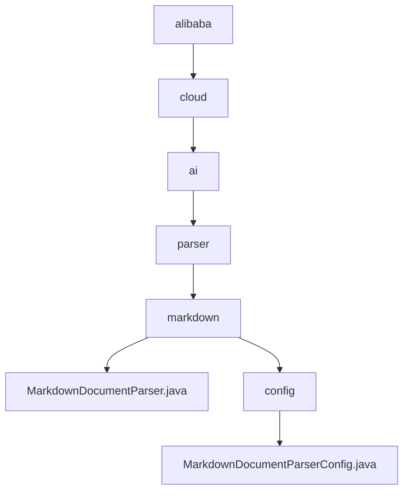

# 基础信息

|      |      |
|------|------|
| 名称 | alibaba |
| 编码语言 | .java |
| 代码路径 | spring-ai-alibaba/community/document-parsers/spring-ai-alibaba-starter-document-parser-markdown/src/main/java/com/alibaba |
| 包名 | spring-ai-alibaba.community.document-parsers.spring-ai-alibaba-starter-document-parser-markdown.src.main.java.com.alibaba |
| 概述说明 | Markdown文档解析器可配置解析行为，生成结构化文档，应用于文档处理与内容管理。 |

# 说明

## 概述

该代码模块是一个Markdown文档解析器，旨在解析Markdown格式的文档，并在解析过程中提供灵活的配置选项。通过该解析器，用户可以根据需求调整解析行为，最终生成结构化的文档列表。该工具广泛应用于文档处理、内容管理和自动化流程中，帮助用户高效处理和组织Markdown内容。

## 主要业务场景

1. **文档处理**：解析Markdown格式的文档，生成结构化的文档列表，便于后续处理和分析。
2. **内容管理**：在内容管理系统中，通过自定义解析配置，确保解析结果符合特定需求，提高内容管理的效率。
3. **自动化流程**：在自动化流程中，通过配置解析器的各类元素处理方式，实现自动化文档解析和处理，减少人工干预。

该模块的核心功能包括对水平线、代码块、引用块以及元数据的处理，用户可以通过配置类自定义这些元素的处理方式，确保解析结果符合预期需求。配置类提供了灵活的设置选项，适用于不同的Markdown解析场景。

### 包内部结构视图

该流程图展示了从 `alibaba` 到 `MarkdownDocumentParserConfig.java` 的层级关系。路径从 `alibaba` 开始，依次经过 `cloud`、`ai`、`parser` 和 `markdown`，最终分为 `MarkdownDocumentParser.java` 和 `config`，而 `config` 下又包含 `MarkdownDocumentParserConfig.java`。整个结构清晰地反映了代码文件的组织方式。

# 文件列表 File List

| 名称   | 类型  | 说明 |
|-------|------|-------------|
| [cloud](cloud/_module.md) | package | Markdown文档解析器可配置解析行为，生成结构化文档，应用于文档处理与内容管理。 |

