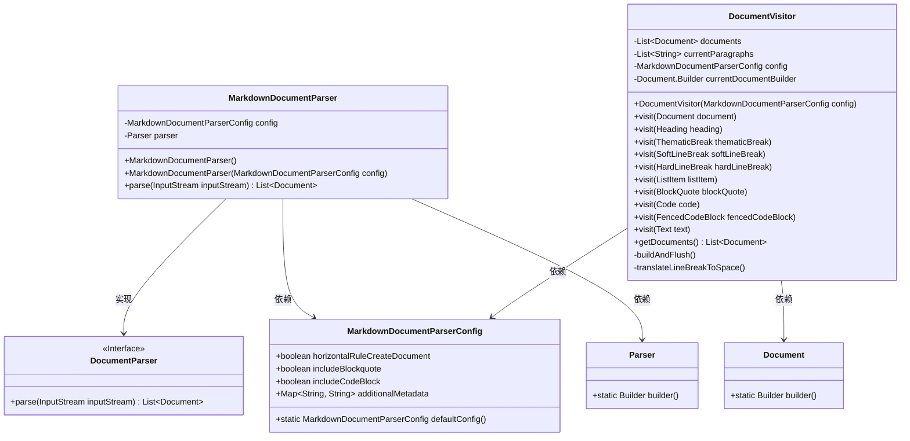

# 基础信息

|      |      |
|------|------|
| 名称 | MarkdownDocumentParser |
| 编码语言 | .java |
| 代码路径 | spring-ai-alibaba/community/document-parsers/spring-ai-alibaba-starter-document-parser-markdown/src/main/java/com/alibaba/cloud/ai/parser/markdown/MarkdownDocumentParser.java |
| 包名 | com.alibaba.cloud.ai.parser.markdown |
| 依赖项 | ['com.alibaba.cloud.ai.document.DocumentParser', 'com.alibaba.cloud.ai.parser.markdown.config.MarkdownDocumentParserConfig', 'org.commonmark.node.AbstractVisitor', 'org.commonmark.node.BlockQuote', 'org.commonmark.node.Code', 'org.commonmark.node.FencedCodeBlock', 'org.commonmark.node.HardLineBreak', 'org.commonmark.node.Heading', 'org.commonmark.node.ListItem', 'org.commonmark.node.Node', 'org.commonmark.node.SoftLineBreak', 'org.commonmark.node.Text', 'org.commonmark.node.ThematicBreak', 'org.commonmark.parser.Parser', 'org.springframework.ai.document.Document', 'java.io.IOException', 'java.io.InputStream', 'java.io.InputStreamReader', 'java.util.ArrayList', 'java.util.List'] |
| 概述说明 | Markdown解析器可配置，生成文档列表。 |

# 说明

Markdown文档解析器是一种工具，能够解析Markdown格式的文档，并支持在解析过程中进行配置。通过该解析器，用户可以根据需求调整解析行为，最终生成结构化的文档列表。这种工具广泛应用于文档处理、内容管理和自动化流程中，帮助用户高效处理和组织Markdown内容。

# 类列表 Class Summary

| 名称   | 类型  | 说明 |
|-------|------|-------------|
| MarkdownDocumentParser | class | Markdown文档解析器，支持配置解析过程，生成文档列表。 |

## 类 MarkdownDocumentParser

|      |      |
|------|------|
| 访问范围 | public |
| 类型 | class |
| 名称 | MarkdownDocumentParser |
| 说明 | Markdown文档解析器，支持配置解析过程，生成文档列表。 |

### UML类图

### 描述
该代码定义了一个`MarkdownDocumentParser`类，实现了`DocumentParser`接口，用于解析Markdown文档并生成`Document`对象。`MarkdownDocumentParser`依赖于`MarkdownDocumentParserConfig`配置类和`Parser`解析器类。`DocumentVisitor`是`MarkdownDocumentParser`的内部类，负责遍历Markdown文档的节点并生成`Document`对象。`DocumentVisitor`通过`buildAndFlush`方法将解析的内容构建为`Document`对象，并通过`translateLineBreakToSpace`方法处理换行符。

### 内部方法调用关系图

```mermaid
graph TD
    A["类MarkdownDocumentParser"]
    B["属性: MarkdownDocumentParserConfig config"]
    C["属性: Parser parser"]
    D["构造方法: MarkdownDocumentParser()"]
    E["构造方法: MarkdownDocumentParser(MarkdownDocumentParserConfig config)"]
    F["方法: List<Document> parse(InputStream inputStream)"]
    G["内部类: DocumentVisitor"]
    H["属性: List<Document> documents"]
    I["属性: List<String> currentParagraphs"]
    J["属性: MarkdownDocumentParserConfig config"]
    K["属性: Document.Builder currentDocumentBuilder"]
    L["方法: visit(Document document)"]
    M["方法: visit(Heading heading)"]
    N["方法: visit(ThematicBreak thematicBreak)"]
    O["方法: visit(SoftLineBreak softLineBreak)"]
    P["方法: visit(HardLineBreak hardLineBreak)"]
    Q["方法: visit(ListItem listItem)"]
    R["方法: visit(BlockQuote blockQuote)"]
    S["方法: visit(Code code)"]
    T["方法: visit(FencedCodeBlock fencedCodeBlock)"]
    U["方法: visit(Text text)"]
    V["方法: getDocuments()"]
    W["方法: buildAndFlush()"]
    X["方法: translateLineBreakToSpace()"]

    A --> B
    A --> C
    A --> D
    A --> E
    A --> F
    A --> G
    G --> H
    G --> I
    G --> J
    G --> K
    G --> L
    G --> M
    G --> N
    G --> O
    G --> P
    G --> Q
    G --> R
    G --> S
    G --> T
    G --> U
    G --> V
    G --> W
    G --> X
```

该流程图描述了`MarkdownDocumentParser`类及其内部类`DocumentVisitor`的结构和主要方法调用关系。`MarkdownDocumentParser`类负责解析Markdown文档，包含两个构造方法和一个解析方法`parse`。`DocumentVisitor`类用于遍历和处理Markdown文档中的节点，包含多个`visit`方法以及用于构建和刷新文档的辅助方法。整个流程展示了从文档解析到最终文档生成的过程。

### 字段列表 Field List

| 名称  | 类型  | 说明 |
|-------|-------|------|
| config | MarkdownDocumentParserConfig | 私有且不可变的Markdown文档解析配置对象。 |
| parser | Parser | 声明一个私有且不可变的解析器实例。 |

### 方法列表 Method List

| 名称  | 类型  | 说明 |
|-------|-------|------|
| parse | List<Document> | 重写方法解析输入流为文档列表，处理异常并返回结果。 |

