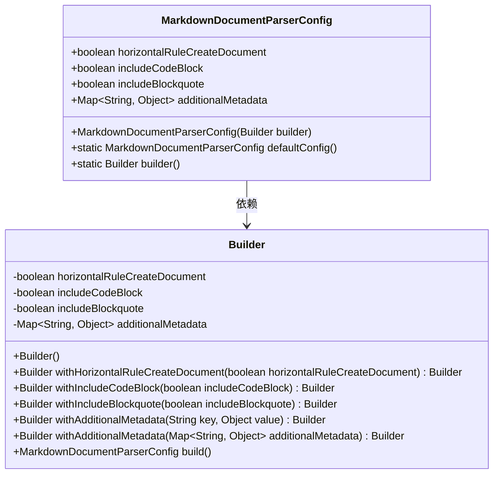
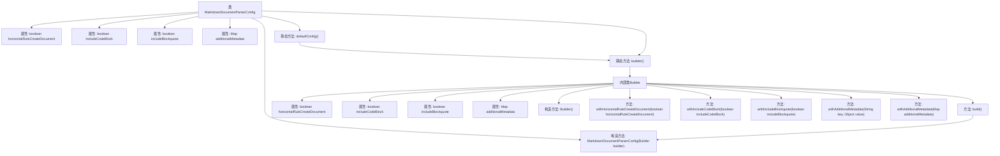

# 基础信息

|      |      |
|------|------|
| 名称 | MarkdownDocumentParserConfig |
| 编码语言 | .java |
| 代码路径 | spring-ai-alibaba/community/document-parsers/spring-ai-alibaba-starter-document-parser-markdown/src/main/java/com/alibaba/cloud/ai/parser/markdown/config/MarkdownDocumentParserConfig.java |
| 包名 | com.alibaba.cloud.ai.parser.markdown.config |
| 依赖项 | ['org.springframework.ai.document.Document', 'org.springframework.util.Assert', 'java.util.HashMap', 'java.util.Map'] |
| 概述说明 | Markdown解析配置类支持水平线、代码块、引用块及元数据设置。 |

# 说明

Markdown文档解析配置类用于定义解析Markdown文档时的各类元素处理方式。该类包含对水平线、代码块、引用块以及元数据的设置。通过这些配置，用户可以自定义解析过程中如何处理这些特定元素，确保解析结果符合预期需求。配置类提供了灵活的设置选项，适用于不同的Markdown解析场景。

# 类列表 Class Summary

| 名称   | 类型  | 说明 |
|-------|------|-------------|
| MarkdownDocumentParserConfig | class | Markdown文档解析配置类，包含水平线、代码块、引用块及元数据设置。 |

## 类 MarkdownDocumentParserConfig

|      |      |
|------|------|
| 访问范围 | public |
| 类型 | class |
| 名称 | MarkdownDocumentParserConfig |
| 说明 | Markdown文档解析配置类，包含水平线、代码块、引用块及元数据设置。 |

### UML类图

这段代码定义了一个 `MarkdownDocumentParserConfig` 类及其内部的 `Builder` 类，用于配置 Markdown 文档解析器的行为。`MarkdownDocumentParserConfig` 类包含四个公有字段，分别控制水平线是否创建新文档、是否包含代码块、是否包含引用块以及附加元数据。`Builder` 类提供了链式方法设置这些配置，并通过 `build` 方法生成不可变的 `MarkdownDocumentParserConfig` 实例。这种设计模式常用于构建复杂对象的配置。

### 内部方法调用关系图

这段代码定义了一个`MarkdownDocumentParserConfig`类及其内部类`Builder`，用于配置Markdown文档解析器的行为。`MarkdownDocumentParserConfig`类包含四个属性，分别控制是否通过水平线创建新文档、是否包含代码块、是否包含引用块以及附加元数据。`Builder`类提供了设置这些属性的方法，并最终通过`build`方法生成不可变的配置对象。流程图展示了类的结构及其内部方法调用关系。

### 字段列表 Field List

| 名称  | 类型  | 说明 |
|-------|-------|------|
| additionalMetadata | Map<String, Object> | 定义了一个不可变Map，存储键值对元数据。 |
| includeCodeBlock | boolean | 包含代码块的公共最终布尔变量。 |
| includeBlockquote | boolean | 该代码定义了一个不可变的布尔变量includeBlockquote。 |
| horizontalRuleCreateDocument | boolean | 该布尔变量控制是否在创建文档时添加水平分隔线。 |

### 方法列表 Method List

| 名称  | 类型  | 说明 |
|-------|-------|------|
| defaultConfig | MarkdownDocumentParserConfig | 定义默认配置的静态方法，返回构建器生成的Markdown解析配置。 |
| builder | Builder | 静态方法`builder()`返回一个新的`Builder`实例。 |

