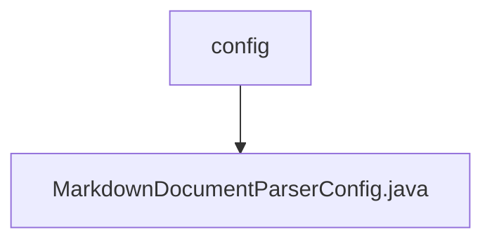

# 基础信息

|      |      |
|------|------|
| 名称 | config |
| 编码语言 | .java |
| 代码路径 | spring-ai-alibaba/community/document-parsers/spring-ai-alibaba-starter-document-parser-markdown/src/main/java/com/alibaba/cloud/ai/parser/markdown/config |
| 包名 | spring-ai-alibaba.community.document-parsers.spring-ai-alibaba-starter-document-parser-markdown.src.main.java.com.alibaba.cloud.ai.parser.markdown.config |
| 概述说明 | Markdown解析配置类支持水平线、代码块、引用块及元数据设置。 |

# 说明

Markdown文档解析配置类用于定义解析Markdown文档时的各类元素处理方式。该类包含对水平线、代码块、引用块以及元数据的设置。通过这些配置，用户可以自定义解析过程中如何处理这些特定元素，确保解析结果符合预期需求。配置类提供了灵活的设置选项，适用于不同的Markdown解析场景。

### 包内部结构视图

该流程图展示了`config`文件夹与`MarkdownDocumentParserConfig.java`文件之间的层级关系。`config`文件夹包含了一个配置文件`MarkdownDocumentParserConfig.java`，表示配置文件的存储位置及其与父文件夹的关系。

# 文件列表 File List

| 名称   | 类型  | 说明 |
|-------|------|-------------|
| [MarkdownDocumentParserConfig.java](MarkdownDocumentParserConfig.md) | file | Markdown解析配置类支持水平线、代码块、引用块及元数据设置。 |

