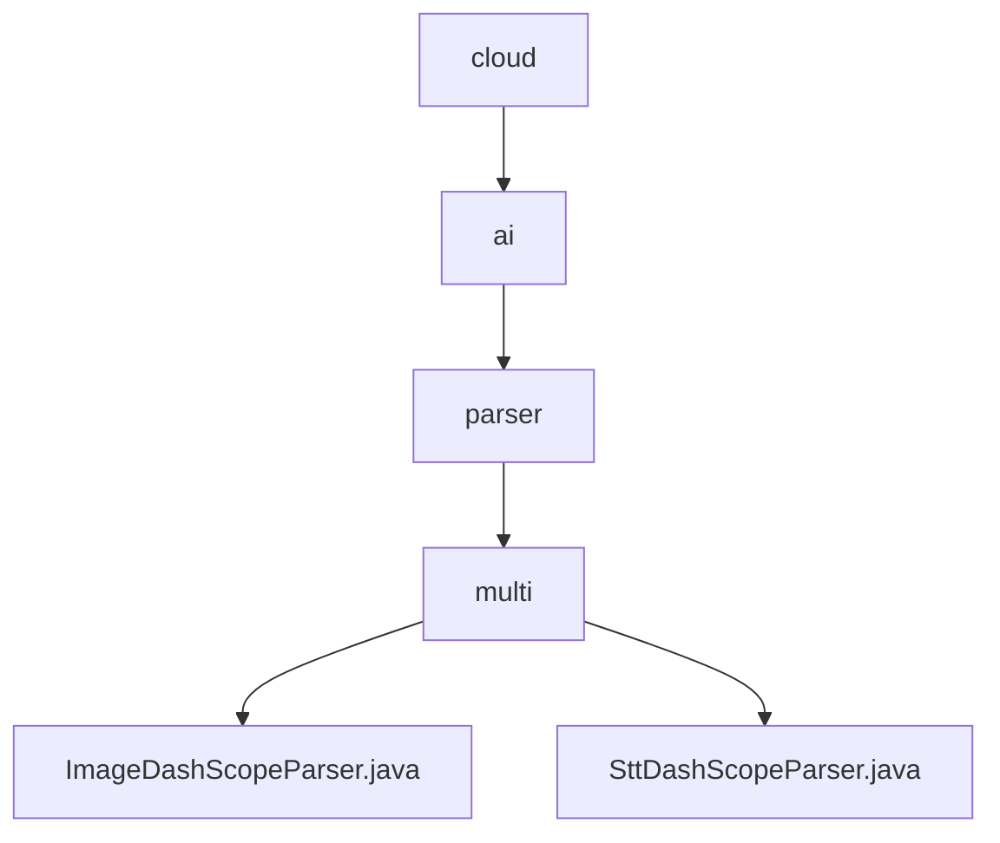

# 基础信息

|      |      |
|------|------|
| 名称 | cloud |
| 编码语言 | .java |
| 代码路径 | spring-ai-alibaba/community/document-parsers/spring-ai-alibaba-starter-document-parser-multi-modality/src/main/java/com/alibaba/cloud |
| 包名 | spring-ai-alibaba.community.document-parsers.spring-ai-alibaba-starter-document-parser-multi-modality.src.main.java.com.alibaba.cloud |
| 概述说明 | ImageDashScopeParser类解析图像文本，兼容多系统路径处理。SttDashScopeParser类转换音频为文本，集成API密钥高效识别。 |

# 说明

## 概述

该代码模块是一个多模态文档解析工具集，主要提供图像和音频文件的文本解析功能。模块通过集成先进的API技术，实现了高效的图像文字识别和音频转文本功能。模块中的类设计兼容多种操作系统环境，确保路径处理的灵活性，同时支持通过API密钥访问特定的模型，以满足不同应用场景的需求。

## 主要业务场景

1. **图像文字识别**：通过`ImageDashScopeParser`类，用户可以解析图像文件中的文本内容。该类支持在不同操作系统上处理路径，并通过调用多模态API实现高效的图像文字识别与提取。适用于需要从图像中提取文字的应用场景，如文档扫描、图像中的文字识别等。

2. **音频转文本**：通过`SttDashScopeParser`类，用户可以将音频文件转换为可读的文本。该类通过使用API密钥和特定模型，高效准确地将音频数据转换为文本。适用于需要将语音转换为文字的应用场景，如语音转录、语音助手等。

这两个类共同构成了一个强大的多模态文档解析工具集，能够处理多种类型的文件，并从中提取有用的文本信息。

### 包内部结构视图

该流程图展示了`spring-ai-alibaba`项目中`document-parsers`模块的层级结构。从`cloud`节点开始，依次向下展开为`ai`、`parser`和`multi`三个子节点，最终在`multi`节点下包含了两个具体的解析器类文件：`ImageDashScopeParser.java`和`SttDashScopeParser.java`。整个结构清晰地反映了模块内部的层级关系和文件分布。

# 文件列表 File List

| 名称   | 类型  | 说明 |
|-------|------|-------------|
| [ai](ai/_module.md) | package | ImageDashScopeParser类解析图像文本，兼容多系统路径处理。SttDashScopeParser类转换音频为文本，集成API密钥高效识别。 |

