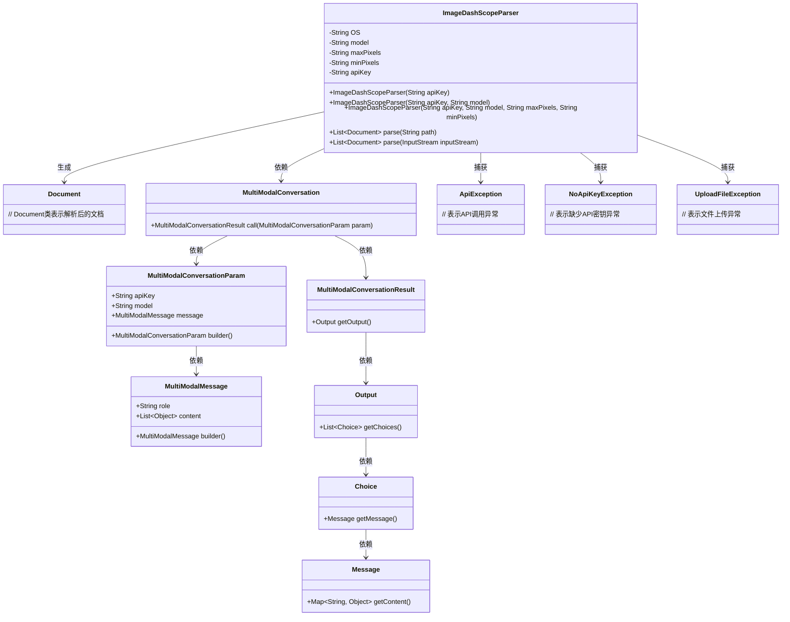
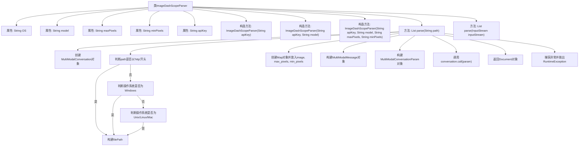

# 基础信息

|      |      |
|------|------|
| 名称 | ImageDashScopeParser |
| 编码语言 | .java |
| 代码路径 | spring-ai-alibaba/community/document-parsers/spring-ai-alibaba-starter-document-parser-multi-modality/src/main/java/com/alibaba/cloud/ai/parser/multi/ImageDashScopeParser.java |
| 包名 | com.alibaba.cloud.ai.parser.multi |
| 依赖项 | ['java.io.InputStream', 'java.util.Arrays', 'java.util.Collections', 'java.util.List', 'java.util.Map', 'java.util.HashMap', 'com.alibaba.cloud.ai.document.DocumentParser', 'com.alibaba.dashscope.aigc.multimodalconversation.MultiModalConversation', 'com.alibaba.dashscope.aigc.multimodalconversation.MultiModalConversationParam', 'com.alibaba.dashscope.aigc.multimodalconversation.MultiModalConversationResult', 'com.alibaba.dashscope.common.MultiModalMessage', 'com.alibaba.dashscope.common.Role', 'com.alibaba.dashscope.exception.ApiException', 'com.alibaba.dashscope.exception.NoApiKeyException', 'com.alibaba.dashscope.exception.UploadFileException', 'org.springframework.ai.document.Document'] |
| 概述说明 | ImageDashScopeParser类解析图像文本，支持多系统路径，调用多模态API提取文字。 |

# 说明

ImageDashScopeParser类是一个用于解析图像文本的工具，支持在不同操作系统上处理路径，并通过调用多模态API来提取图像中的文字内容。该类的设计旨在兼容多种操作系统环境，确保路径处理的灵活性，同时利用先进的API技术实现高效的图像文字识别与提取功能。

# 类列表 Class Summary

| 名称   | 类型  | 说明 |
|-------|------|-------------|
| ImageDashScopeParser | class | ImageDashScopeParser类用于解析图像文本，支持不同操作系统路径处理，调用多模态API提取图像文字。 |

## 类 ImageDashScopeParser

|      |      |
|------|------|
| 访问范围 | public |
| 类型 | class |
| 名称 | ImageDashScopeParser |
| 说明 | ImageDashScopeParser类用于解析图像文本，支持不同操作系统路径处理，调用多模态API提取图像文字。 |

### UML类图

**描述：**  
`ImageDashScopeParser` 类用于解析图像文档，通过调用多模态对话API来提取图像中的文本。它依赖于 `MultiModalConversation` 类来处理API请求，并生成 `Document` 对象。该类还处理了多种异常情况，如 `ApiException`、`NoApiKeyException` 和 `UploadFileException`，以确保代码的健壮性。

### 内部方法调用关系图

**描述：**  
`ImageDashScopeParser`类用于解析图像文档，通过构造方法初始化API密钥、模型名称、最大像素和最小像素等属性。`parse(String path)`方法根据路径判断是否为HTTP链接或本地文件，并构建相应的文件路径。然后，通过`MultiModalConversation`对象进行图像文本的识别，最终返回解析后的文档内容。若在解析过程中出现异常，将抛出`RuntimeException`。

### 字段列表 Field List

| 名称  | 类型  | 说明 |
|-------|-------|------|
| OS = System.getProperty("os.name").toLowerCase() | String | 获取系统名称并转换为小写存储。 |
| minPixels | String | 私有字符串变量minPixels的声明。 |
| model | String | 定义了一个私有的不可变字符串变量model。 |
| apiKey | String | 声明一个私有的不可变字符串变量apiKey。 |
| maxPixels | String | 私有字符串变量maxPixels |

### 方法列表 Method List

| 名称  | 类型  | 说明 |
|-------|-------|------|
| parse | List<Document> | 解析路径生成多模态对话，返回图像文本内容。 |
| parse | List<Document> | 重写parse方法，返回空文档列表。 |

