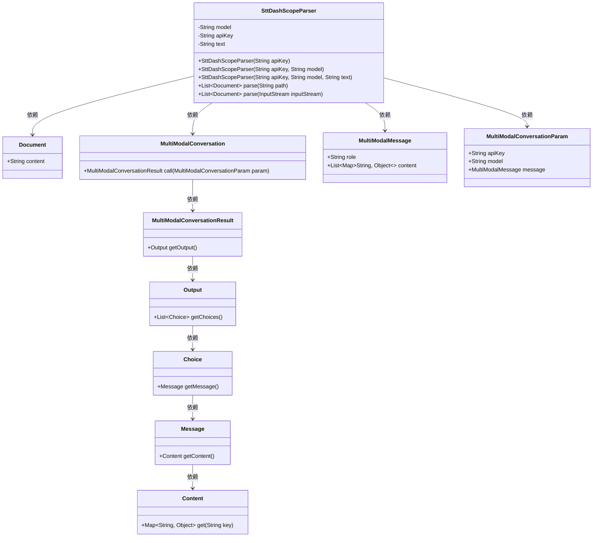
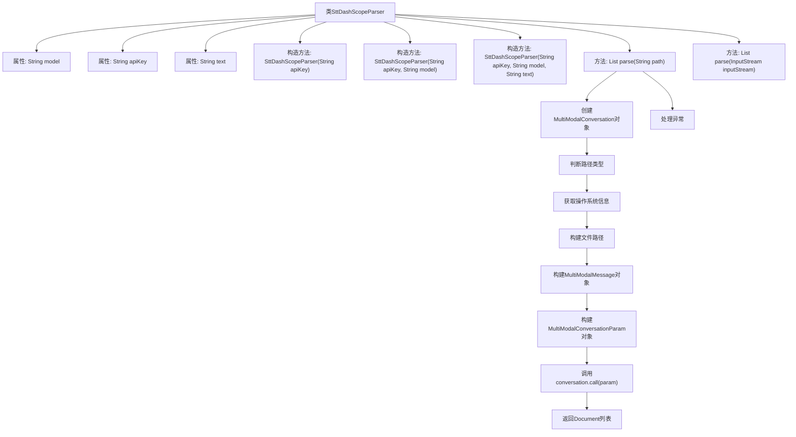

# 基础信息

|      |      |
|------|------|
| 名称 | SttDashScopeParser |
| 编码语言 | .java |
| 代码路径 | spring-ai-alibaba/community/document-parsers/spring-ai-alibaba-starter-document-parser-multi-modality/src/main/java/com/alibaba/cloud/ai/parser/multi/SttDashScopeParser.java |
| 包名 | com.alibaba.cloud.ai.parser.multi |
| 依赖项 | ['java.io.InputStream', 'java.util.Arrays', 'java.util.HashMap', 'java.util.List', 'com.alibaba.cloud.ai.document.DocumentParser', 'com.alibaba.dashscope.aigc.multimodalconversation.MultiModalConversation', 'com.alibaba.dashscope.aigc.multimodalconversation.MultiModalConversationParam', 'com.alibaba.dashscope.aigc.multimodalconversation.MultiModalConversationResult', 'com.alibaba.dashscope.common.MultiModalMessage', 'com.alibaba.dashscope.common.Role', 'com.alibaba.dashscope.exception.ApiException', 'com.alibaba.dashscope.exception.NoApiKeyException', 'com.alibaba.dashscope.exception.UploadFileException', 'org.springframework.ai.document.Document'] |
| 概述说明 | SttDashScopeParser类解析音频文件，利用API密钥和模型生成文本。 |

# 说明

SttDashScopeParser类是一个用于解析音频文件的工具，它通过使用API密钥和特定模型来生成文本内容。该类的核心功能是将音频数据转换为可读的文本，适用于需要将语音转换为文字的应用场景。通过集成API密钥，用户可以访问特定的语音识别模型，从而高效准确地完成音频到文本的转换任务。

# 类列表 Class Summary

| 名称   | 类型  | 说明 |
|-------|------|-------------|
| SttDashScopeParser | class | SttDashScopeParser类用于解析音频文件，通过API密钥和模型生成文本内容。 |

## 类 SttDashScopeParser

|      |      |
|------|------|
| 访问范围 | public |
| 类型 | class |
| 名称 | SttDashScopeParser |
| 说明 | SttDashScopeParser类用于解析音频文件，通过API密钥和模型生成文本内容。 |

### UML类图

这段代码定义了一个`SttDashScopeParser`类，用于解析音频文件并将其转换为文本。该类通过调用`MultiModalConversation`类来处理音频文件，并生成`Document`对象。`SttDashScopeParser`类有三个构造函数，分别用于初始化API密钥、模型和文本。`parse`方法根据文件路径或输入流解析音频文件，并返回包含解析结果的`Document`对象。整个流程涉及多个辅助类，如`MultiModalMessage`、`MultiModalConversationParam`和`MultiModalConversationResult`，用于构建和处理多模态对话的请求和响应。

### 内部方法调用关系图

这段代码定义了一个名为`SttDashScopeParser`的类，用于解析音频文件并生成文档。类包含三个属性：`model`、`apiKey`和`text`，以及三个构造方法用于初始化这些属性。`parse(String path)`方法通过判断路径类型和操作系统信息，构建文件路径并调用`MultiModalConversation`对象进行处理，最终返回解析后的文档列表。`parse(InputStream inputStream)`方法目前返回空列表。

### 字段列表 Field List

| 名称  | 类型  | 说明 |
|-------|-------|------|
| apiKey | String | 私有且不可变的API密钥字符串。 |
| text | String | 私有不可变字符串变量text。 |
| model | String | 定义了一个私有且不可变的字符串变量model。 |

### 方法列表 Method List

| 名称  | 类型  | 说明 |
|-------|-------|------|
| parse | List<Document> | 重写方法，返回空文档列表。 |
| parse | List<Document> | 解析路径生成多模态对话结果，返回文档列表。 |

