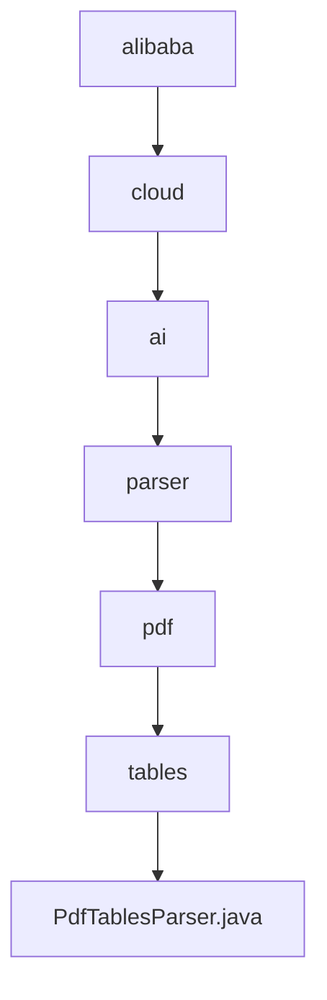

# 基础信息

|      |      |
|------|------|
| 名称 | alibaba |
| 编码语言 | .java |
| 代码路径 | spring-ai-alibaba/community/document-parsers/spring-ai-alibaba-starter-document-parser-pdf-tables/src/main/java/com/alibaba |
| 包名 | spring-ai-alibaba.community.document-parsers.spring-ai-alibaba-starter-document-parser-pdf-tables.src.main.java.com.alibaba |
| 概述说明 | PdfTablesParser类解析PDF表格，支持指定页码和元数据，提取为文档列表。 |

# 说明

PdfTablesParser类用于解析PDF文件中的表格数据，支持用户指定特定的页码和元数据。通过该类的功能，能够将PDF中的表格数据提取并转换为文档列表，便于后续处理和分析。这一工具在处理包含大量表格的PDF文件时，能够有效提高数据提取的效率和准确性。

### 包内部结构视图

该流程图展示了从`alibaba`到`PdfTablesParser.java`的层级关系。每个节点代表路径中的一个文件夹或文件，最终指向`PdfTablesParser.java`文件。层级关系清晰，符合路径的嵌套结构。

# 文件列表 File List

| 名称   | 类型  | 说明 |
|-------|------|-------------|
| [cloud](cloud/_module.md) | package | PdfTablesParser类解析PDF表格，支持指定页码和元数据，提取为文档列表。 |

