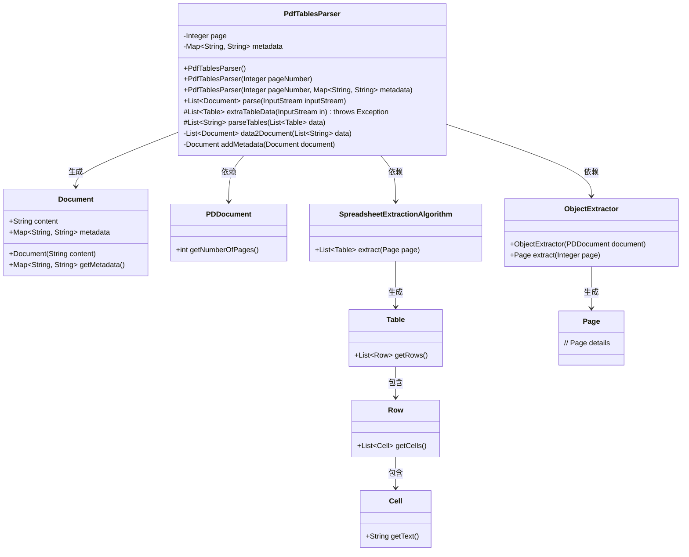
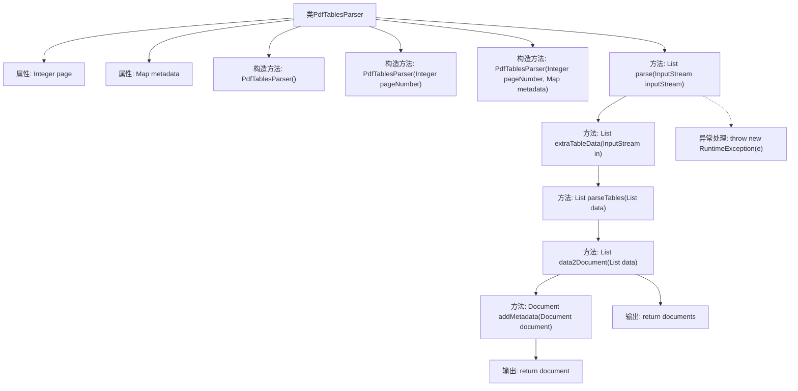

# 基础信息

|      |      |
|------|------|
| 名称 | PdfTablesParser |
| 编码语言 | .java |
| 代码路径 | spring-ai-alibaba/community/document-parsers/spring-ai-alibaba-starter-document-parser-pdf-tables/src/main/java/com/alibaba/cloud/ai/parser/pdf/tables/PdfTablesParser.java |
| 包名 | com.alibaba.cloud.ai.parser.pdf.tables |
| 依赖项 | ['java.io.InputStream', 'java.util.ArrayList', 'java.util.Collections', 'java.util.List', 'java.util.Map', 'java.util.stream.Collectors', 'com.alibaba.cloud.ai.document.DocumentParser', 'org.apache.pdfbox.pdmodel.PDDocument', 'technology.tabula.ObjectExtractor', 'technology.tabula.Page', 'technology.tabula.Table', 'technology.tabula.extractors.SpreadsheetExtractionAlgorithm', 'org.springframework.ai.document.Document'] |
| 概述说明 | PdfTablesParser类解析PDF表格，支持指定页码和元数据，提取为文档列表。 |

# 说明

PdfTablesParser类用于解析PDF文件中的表格数据，支持用户指定特定的页码和元数据。通过该类的功能，能够将PDF中的表格数据提取并转换为文档列表，便于后续处理和分析。这一工具在处理包含大量表格的PDF文件时，能够有效提高数据提取的效率和准确性。

# 类列表 Class Summary

| 名称   | 类型  | 说明 |
|-------|------|-------------|
| PdfTablesParser | class | PdfTablesParser类解析PDF表格数据，支持指定页码和元数据，提取并转换为文档列表。 |

## 类 PdfTablesParser

|      |      |
|------|------|
| 访问范围 | public |
| 类型 | class |
| 名称 | PdfTablesParser |
| 说明 | PdfTablesParser类解析PDF表格数据，支持指定页码和元数据，提取并转换为文档列表。 |

### UML类图

### 描述
`PdfTablesParser` 类用于解析 PDF 文件中的表格数据，并将其转换为 `Document` 对象。该类通过构造函数支持指定页码和元数据，提供了多个受保护的方法来提取表格数据、解析表格内容以及将数据转换为文档对象。`PdfTablesParser` 依赖于 `PDDocument`、`SpreadsheetExtractionAlgorithm` 和 `ObjectExtractor` 类来完成 PDF 文件的加载和表格提取。最终生成的 `Document` 对象包含从表格中提取的内容以及可选的元数据。

### 内部方法调用关系图

**描述：**
该流程图展示了`PdfTablesParser`类的结构和主要方法调用关系。类包含两个属性`page`和`metadata`，以及三个构造方法用于初始化这些属性。`parse`方法负责解析PDF文件，调用`extraTableData`提取表格数据，然后通过`parseTables`和`data2Document`方法将数据转换为文档对象，并添加元数据。流程图清晰地展示了方法之间的调用顺序和异常处理流程。

### 字段列表 Field List

| 名称  | 类型  | 说明 |
|-------|-------|------|
| page | Integer | 定义了一个私有的不可变整数变量page。 |
| metadata | Map<String, String> | 私有不可变的字符串键值对映射。 |

### 方法列表 Method List

| 名称  | 类型  | 说明 |
|-------|-------|------|
| addMetadata | Document | 为文档添加元数据，若元数据为空则返回原文档。 |
| parseTables | List<String> | 解析表格数据，合并单元格内容并用竖线分隔。 |
| data2Document | List<Document> | 将字符串列表转换为文档对象列表，若为空返回null。 |
| parse | List<Document> | 解析输入流并转换为文档列表，异常时抛出运行时异常。 |
| extraTableData | List<Table> | 方法从PDF文件中提取指定页面的表格数据，验证页数后使用算法进行提取。 |

