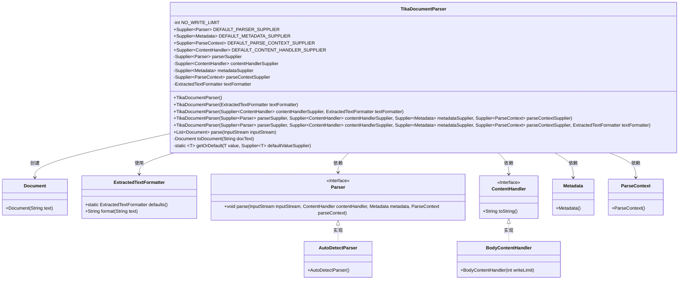

# 基础信息

|      |      |
|------|------|
| 名称 | TikaDocumentParser |
| 编码语言 | .java |
| 代码路径 | spring-ai-alibaba/community/document-parsers/spring-ai-alibaba-starter-document-parser-tika/src/main/java/com/alibaba/cloud/ai/parser/tika/TikaDocumentParser.java |
| 包名 | com.alibaba.cloud.ai.parser.tika |
| 依赖项 | ['com.alibaba.cloud.ai.document.DocumentParser', 'org.apache.tika.exception.ZeroByteFileException', 'org.apache.tika.metadata.Metadata', 'org.apache.tika.parser.AutoDetectParser', 'org.apache.tika.parser.ParseContext', 'org.apache.tika.parser.Parser', 'org.apache.tika.sax.BodyContentHandler', 'org.springframework.ai.document.Document', 'org.springframework.ai.reader.ExtractedTextFormatter', 'org.xml.sax.ContentHandler', 'java.io.InputStream', 'java.util.Collections', 'java.util.List', 'java.util.Objects', 'java.util.function.Supplier'] |
| 概述说明 | TikaDocumentParser类支持自定义解析器、内容处理器、元数据和解析上下文，默认使用AutoDetectParser和BodyContentHandler。 |

# 说明

TikaDocumentParser类用于实现文档解析功能，支持自定义解析器、内容处理器、元数据和解析上下文。默认情况下，该类使用AutoDetectParser进行自动检测解析，并采用BodyContentHandler处理文档内容。这一设计提供了灵活的解析选项，同时确保了默认配置的高效性和适用性。

# 类列表 Class Summary

| 名称   | 类型  | 说明 |
|-------|------|-------------|
| TikaDocumentParser | class | TikaDocumentParser类实现文档解析，支持自定义解析器、内容处理器、元数据和解析上下文，默认使用AutoDetectParser和BodyContentHandler。 |

## 类 TikaDocumentParser

|      |      |
|------|------|
| 访问范围 | public |
| 类型 | class |
| 名称 | TikaDocumentParser |
| 说明 | TikaDocumentParser类实现文档解析，支持自定义解析器、内容处理器、元数据和解析上下文，默认使用AutoDetectParser和BodyContentHandler。 |

### UML类图

### 描述
`TikaDocumentParser` 类是一个用于解析文档的工具，它依赖于多个 Tika 组件（如 `Parser`、`ContentHandler`、`Metadata` 和 `ParseContext`）来处理输入流并生成 `Document` 对象。该类提供了多个构造函数，允许用户自定义各个组件的供应商，若未提供则使用默认值。`parse` 方法负责解析输入流并返回文档列表，而 `toDocument` 方法将提取的文本格式化为 `Document` 对象。

### 内部方法调用关系图

```mermaid
graph TD
    A["类TikaDocumentParser"]
    B["常量: int NO_WRITE_LIMIT = -1"]
    C["常量: Supplier<Parser> DEFAULT_PARSER_SUPPLIER = AutoDetectParser::new"]
    D["常量: Supplier<Metadata> DEFAULT_METADATA_SUPPLIER = Metadata::new"]
    E["常量: Supplier<ParseContext> DEFAULT_PARSE_CONTEXT_SUPPLIER = ParseContext::new"]
    F["常量: Supplier<ContentHandler> DEFAULT_CONTENT_HANDLER_SUPPLIER = () -> new BodyContentHandler(NO_WRITE_LIMIT)"]
    G["属性: Supplier<Parser> parserSupplier"]
    H["属性: Supplier<ContentHandler> contentHandlerSupplier"]
    I["属性: Supplier<Metadata> metadataSupplier"]
    J["属性: Supplier<ParseContext> parseContextSupplier"]
    K["属性: ExtractedTextFormatter textFormatter"]
    L["构造方法: TikaDocumentParser()"]
    M["构造方法: TikaDocumentParser(ExtractedTextFormatter textFormatter)"]
    N["构造方法: TikaDocumentParser(Supplier<ContentHandler> contentHandlerSupplier, ExtractedTextFormatter textFormatter)"]
    O["构造方法: TikaDocumentParser(Supplier<Parser> parserSupplier, Supplier<ContentHandler> contentHandlerSupplier, Supplier<Metadata> metadataSupplier, Supplier<ParseContext> parseContextSupplier)"]
    P["构造方法: TikaDocumentParser(Supplier<Parser> parserSupplier, Supplier<ContentHandler> contentHandlerSupplier, Supplier<Metadata> metadataSupplier, Supplier<ParseContext> parseContextSupplier, ExtractedTextFormatter textFormatter)"]
    Q["方法: List<Document> parse(InputStream inputStream)"]
    R["方法: Document toDocument(String docText)"]
    S["方法: <T> T getOrDefault(T value, Supplier<T> defaultValueSupplier)"]

    A --> B
    A --> C
    A --> D
    A --> E
    A --> F
    A --> G
    A --> H
    A --> I
    A --> J
    A --> K
    A --> L
    A --> M
    A --> N
    A --> O
    A --> P
    A --> Q
    A --> R
    A --> S
    Q --> R
    P --> Q
    P --> R
    P --> S
```

这段代码定义了一个`TikaDocumentParser`类，用于解析文档并转换为`Document`对象。类中包含多个构造方法和解析方法，支持自定义的Tika组件供应商和文本格式化器。主要功能是通过输入流解析文档内容，并将其格式化为`Document`对象。流程图展示了类的结构、属性和方法之间的关系，以及方法之间的调用链。

### 字段列表 Field List

| 名称  | 类型  | 说明 |
|-------|-------|------|
| textFormatter | ExtractedTextFormatter | 私有且不可变的文本格式化工具实例。 |
| NO_WRITE_LIMIT = -1 | int | 定义常量NO_WRITE_LIMIT，值为-1，表示无写入限制。 |
| contentHandlerSupplier | Supplier<ContentHandler> | 私有最终内容处理器供应商字段。 |
| DEFAULT_CONTENT_HANDLER_SUPPLIER = () -> new BodyContentHandler(			NO_WRITE_LIMIT) | Supplier<ContentHandler> | 默认内容处理器供应商返回无写入限制的主体内容处理器。 |
| parseContextSupplier | Supplier<ParseContext> | 私有最终解析上下文供应商。 |
| parserSupplier | Supplier<Parser> | 私有最终解析器供应商字段。 |
| DEFAULT_PARSER_SUPPLIER = AutoDetectParser::new | Supplier<Parser> | 定义默认解析器供应商为自动检测解析器。 |
| DEFAULT_METADATA_SUPPLIER = Metadata::new | Supplier<Metadata> | 定义默认元数据供应商为Metadata构造函数。 |
| DEFAULT_PARSE_CONTEXT_SUPPLIER = ParseContext::new | Supplier<ParseContext> | 默认解析上下文供应商为ParseContext的新实例。 |
| metadataSupplier | Supplier<Metadata> | 私有字段，类型为Supplier<Metadata>，用于提供Metadata实例。 |

### 方法列表 Method List

| 名称  | 类型  | 说明 |
|-------|-------|------|
| parse | List<Document> | 解析输入流生成文档列表，处理异常和空内容。 |
| getOrDefault | T | 获取默认值方法：若值为空则调用默认值提供者。 |
| toDocument | Document | 将字符串格式化为文档对象，处理空值。 |

