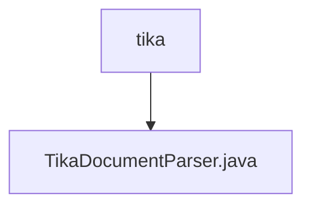

# 基础信息

|      |      |
|------|------|
| 名称 | tika |
| 编码语言 | .java |
| 代码路径 | spring-ai-alibaba/community/document-parsers/spring-ai-alibaba-starter-document-parser-tika/src/main/java/com/alibaba/cloud/ai/parser/tika |
| 包名 | spring-ai-alibaba.community.document-parsers.spring-ai-alibaba-starter-document-parser-tika.src.main.java.com.alibaba.cloud.ai.parser.tika |
| 概述说明 | TikaDocumentParser类支持自定义解析器、内容处理器、元数据和解析上下文，默认使用AutoDetectParser和BodyContentHandler。 |

# 说明

TikaDocumentParser类用于实现文档解析功能，支持自定义解析器、内容处理器、元数据和解析上下文。默认情况下，该类使用AutoDetectParser进行自动检测解析，并采用BodyContentHandler处理文档内容。这一设计提供了灵活的解析选项，同时确保了默认配置的高效性和适用性。

### 包内部结构视图

该流程图展示了`tika`文件夹与其包含的`TikaDocumentParser.java`文件之间的层级关系。`tika`作为父节点，直接包含`TikaDocumentParser.java`文件，表明后者是前者目录下的一个具体实现文件。这种结构常用于项目中的模块划分，确保代码的组织清晰且易于维护。

# 文件列表 File List

| 名称   | 类型  | 说明 |
|-------|------|-------------|
| [TikaDocumentParser.java](TikaDocumentParser.md) | file | TikaDocumentParser类支持自定义解析器、内容处理器、元数据和解析上下文，默认使用AutoDetectParser和BodyContentHandler。 |

