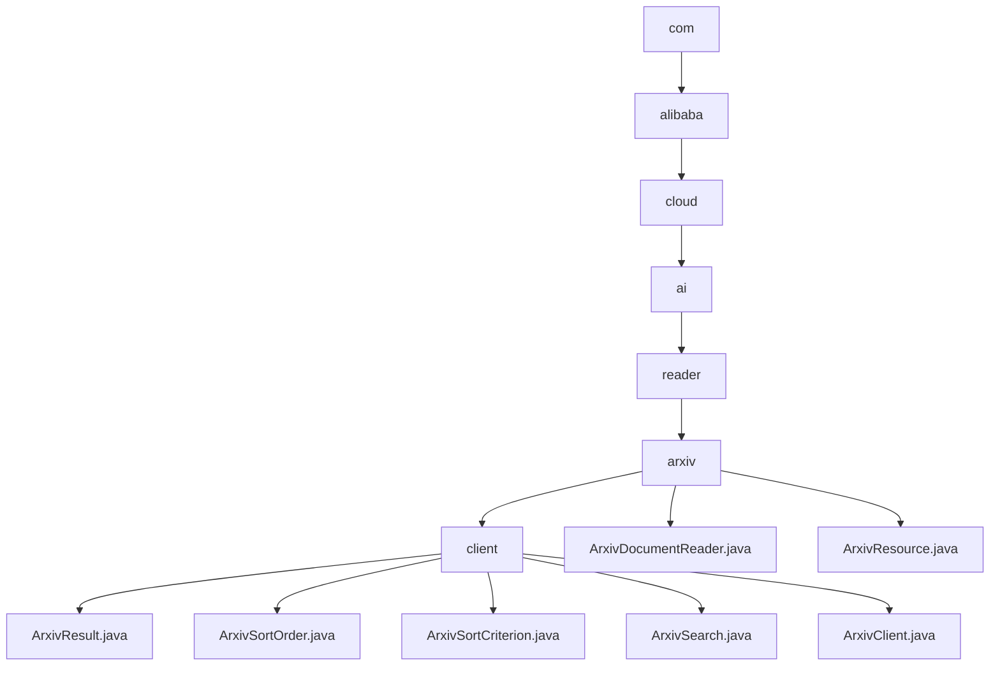

# 基础信息

|      |      |
|------|------|
| 名称 | com |
| 编码语言 | .java |
| 代码路径 | spring-ai-alibaba/community/document-readers/spring-ai-alibaba-starter-document-reader-arxiv/src/main/java/com |
| 包名 | spring-ai-alibaba.community.document-readers.spring-ai-alibaba-starter-document-reader-arxiv.src.main.java.com |
| 概述说明 | 该模块用于管理和查询Arxiv论文，支持元数据存储、搜索配置、分页查询、重试机制、频率控制和PDF下载。 |

# 说明

## 概述
该代码模块是一个用于管理和查询Arxiv学术论文的工具集，提供了从论文元数据管理到实际查询和下载的完整解决方案。模块中的各个类协同工作，支持论文信息的存储、搜索配置、分页查询、重试机制、请求频率控制以及PDF下载等功能。此外，模块还包含专门用于处理Arxiv文档的读取器类，能够高效地提取和管理论文的元数据，适用于需要批量处理或频繁访问Arxiv文档的场景。

## 主要业务场景
1. **论文信息管理**：通过`ArxivResult`类，用户可以存储和管理学术论文的详细信息，包括标题、作者、摘要、DOI、分类等元数据，便于后续的检索和使用。
2. **论文搜索配置**：`ArxivSearch`类允许用户灵活配置搜索参数，如查询字符串、文章ID列表、最大返回结果数量、排序标准和顺序，以优化搜索结果。
3. **分页查询与重试机制**：`ArxivClient`类支持分页查询，避免一次性加载过多数据，并实现了重试机制，确保在请求失败时自动重试，提高查询的稳定性。
4. **请求频率控制**：`ArxivClient`类还提供了延迟请求功能，确保请求间隔符合Arxiv的频率限制，避免因频繁请求而被限制访问。
5. **PDF下载**：通过`ArxivClient`类，用户可以直接下载论文的PDF文件，方便后续的阅读和保存。
6. **Arxiv文档读取与解析**：`ArxivDocumentReader`类专门用于查询、解析和获取arXiv文档及其元数据，提取包括标题、作者、摘要、出版日期等在内的关键信息，确保数据的准确性和完整性。
7. **资源管理**：`ArxivResource`类用于管理Arxiv资源，主要功能包括处理查询字符串、设置最大文档数、管理临时文件路径，并提供文件输入流和清理功能，确保资源的高效管理和使用。

### 包内部结构视图

该流程图展示了`spring-ai-alibaba`项目中`document-reader-arxiv`模块的目录结构。从根目录`com`开始，逐级深入到`alibaba`、`cloud`、`ai`、`reader`和`arxiv`目录。`arxiv`目录下包含`client`子目录以及两个文件`ArxivDocumentReader.java`和`ArxivResource.java`。`client`目录下则包含了多个与Arxiv客户端相关的Java文件，如`ArxivResult.java`、`ArxivSortOrder.java`等。整个结构清晰地反映了模块的组织方式。

# 文件列表 File List

| 名称   | 类型  | 说明 |
|-------|------|-------------|
| [alibaba](alibaba/_module.md) | package | 该模块用于管理和查询Arxiv论文，支持元数据存储、搜索配置、分页查询、重试机制、频率控制和PDF下载。 |

