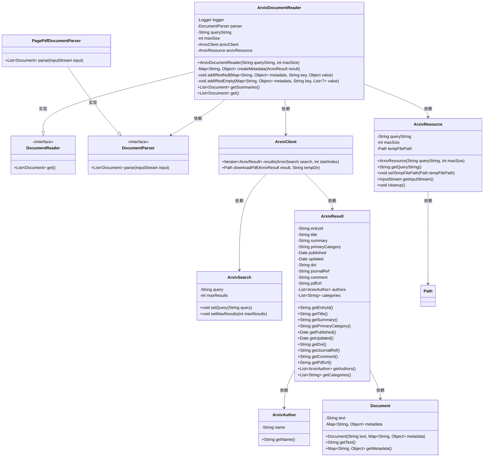
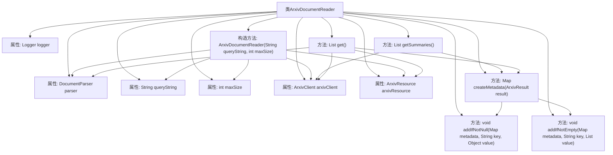

# 基础信息

|      |      |
|------|------|
| 名称 | ArxivDocumentReader |
| 编码语言 | .java |
| 代码路径 | spring-ai-alibaba/community/document-readers/spring-ai-alibaba-starter-document-reader-arxiv/src/main/java/com/alibaba/cloud/ai/reader/arxiv/ArxivDocumentReader.java |
| 包名 | com.alibaba.cloud.ai.reader.arxiv |
| 依赖项 | ['com.alibaba.cloud.ai.document.DocumentParser', 'com.alibaba.cloud.ai.parser.apache.pdfbox.PagePdfDocumentParser', 'com.alibaba.cloud.ai.reader.arxiv.client.ArxivClient', 'com.alibaba.cloud.ai.reader.arxiv.client.ArxivResult', 'com.alibaba.cloud.ai.reader.arxiv.client.ArxivSearch', 'org.slf4j.Logger', 'org.slf4j.LoggerFactory', 'org.springframework.ai.document.Document', 'org.springframework.ai.document.DocumentReader', 'org.springframework.util.Assert', 'java.io.IOException', 'java.nio.file.Files', 'java.nio.file.Path', 'java.util.ArrayList', 'java.util.HashMap', 'java.util.List', 'java.util.Map'] |
| 概述说明 | Arxiv文档读取器类，用于查询解析获取文档及元数据。 |

# 说明

Arxiv文档读取器类是一个专门设计用于查询、解析和获取arXiv文档及其元数据的工具。它能够高效地处理arXiv平台上的学术论文，提取包括标题、作者、摘要、出版日期等在内的关键信息。该类通过结构化的方式处理文档，确保数据的准确性和完整性，便于用户进行进一步的分析和研究。Arxiv文档读取器类适用于需要批量处理或频繁访问arXiv文档的场景，为学术研究和信息管理提供了便利。

# 类列表 Class Summary

| 名称   | 类型  | 说明 |
|-------|------|-------------|
| ArxivDocumentReader | class | Arxiv文档读取器类，用于查询、解析和获取arXiv文档及其元数据。 |

## 类 ArxivDocumentReader

|      |      |
|------|------|
| 访问范围 | public |
| 类型 | class |
| 名称 | ArxivDocumentReader |
| 说明 | Arxiv文档读取器类，用于查询、解析和获取arXiv文档及其元数据。 |

### UML类图

### 描述
`ArxivDocumentReader`类实现了`DocumentReader`接口，用于从arXiv平台读取文档。它依赖于`ArxivClient`进行API调用，`ArxivResource`管理资源，以及`DocumentParser`解析文档内容。`ArxivDocumentReader`通过`createMetadata`方法生成文档元数据，并通过`getSummaries`和`get`方法分别获取文档摘要和完整文档。整个类图展示了各个类之间的依赖关系和实现细节，确保文档读取和解析的完整流程。

### 内部方法调用关系图

**描述：**  
`ArxivDocumentReader` 类用于从 arXiv 读取文档，包含构造方法、创建元数据的方法、添加非空值的方法、获取文档摘要的方法以及获取完整文档的方法。构造方法初始化查询字符串、最大文档数量、文档解析器、arXiv 客户端和资源对象。`createMetadata` 方法生成文档的元数据，`addIfNotNull` 和 `addIfNotEmpty` 方法用于向元数据中添加非空值。`getSummaries` 方法获取文档摘要，`get` 方法获取完整文档并处理 PDF 文件。

### 字段列表 Field List

| 名称  | 类型  | 说明 |
|-------|-------|------|
| arxivClient | ArxivClient | 私有且不可变的ArxivClient实例。 |
| parser | DocumentParser | 私有成员变量：文档解析器实例。 |
| queryString | String | 私有字符串变量queryString。 |
| maxSize | int | 定义了一个私有的不可变整数变量maxSize。 |
| arxivResource | ArxivResource | 私有且不可变的ArxivResource实例。 |
| logger = LoggerFactory.getLogger(ArxivDocumentReader.class) | Logger | ArxivDocumentReader类中定义了一个静态的日志记录器。 |

### 方法列表 Method List

| 名称  | 类型  | 说明 |
|-------|-------|------|
| addIfNotEmpty | void | 方法将非空列表添加到元数据映射中。 |
| getSummaries | List<Document> | 从arXiv获取摘要，生成文档列表，包含元数据，处理异常。 |
| get | List<Document> | 通过Arxiv搜索下载PDF，解析并添加元数据，返回文档列表。 |
| createMetadata | Map<String, Object> | 方法创建元数据映射，包含非空字段和作者、分类列表。 |
| addIfNotNull | void | 方法`addIfNotNull`用于在值非空时将键值对添加到元数据映射中。 |

