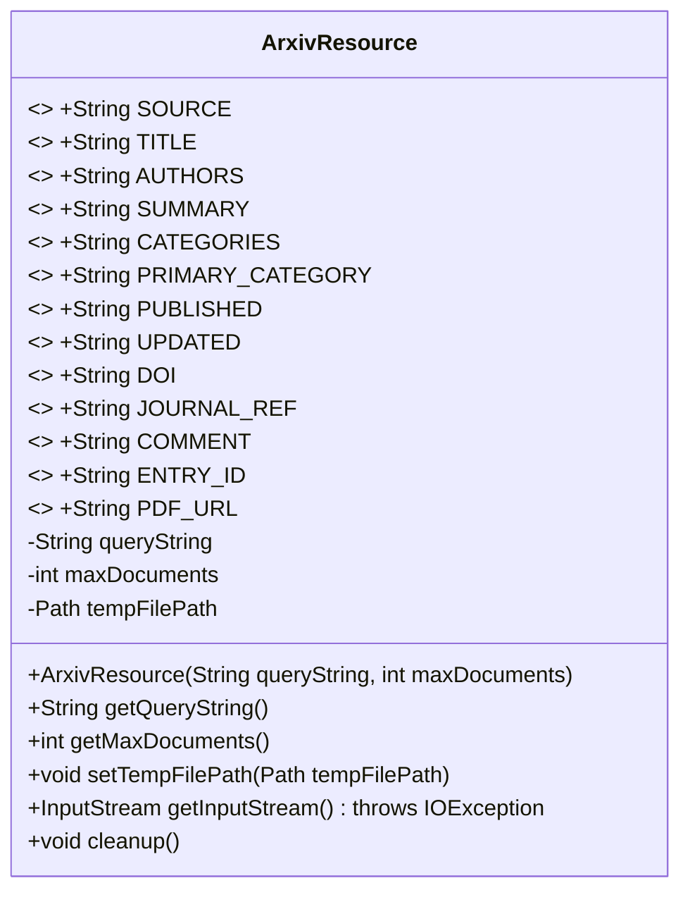

# 基础信息

|      |      |
|------|------|
| 名称 | ArxivResource |
| 编码语言 | .java |
| 代码路径 | spring-ai-alibaba/community/document-readers/spring-ai-alibaba-starter-document-reader-arxiv/src/main/java/com/alibaba/cloud/ai/reader/arxiv/ArxivResource.java |
| 包名 | com.alibaba.cloud.ai.reader.arxiv |
| 依赖项 | ['java.io.IOException', 'java.io.InputStream', 'java.nio.file.Files', 'java.nio.file.Path'] |
| 概述说明 | ArxivResource类管理Arxiv资源，支持查询、文档限制和文件处理。 |

# 说明

ArxivResource类用于管理Arxiv资源，主要功能包括处理查询字符串、设置最大文档数、管理临时文件路径，并提供文件输入流和清理功能，确保资源的高效管理和使用。

# 类列表 Class Summary

| 名称   | 类型  | 说明 |
|-------|------|-------------|
| ArxivResource | class | ArxivResource类用于管理Arxiv资源，包含查询字符串、最大文档数和临时文件路径，提供文件输入流和清理功能。 |

## 类 ArxivResource

|      |      |
|------|------|
| 访问范围 | public |
| 类型 | class |
| 名称 | ArxivResource |
| 说明 | ArxivResource类用于管理Arxiv资源，包含查询字符串、最大文档数和临时文件路径，提供文件输入流和清理功能。 |

### UML类图

**描述：**  
`ArxivResource` 类用于管理与 arXiv 资源相关的数据。它包含多个静态常量字段，表示 arXiv 资源的不同属性，如标题、作者、摘要等。类中还包含查询字符串、最大文档数和临时文件路径等私有字段。类提供了构造函数、获取查询字符串和最大文档数的方法，以及设置临时文件路径、获取输入流和清理临时文件的方法。该类的主要功能是处理与 arXiv 资源相关的数据操作，并提供对临时文件的访问和清理功能。

### 内部方法调用关系图

```mermaid
graph TD
    A["类ArxivResource"]
    B["常量: String SOURCE"]
    C["常量: String TITLE"]
    D["常量: String AUTHORS"]
    E["常量: String SUMMARY"]
    F["常量: String CATEGORIES"]
    G["常量: String PRIMARY_CATEGORY"]
    H["常量: String PUBLISHED"]
    I["常量: String UPDATED"]
    J["常量: String DOI"]
    K["常量: String JOURNAL_REF"]
    L["常量: String COMMENT"]
    M["常量: String ENTRY_ID"]
    N["常量: String PDF_URL"]
    O["属性: String queryString"]
    P["属性: int maxDocuments"]
    Q["属性: Path tempFilePath"]
    R["构造方法: ArxivResource(String queryString, int maxDocuments)"]
    S["方法: String getQueryString()"]
    T["方法: int getMaxDocuments()"]
    U["方法: void setTempFilePath(Path tempFilePath)"]
    V["方法: InputStream getInputStream() throws IOException"]
    W["方法: void cleanup()"]

    A --> B
    A --> C
    A --> D
    A --> E
    A --> F
    A --> G
    A --> H
    A --> I
    A --> J
    A --> K
    A --> L
    A --> M
    A --> N
    A --> O
    A --> P
    A --> Q
    A --> R
    A --> S
    A --> T
    A --> U
    A --> V
    A --> W
```

该流程图展示了`ArxivResource`类的结构和内部方法调用关系。类中包含多个常量定义，用于表示arXiv资源的不同属性。类还包含三个私有属性：`queryString`、`maxDocuments`和`tempFilePath`，分别用于存储查询字符串、最大文档数和临时文件路径。类提供了构造方法、获取属性值的方法、设置临时文件路径的方法、获取输入流的方法以及清理临时文件的方法。

### 字段列表 Field List

| 名称  | 类型  | 说明 |
|-------|-------|------|
| PDF_URL = "pdf_url" | String | 定义常量PDF_URL，值为"pdf_url"。 |
| tempFilePath | Path | 定义了一个私有路径变量tempFilePath。 |
| COMMENT = "comment" | String | 定义常量字符串COMMENT，值为"comment"。 |
| maxDocuments | int | 私有整型变量maxDocuments用于存储最大文档数量。 |
| JOURNAL_REF = "journal_ref" | String | 定义了一个静态常量字符串JOURNAL_REF，值为"journal_ref"。 |
| PRIMARY_CATEGORY = "primary_category" | String | 定义常量PRIMARY_CATEGORY，值为"primary_category"。 |
| PUBLISHED = "published" | String | 定义了一个公共静态常量字符串"published"。 |
| ENTRY_ID = "entry_id" | String | 定义常量字符串ENTRY_ID，值为"entry_id"。 |
| AUTHORS = "authors" | String | 定义静态常量AUTHORS，值为"authors"。 |
| CATEGORIES = "categories" | String | 定义静态常量CATEGORIES，值为"categories"。 |
| queryString | String | 定义了一个私有的不可变字符串变量queryString。 |
| UPDATED = "updated" | String | 定义了一个名为UPDATED的静态常量字符串，值为"updated"。 |
| SOURCE = "source" | String | 定义了一个名为SOURCE的公共静态常量字符串，值为"source"。 |
| TITLE = "title" | String | 定义了一个静态不可变的字符串常量TITLE，值为"title"。 |
| SUMMARY = "summary" | String | 定义一个静态常量字符串变量，名为SUMMARY，值为"summary"。 |
| DOI = "doi" | String | 定义了一个静态常量字符串DOI，值为"doi"。 |

### 方法列表 Method List

| 名称  | 类型  | 说明 |
|-------|-------|------|
| getMaxDocuments | int | 获取最大文档数量的方法。 |
| getQueryString | String | 方法返回查询字符串。 |
| setTempFilePath | void | 设置临时文件路径方法，将传入路径赋值给类变量。 |
| cleanup | void | 清理方法删除临时文件，忽略异常。 |
| getInputStream | InputStream | 获取临时PDF文件的输入流，若文件不存在则抛出异常。 |

