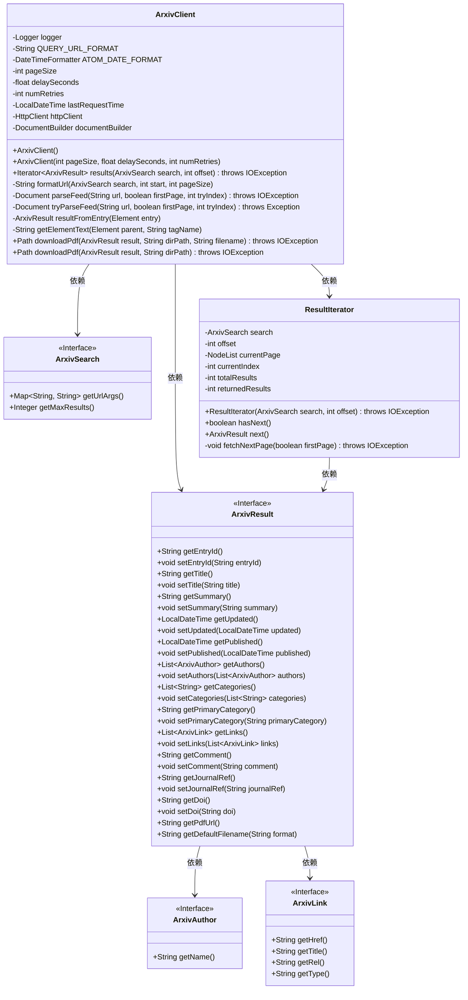
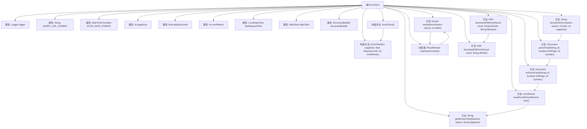

# 基础信息

|      |      |
|------|------|
| 名称 | ArxivClient |
| 编码语言 | .java |
| 代码路径 | spring-ai-alibaba/community/document-readers/spring-ai-alibaba-starter-document-reader-arxiv/src/main/java/com/alibaba/cloud/ai/reader/arxiv/client/ArxivClient.java |
| 包名 | com.alibaba.cloud.ai.reader.arxiv.client |
| 依赖项 | ['org.slf4j.Logger', 'org.slf4j.LoggerFactory', 'org.w3c.dom.Document', 'org.w3c.dom.Element', 'org.w3c.dom.Node', 'org.w3c.dom.NodeList', 'javax.xml.parsers.DocumentBuilder', 'javax.xml.parsers.DocumentBuilderFactory', 'java.io.ByteArrayInputStream', 'java.io.IOException', 'java.io.InputStream', 'java.nio.file.Files', 'java.nio.file.Path', 'java.nio.file.Paths', 'java.nio.file.StandardCopyOption', 'java.net.URI', 'java.net.URLEncoder', 'java.net.http.HttpClient', 'java.net.http.HttpRequest', 'java.net.http.HttpResponse', 'java.nio.charset.StandardCharsets', 'java.time.Duration', 'java.time.LocalDateTime', 'java.time.format.DateTimeFormatter', 'java.util', 'java.util.stream.Collectors', 'java.util.stream.IntStream'] |
| 概述说明 | ArxivClient类支持查询论文，分页、重试、延迟请求及PDF下载。 |

# 说明

ArxivClient类是一个用于查询Arxiv论文的工具，具备多种实用功能。它支持分页查询，允许用户分批获取论文数据，避免一次性加载过多内容。此外，该类还实现了重试机制，能够在请求失败时自动重试，提高查询的稳定性。为了遵守Arxiv的请求频率限制，ArxivClient类还提供了延迟请求功能，确保请求间隔符合要求。最后，该类还支持PDF下载功能，用户可以直接通过它获取论文的PDF文件，方便后续阅读和保存。

# 类列表 Class Summary

| 名称   | 类型  | 说明 |
|-------|------|-------------|
| ArxivClient | class | ArxivClient类用于查询Arxiv论文，支持分页、重试、延迟请求及PDF下载功能。 |

## 类 ArxivClient

|      |      |
|------|------|
| 访问范围 | public |
| 类型 | class |
| 名称 | ArxivClient |
| 说明 | ArxivClient类用于查询Arxiv论文，支持分页、重试、延迟请求及PDF下载功能。 |

### UML类图

**描述：**  
`ArxivClient` 是一个用于与 arXiv API 交互的客户端类，支持搜索论文、解析结果和下载 PDF 文件。它包含多个私有方法用于构建请求 URL、解析 XML 数据和处理结果。`ArxivSearch` 接口定义了搜索参数，`ArxivResult` 接口表示搜索结果，包含论文的基本信息和元数据。`ResultIterator` 是 `ArxivClient` 的内部类，用于迭代搜索结果。整个类图展示了 `ArxivClient` 如何依赖其他接口和类来实现其功能。

### 内部方法调用关系图

**描述：**  
`ArxivClient` 类是一个用于与 arXiv API 交互的客户端，提供了搜索、解析和下载 PDF 的功能。类中包含多个属性，如日志记录器、URL 格式、日期格式化器等。构造方法用于初始化这些属性，并创建 HTTP 客户端和 XML 解析器。`results` 方法用于执行搜索并返回结果迭代器，`formatUrl` 方法用于构建请求 URL，`parseFeed` 和 `tryParseFeed` 方法用于解析 XML 数据。`resultFromEntry` 方法用于从 XML 条目中创建 `ArxivResult` 对象。`downloadPdf` 方法用于下载 PDF 文件并保存到指定目录。内部类 `ResultIterator` 实现了 `Iterator` 接口，用于遍历搜索结果。

### 字段列表 Field List

| 名称  | 类型  | 说明 |
|-------|-------|------|
| httpClient | HttpClient | 私有且不可变的HttpClient实例。 |
| lastRequestTime | LocalDateTime | 记录最后一次请求时间的私有变量。 |
| ATOM_DATE_FORMAT = DateTimeFormatter.ISO_OFFSET_DATE_TIME | DateTimeFormatter | 定义ATOM_DATE_FORMAT为ISO偏移日期时间格式化器。 |
| delaySeconds | float | 定义了一个私有的浮点型变量delaySeconds。 |
| pageSize | int | 私有整型变量pageSize，用于存储页面大小。 |
| logger = LoggerFactory.getLogger(ArxivClient.class) | Logger | ArxivClient类中定义了一个私有的静态Logger实例。 |
| documentBuilder | DocumentBuilder | 私有且不可变的DocumentBuilder实例。 |
| QUERY_URL_FORMAT = "https://export.arxiv.org/api/query?%s" | String | 定义私有静态常量QUERY_URL_FORMAT，用于格式化arXiv API查询URL。 |
| numRetries | int | 私有整型变量numRetries，用于存储重试次数。 |

### 方法列表 Method List

| 名称  | 类型  | 说明 |
|-------|-------|------|
| formatUrl | String | 根据搜索参数生成带分页的URL。 |
| getElementText | String | 方法获取指定标签名的第一个子元素文本内容，若无则返回空。 |
| parseFeed | Document | 解析URL文档，失败时重试，达到重试次数后抛出异常。 |
| downloadPdf | Path | 下载PDF文件的方法，接收ArxivResult和目录路径参数，可能抛出IOException。 |
| results | Iterator<ArxivResult> | 方法根据搜索条件返回Arxiv结果迭代器，处理最大结果限制。 |
| downloadPdf | Path | 下载PDF文件，创建目录，设置文件名，发送请求并保存文件。 |
| tryParseFeed | Document | 解析URL文档，处理请求延迟，检查响应状态，返回解析结果。 |
| resultFromEntry | ArxivResult | 从XML元素提取Arxiv结果，设置ID、标题、摘要、日期、作者、类别、主类别、链接及可选字段。 |

