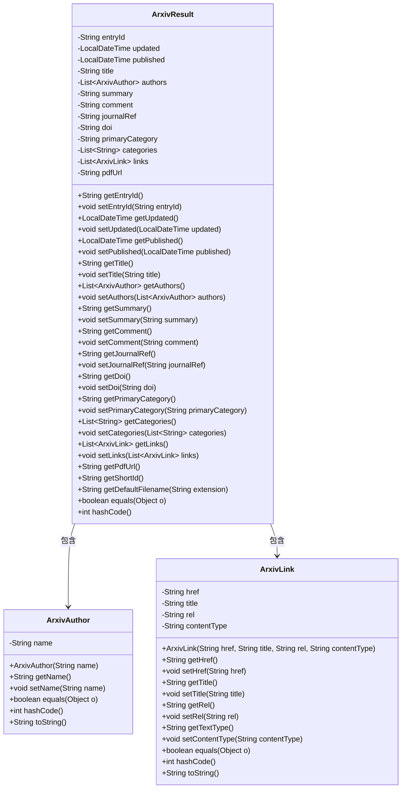

# 基础信息

|      |      |
|------|------|
| 名称 | ArxivResult |
| 编码语言 | .java |
| 代码路径 | spring-ai-alibaba/community/document-readers/spring-ai-alibaba-starter-document-reader-arxiv/src/main/java/com/alibaba/cloud/ai/reader/arxiv/client/ArxivResult.java |
| 包名 | com.alibaba.cloud.ai.reader.arxiv.client |
| 依赖项 | ['java.time.LocalDateTime', 'java.util.List', 'java.util.Objects', 'java.util.regex.Pattern'] |
| 概述说明 | ArxivResult类存储论文ID、时间、标题、作者、摘要、引用、分类及链接等数据。 |

# 说明

ArxivResult类是一个用于存储和管理学术论文相关信息的类，包含了论文的唯一标识ID、更新和发布时间、论文标题、作者列表、摘要内容、评论信息、期刊引用、数字对象标识符DOI、论文分类、相关链接以及论文的PDF下载链接。这些信息全面覆盖了论文的基本元数据和相关资源，便于用户获取和检索学术论文的详细信息。

# 类列表 Class Summary

| 名称   | 类型  | 说明 |
|-------|------|-------------|
| ArxivResult | class | ArxivResult类包含论文ID、更新和发布时间、标题、作者、摘要、评论、期刊引用、DOI、分类、相关链接及PDF链接等信息。 |

## 类 ArxivResult

|      |      |
|------|------|
| 访问范围 | public |
| 类型 | class |
| 名称 | ArxivResult |
| 说明 | ArxivResult类包含论文ID、更新和发布时间、标题、作者、摘要、评论、期刊引用、DOI、分类、相关链接及PDF链接等信息。 |

### UML类图

**描述：**
`ArxivResult` 类用于表示 arXiv 文章的相关信息，包括文章的 ID、更新时间、发布时间、标题、作者列表、摘要、评论、期刊引用、DOI、主要分类、所有分类、相关链接以及 PDF 链接。该类还包含两个内部类 `ArxivAuthor` 和 `ArxivLink`，分别用于表示文章的作者和相关链接。`ArxivResult` 类提供了获取和设置这些属性的方法，并包含一些辅助方法如 `getShortId` 和 `getDefaultFilename`。

### 内部方法调用关系图

这段代码定义了一个名为`ArxivResult`的类，用于表示arXiv文章的相关信息。该类包含多个属性，如文章的ID、更新时间、标题、作者列表、摘要等，并提供了相应的getter和setter方法。此外，类中还包含两个内部类`ArxivAuthor`和`ArxivLink`，分别用于表示文章作者和相关链接。`ArxivResult`类还提供了获取文章短ID、生成默认文件名、重写`equals`和`hashCode`方法等功能。

### 字段列表 Field List

| 名称  | 类型  | 说明 |
|-------|-------|------|
| primaryCategory | String | 定义了一个私有字符串变量primaryCategory。 |
| entryId | String | 定义私有字符串变量entryId。 |
| updated | LocalDateTime | 更新时间为LocalDateTime类型。 |
| pdfUrl | String | 定义私有字符串变量pdfUrl。 |
| categories | List<String> | 私有字符串列表，存储分类信息。 |
| doi | String | 定义私有字符串变量doi。 |
| journalRef | String | 定义私有字符串变量journalRef。 |
| authors | List<ArxivAuthor> | 私有作者列表，类型为ArxivAuthor。 |
| title | String | 定义了一个私有的字符串类型变量title。 |
| links | List<ArxivLink> | 包含私有ArxivLink列表的变量。 |
| comment | String | 定义一个私有的字符串类型变量comment。 |
| published | LocalDateTime | 定义私有LocalDateTime类型变量published。 |
| summary | String | 私有字符串变量用于存储概要信息。 |

### 方法列表 Method List

| 名称  | 类型  | 说明 |
|-------|-------|------|
| setPublished | void | 设置发布时间的方法。 |
| getEntryId | String | 该方法返回entryId字符串值。 |
| setAuthors | void | 该方法用于设置作者列表。 |
| setTitle | void | 设置对象标题的方法。 |
| getSummary | String | 获取摘要信息的字符串方法。 |
| getAuthors | List<ArxivAuthor> | 该方法返回一个包含ArxivAuthor对象的列表。 |
| setEntryId | void | 设置条目ID的方法。 |
| setComment | void | 该方法用于设置评论内容。 |
| getComment | String | 获取评论内容的方法。 |
| getDoi | String | 获取DOI的公共方法。 |
| setCategories | void | 该方法用于设置类别列表。 |
| setDoi | void | 该方法用于设置对象的DOI属性。 |
| getJournalRef | String | 获取期刊引用字符串的方法。 |
| setLinks | void | 设置链接并提取PDF URL。 |
| getPdfUrl | String | 获取PDF链接的方法。 |
| getPublished | LocalDateTime | 获取发布时间的方法，返回LocalDateTime类型。 |
| hashCode | int | 重写hashCode方法，使用entryId生成哈希值。 |
| getPrimaryCategory | String | 获取主分类的字符串方法。 |
| getTitle | String | 获取标题的公共方法。 |
| setSummary | void | 设置summary属性的方法，用于存储传入的字符串值。 |
| getShortId | String | 该方法从entryId中提取并返回arxiv.org/abs/后的短ID。 |
| setJournalRef | void | 设置日志引用的方法。 |
| equals | boolean | 重写equals方法，比较对象ID是否相等。 |
| setUpdated | void | 设置更新时间的方法，接受LocalDateTime类型参数。 |
| setPrimaryCategory | void | 设置主类别方法，接收字符串参数并赋值给主类别变量。 |
| getLinks | List<ArxivLink> | 该方法返回一个包含ArxivLink对象的列表。 |
| getCategories | List<String> | 该方法返回一个字符串列表，包含所有类别。 |
| getUpdated | LocalDateTime | 获取更新时间的方法。 |
| getDefaultFilename | String | 方法生成默认文件名，包含短ID、处理后的标题和扩展名。 |

