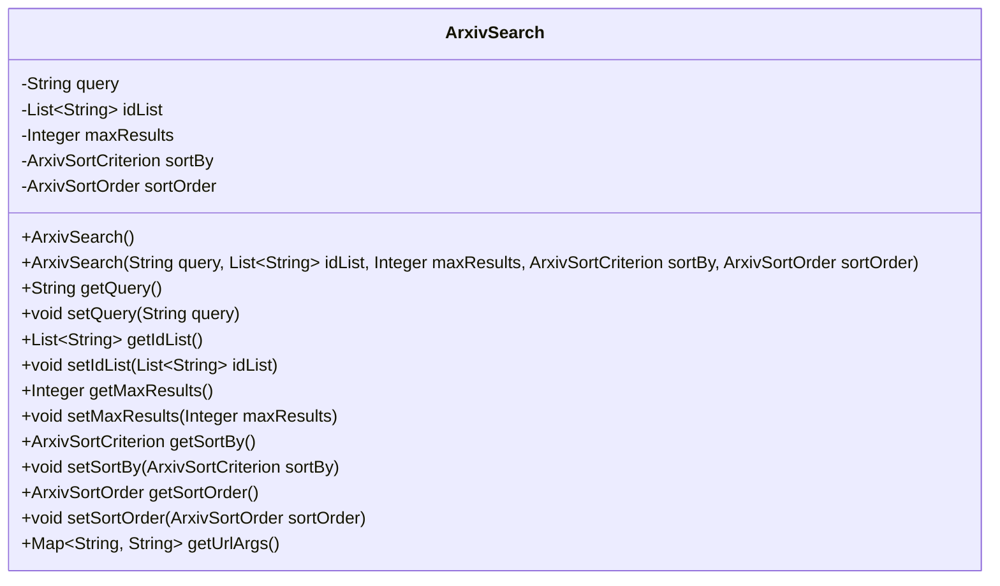

# 基础信息

|      |      |
|------|------|
| 名称 | ArxivSearch |
| 编码语言 | .java |
| 代码路径 | spring-ai-alibaba/community/document-readers/spring-ai-alibaba-starter-document-reader-arxiv/src/main/java/com/alibaba/cloud/ai/reader/arxiv/client/ArxivSearch.java |
| 包名 | com.alibaba.cloud.ai.reader.arxiv.client |
| 依赖项 | ['java.util.ArrayList', 'java.util.HashMap', 'java.util.List', 'java.util.Map'] |
| 概述说明 | ArxivSearch类管理论文搜索参数，包括查询、ID列表、结果数、排序等。 |

# 说明

ArxivSearch类用于配置和管理Arxiv论文搜索的相关参数。它允许用户设置查询字符串，指定文章ID列表，定义最大返回结果数量，选择排序标准，并确定排序顺序。通过这些功能，用户可以灵活地定制和优化Arxiv论文搜索的查询条件，以获取更精确和符合需求的搜索结果。

# 类列表 Class Summary

| 名称   | 类型  | 说明 |
|-------|------|-------------|
| ArxivSearch | class | ArxivSearch类用于配置和管理Arxiv论文搜索参数，包括查询字符串、文章ID列表、最大结果数、排序标准和顺序。 |

## 类 ArxivSearch

|      |      |
|------|------|
| 访问范围 | public |
| 类型 | class |
| 名称 | ArxivSearch |
| 说明 | ArxivSearch类用于配置和管理Arxiv论文搜索参数，包括查询字符串、文章ID列表、最大结果数、排序标准和顺序。 |

### UML类图

**描述：**  
`ArxivSearch` 类用于封装 arXiv 搜索的相关参数，包括查询字符串、文章 ID 列表、最大结果数、排序标准和排序顺序。该类提供了默认构造函数和带参构造函数，以及用于获取和设置这些参数的公有方法。`getUrlArgs` 方法将这些参数转换为 API 请求所需的 URL 参数格式。通过该类，用户可以方便地管理和操作 arXiv 搜索的相关配置。

### 内部方法调用关系图

```mermaid
graph TD
    A["类ArxivSearch"]
    B["属性: String query"]
    C["属性: List<String> idList"]
    D["属性: Integer maxResults"]
    E["属性: ArxivSortCriterion sortBy"]
    F["属性: ArxivSortOrder sortOrder"]
    G["构造方法: ArxivSearch()"]
    H["构造方法: ArxivSearch(String query, List<String> idList, Integer maxResults, ArxivSortCriterion sortBy, ArxivSortOrder sortOrder)"]
    I["方法: String getQuery()"]
    J["方法: void setQuery(String query)"]
    K["方法: List<String> getIdList()"]
    L["方法: void setIdList(List<String> idList)"]
    M["方法: Integer getMaxResults()"]
    N["方法: void setMaxResults(Integer maxResults)"]
    O["方法: ArxivSortCriterion getSortBy()"]
    P["方法: void setSortBy(ArxivSortCriterion sortBy)"]
    Q["方法: ArxivSortOrder getSortOrder()"]
    R["方法: void setSortOrder(ArxivSortOrder sortOrder)"]
    S["方法: Map<String, String> getUrlArgs()"]

    A --> B
    A --> C
    A --> D
    A --> E
    A --> F
    A --> G
    A --> H
    A --> I
    A --> J
    A --> K
    A --> L
    A --> M
    A --> N
    A --> O
    A --> P
    A --> Q
    A --> R
    A --> S
```

这段代码定义了一个名为`ArxivSearch`的类，用于处理Arxiv搜索的相关参数。类中包含多个属性，如查询字符串、文章ID列表、最大结果数、排序标准和排序顺序等。类提供了两个构造方法，分别用于默认初始化和自定义初始化。此外，类还提供了多个getter和setter方法，用于访问和修改这些属性。最后，`getUrlArgs`方法用于生成API请求所需的搜索参数。整个类结构清晰，功能明确，适用于处理Arxiv搜索的相关操作。

### 字段列表 Field List

| 名称  | 类型  | 说明 |
|-------|-------|------|
| query | String | 定义私有字符串变量query。 |
| maxResults | Integer | 私有整型变量maxResults。 |
| idList | List<String> | 私有字符串列表idList。 |
| sortOrder | ArxivSortOrder | 私有变量sortOrder用于存储Arxiv排序顺序。 |
| sortBy | ArxivSortCriterion | 私有变量sortBy用于Arxiv排序标准。 |

### 方法列表 Method List

| 名称  | 类型  | 说明 |
|-------|-------|------|
| getMaxResults | Integer | 该方法返回整数类型的maxResults值。 |
| setQuery | void | 设置查询字符串的方法。 |
| setIdList | void | 该方法用于设置idList属性的值。 |
| getIdList | List<String> | 该方法返回一个字符串列表类型的idList。 |
| getSortBy | ArxivSortCriterion | 方法返回排序标准。 |
| setSortOrder | void | 设置排序顺序方法，参数为ArxivSortOrder类型。 |
| getSortOrder | ArxivSortOrder | 获取ArxivSortOrder类型的排序顺序值。 |
| getQuery | String | 方法getQuery返回字符串类型的query值。 |
| getUrlArgs | Map<String, String> | 方法返回包含查询、ID列表、排序方式和顺序的URL参数字典。 |
| setMaxResults | void | 设置最大结果数的方法，用于更新maxResults变量。 |
| setSortBy | void | 该方法用于设置排序依据，接收ArxivSortCriterion类型参数。 |

