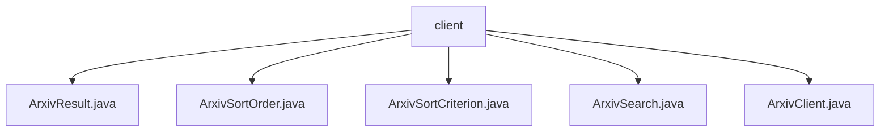

# 基础信息

|      |      |
|------|------|
| 名称 | client |
| 编码语言 | .java |
| 代码路径 | spring-ai-alibaba/community/document-readers/spring-ai-alibaba-starter-document-reader-arxiv/src/main/java/com/alibaba/cloud/ai/reader/arxiv/client |
| 包名 | spring-ai-alibaba.community.document-readers.spring-ai-alibaba-starter-document-reader-arxiv.src.main.java.com.alibaba.cloud.ai.reader.arxiv.client |
| 概述说明 | ArxivResult类管理论文元数据，ArxivSearch配置搜索参数，ArxivClient支持分页查询和PDF下载。 |

# 说明

## 概述
该代码模块是一个用于管理和查询Arxiv学术论文的工具集，主要功能包括论文信息的存储、搜索配置、分页查询、重试机制、请求频率控制以及PDF下载。模块中的各个类协同工作，提供了从论文元数据管理到实际查询和下载的完整解决方案。

## 主要业务场景
1. **论文信息管理**：通过`ArxivResult`类，用户可以存储和管理学术论文的详细信息，包括标题、作者、摘要、DOI、分类等元数据，便于后续的检索和使用。
2. **论文搜索配置**：`ArxivSearch`类允许用户灵活配置搜索参数，如查询字符串、文章ID列表、最大返回结果数量、排序标准和顺序，以优化搜索结果。
3. **分页查询与重试机制**：`ArxivClient`类支持分页查询，避免一次性加载过多数据，并实现了重试机制，确保在请求失败时自动重试，提高查询的稳定性。
4. **请求频率控制**：`ArxivClient`类还提供了延迟请求功能，确保请求间隔符合Arxiv的频率限制，避免因频繁请求而被限制访问。
5. **PDF下载**：通过`ArxivClient`类，用户可以直接下载论文的PDF文件，方便后续的阅读和保存。

### 包内部结构视图

该流程图展示了`spring-ai-alibaba-starter-document-reader-arxiv`项目中`client`文件夹下的文件层级关系。`client`文件夹包含五个Java文件，分别是`ArxivResult.java`、`ArxivSortOrder.java`、`ArxivSortCriterion.java`、`ArxivSearch.java`和`ArxivClient.java`。这些文件都与Arxiv文档读取功能相关，分别负责处理不同的逻辑和功能。

# 文件列表 File List

| 名称   | 类型  | 说明 |
|-------|------|-------------|
| [ArxivSearch.java](ArxivSearch.md) | file | ArxivSearch类管理论文搜索参数，包括查询、ID列表、结果数、排序等。 |
| [ArxivClient.java](ArxivClient.md) | file | ArxivClient类支持查询论文，分页、重试、延迟请求及PDF下载。 |
| [ArxivSortCriterion.java](ArxivSortCriterion.md) | file | 信息为空，无法生成概要描述。 |
| [ArxivSortOrder.java](ArxivSortOrder.md) | file | 信息为空，无法生成概要描述。 |
| [ArxivResult.java](ArxivResult.md) | file | ArxivResult类存储论文ID、时间、标题、作者、摘要、引用、分类及链接等数据。 |

