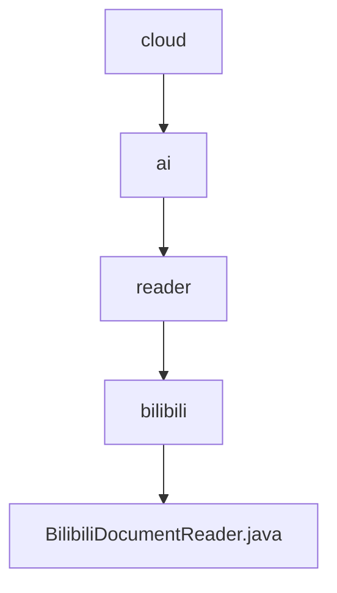

# 基础信息

|      |      |
|------|------|
| 名称 | cloud |
| 编码语言 | .java |
| 代码路径 | spring-ai-alibaba/community/document-readers/spring-ai-alibaba-starter-document-reader-bilibili/src/main/java/com/alibaba/cloud |
| 包名 | spring-ai-alibaba.community.document-readers.spring-ai-alibaba-starter-document-reader-bilibili.src.main.java.com.alibaba.cloud |
| 概述说明 | BilibiliDocumentReader类读取B站视频信息及字幕，处理异常并返回文档列表。 |

# 说明

BilibiliDocumentReader类是一个用于读取B站视频信息及字幕的工具。它能够处理可能出现的异常情况，并最终返回一个包含相关信息的文档列表。该类的功能包括从B站视频中提取关键数据，如视频标题、描述、字幕等，并在遇到错误时进行适当的异常处理，确保数据的完整性和准确性。通过这个类，用户可以方便地获取并管理B站视频的相关信息。

### 包内部结构视图

该流程图展示了从`cloud`到`BilibiliDocumentReader.java`的层级关系。首先，`cloud`包含`ai`，`ai`包含`reader`，`reader`包含`bilibili`，最后`bilibili`包含`BilibiliDocumentReader.java`。每个节点代表路径的最后一级元素，清晰地展示了文件的嵌套结构。

# 文件列表 File List

| 名称   | 类型  | 说明 |
|-------|------|-------------|
| [ai](ai/_module.md) | package | BilibiliDocumentReader类读取B站视频信息及字幕，处理异常并返回文档列表。 |

