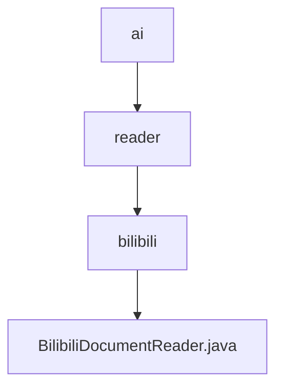

# 基础信息

|      |      |
|------|------|
| 名称 | ai |
| 编码语言 | .java |
| 代码路径 | spring-ai-alibaba/community/document-readers/spring-ai-alibaba-starter-document-reader-bilibili/src/main/java/com/alibaba/cloud/ai |
| 包名 | spring-ai-alibaba.community.document-readers.spring-ai-alibaba-starter-document-reader-bilibili.src.main.java.com.alibaba.cloud.ai |
| 概述说明 | BilibiliDocumentReader类读取B站视频信息及字幕，处理异常并返回文档列表。 |

# 说明

BilibiliDocumentReader类是一个用于读取B站视频信息及字幕的工具。它能够处理可能出现的异常情况，并最终返回一个包含相关信息的文档列表。该类的功能包括从B站视频中提取关键数据，如视频标题、描述、字幕等，并在遇到错误时进行适当的异常处理，确保数据的完整性和准确性。通过这个类，用户可以方便地获取并管理B站视频的相关信息。

### 包内部结构视图

该流程图展示了 `spring-ai-alibaba-starter-document-reader-bilibili` 项目中的文件层级关系。从 `ai` 目录开始，依次进入 `reader` 和 `bilibili` 子目录，最终指向 `BilibiliDocumentReader.java` 文件。这种层级结构清晰地反映了项目的模块化设计和文件组织方式。

# 文件列表 File List

| 名称   | 类型  | 说明 |
|-------|------|-------------|
| [reader](reader/_module.md) | package | BilibiliDocumentReader类读取B站视频信息及字幕，处理异常并返回文档列表。 |

