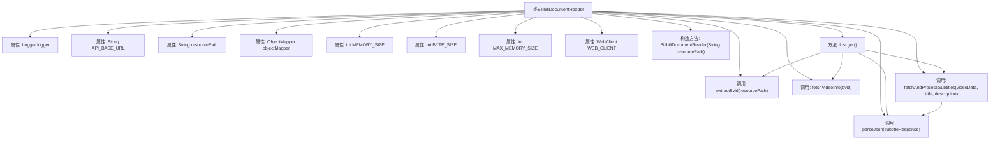

# 基础信息

|      |      |
|------|------|
| 名称 | BilibiliDocumentReader |
| 编码语言 | .java |
| 代码路径 | spring-ai-alibaba/community/document-readers/spring-ai-alibaba-starter-document-reader-bilibili/src/main/java/com/alibaba/cloud/ai/reader/bilibili/BilibiliDocumentReader.java |
| 包名 | com.alibaba.cloud.ai.reader.bilibili |
| 依赖项 | ['com.fasterxml.jackson.databind.JsonNode', 'com.fasterxml.jackson.databind.ObjectMapper', 'org.slf4j.Logger', 'org.slf4j.LoggerFactory', 'org.springframework.ai.document.Document', 'org.springframework.ai.document.DocumentReader', 'org.springframework.http.HttpHeaders', 'org.springframework.http.MediaType', 'org.springframework.util.Assert', 'org.springframework.web.reactive.function.client.WebClient', 'java.io.IOException', 'java.util.ArrayList', 'java.util.List', 'java.util.Map'] |
| 概述说明 | BilibiliDocumentReader类读取B站视频信息及字幕，处理异常并返回文档列表。 |

# 说明

BilibiliDocumentReader类是一个用于读取B站视频信息及字幕的工具。它能够处理可能出现的异常情况，并最终返回一个包含相关信息的文档列表。该类的功能包括从B站视频中提取关键数据，如视频标题、描述、字幕等，并在遇到错误时进行适当的异常处理，确保数据的完整性和准确性。通过这个类，用户可以方便地获取并管理B站视频的相关信息。

# 类列表 Class Summary

| 名称   | 类型  | 说明 |
|-------|------|-------------|
| BilibiliDocumentReader | class | BilibiliDocumentReader类读取B站视频信息及字幕，处理异常并返回文档列表。 |


## 类 BilibiliDocumentReader

|      |      |
|------|------|
| 访问范围 | public |
| 类型 | class |
| 名称 | BilibiliDocumentReader |
| 说明 | BilibiliDocumentReader类读取B站视频信息及字幕，处理异常并返回文档列表。 |


### UML类图

```mermaid
classDiagram
    class Document {
        +String content
        +Map~String, String~ metadata
        +Document(String content, Map~String, String~ metadata)
        +Document(String content)
    }

    class BilibiliDocumentReader {
        -Logger logger
        -String API_BASE_URL
        -String resourcePath
        -ObjectMapper objectMapper
        -int MEMORY_SIZE
        -int BYTE_SIZE
        -int MAX_MEMORY_SIZE
        -WebClient WEB_CLIENT
        +BilibiliDocumentReader(String resourcePath)
        +List~Document~ get()
        -String extractBvid(String resourcePath)
        -String fetchVideoInfo(String bvid)
        -JsonNode parseJson(String jsonResponse) throws IOException
        -String fetchAndProcessSubtitles(JsonNode videoData, String title, String description) throws IOException
    }

    interface DocumentReader {
        <<Interface>>
        +List~Document~ get()
    }

    BilibiliDocumentReader --> Document : 创建
    BilibiliDocumentReader ..|> DocumentReader : 实现
```

### 描述
`BilibiliDocumentReader` 类实现了 `DocumentReader` 接口，用于从Bilibili视频中提取信息并生成文档。它通过解析视频的JSON数据来获取标题、描述和字幕内容，并将这些信息封装在 `Document` 对象中返回。类中包含了多个私有方法，用于提取视频ID、获取视频信息、解析JSON以及处理字幕数据。整个过程涉及网络请求和JSON解析，处理了多种异常情况，确保在出现错误时能够返回相应的错误文档。


### 内部方法调用关系图



这段代码是一个用于读取Bilibili视频信息的类，主要功能包括提取视频ID、获取视频信息、解析JSON数据以及处理字幕。代码通过WebClient发送HTTP请求，使用ObjectMapper解析JSON响应，并将视频信息和字幕内容封装为Document对象返回。流程图展示了类的属性和方法之间的调用关系，以及主要方法的执行流程。

### 字段列表 Field List

| 名称  | 类型  | 说明 |
|-------|-------|------|
| resourcePath | String | 私有字符串变量resourcePath。 |
| API_BASE_URL = "https://api.bilibili.com/x/web-interface/view?bvid=" | String | B站API基础URL用于获取视频信息。 |
| logger = LoggerFactory.getLogger(BilibiliDocumentReader.class) | Logger | BilibiliDocumentReader类中定义了一个静态的Logger实例。 |
| BYTE_SIZE = 1024 | int | 定义常量BYTE_SIZE，值为1024。 |
| objectMapper | ObjectMapper | 私有不可变的对象映射器实例。 |
| WEB_CLIENT = WebClient.builder()		.defaultHeader(HttpHeaders.ACCEPT, MediaType.APPLICATION_JSON_VALUE)		.codecs(configurer -> configurer.defaultCodecs().maxInMemorySize(MAX_MEMORY_SIZE))		.build() | WebClient | 创建WebClient实例，设置默认JSON头，配置内存大小限制。 |
| MAX_MEMORY_SIZE = MEMORY_SIZE * BYTE_SIZE * BYTE_SIZE | int | 定义常量MAX_MEMORY_SIZE为MEMORY_SIZE乘以BYTE_SIZE的平方。 |
| MEMORY_SIZE = 5 | int | 定义了一个不可变的静态整型常量MEMORY_SIZE，值为5。 |

### 方法列表 Method List

| 名称  | 类型  | 说明 |
|-------|-------|------|
| parseJson | JsonNode | 解析JSON字符串并返回JsonNode对象。 |
| extractBvid | String | 提取资源路径中的BV号并返回。 |
| get | List<Document> | 获取视频信息并处理字幕，处理异常返回错误文档。 |
| fetchVideoInfo | String | 该方法通过HTTP GET请求获取指定视频ID的详细信息并返回响应内容。 |
| fetchAndProcessSubtitles | String | 获取视频字幕并处理，返回标题、描述及字幕内容，若无字幕则返回无字幕提示。 |


