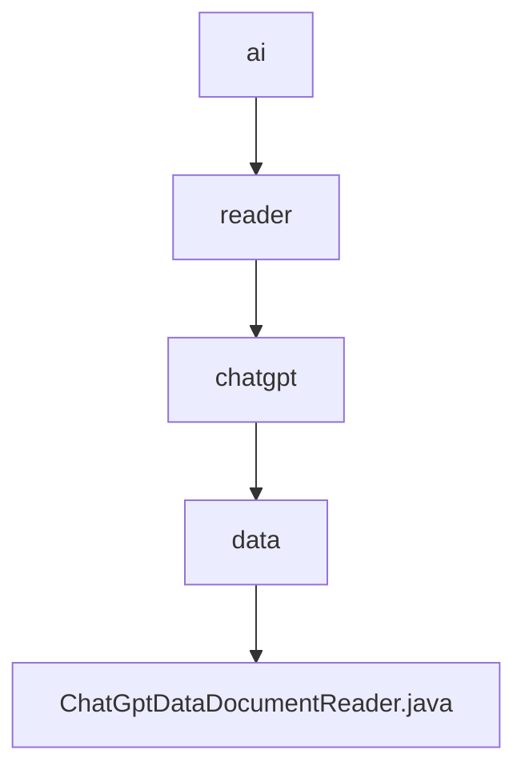

# 基础信息

|      |      |
|------|------|
| 名称 | ai |
| 编码语言 | .java |
| 代码路径 | spring-ai-alibaba/community/document-readers/spring-ai-alibaba-starter-document-reader-chatgpt-data/src/main/java/com/alibaba/cloud/ai |
| 包名 | spring-ai-alibaba.community.document-readers.spring-ai-alibaba-starter-document-reader-chatgpt-data.src.main.java.com.alibaba.cloud.ai |
| 概述说明 | ChatGptDataDocumentReader类读取JSON，处理对话，生成格式化文档。 |

# 说明

ChatGptDataDocumentReader类负责读取JSON文件，解析其中包含的ChatGPT对话数据，并将这些对话内容处理成结构化的格式化文档。该类的核心功能包括数据读取、对话解析以及文档生成，确保最终输出的文档内容清晰、格式统一，便于后续使用和分析。

### 包内部结构视图

该流程图展示了从`ai`目录到`ChatGptDataDocumentReader.java`文件的层级关系。`ai`目录下包含`reader`子目录，`reader`下又包含`chatgpt`子目录，`chatgpt`下包含`data`子目录，最终在`data`目录中找到了`ChatGptDataDocumentReader.java`文件。

# 文件列表 File List

| 名称   | 类型  | 说明 |
|-------|------|-------------|
| [reader](reader/_module.md) | package | ChatGptDataDocumentReader类读取JSON，处理对话，生成格式化文档。 |

