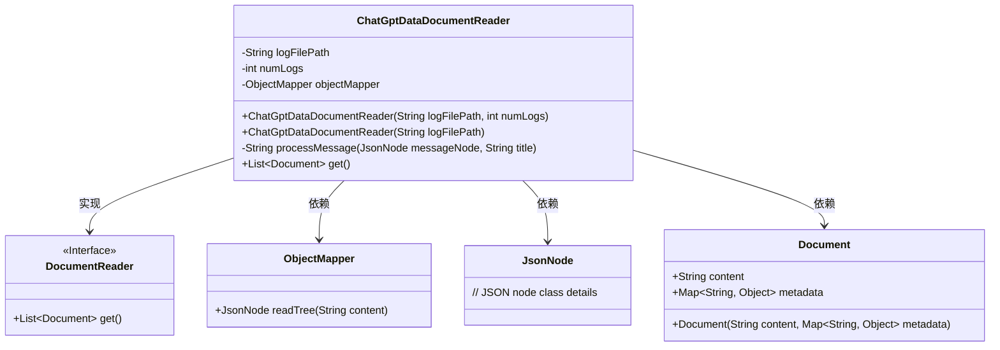
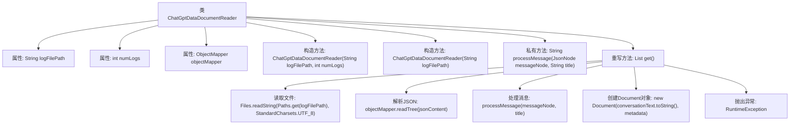

# 基础信息

|      |      |
|------|------|
| 名称 | ChatGptDataDocumentReader |
| 编码语言 | .java |
| 代码路径 | spring-ai-alibaba/community/document-readers/spring-ai-alibaba-starter-document-reader-chatgpt-data/src/main/java/com/alibaba/cloud/ai/reader/chatgpt/data/ChatGptDataDocumentReader.java |
| 包名 | com.alibaba.cloud.ai.reader.chatgpt.data |
| 依赖项 | ['java.io.IOException', 'java.nio.charset.StandardCharsets', 'java.nio.file.Files', 'java.nio.file.Paths', 'java.time.Instant', 'java.time.LocalDateTime', 'java.time.ZoneId', 'java.time.format.DateTimeFormatter', 'java.util.HashMap', 'java.util.List', 'java.util.Map', 'java.util.Spliterator', 'java.util.Spliterators', 'java.util.stream.Collectors', 'java.util.stream.IntStream', 'java.util.stream.StreamSupport', 'com.fasterxml.jackson.databind.JsonNode', 'com.fasterxml.jackson.databind.ObjectMapper', 'org.springframework.ai.document.Document', 'org.springframework.ai.document.DocumentReader'] |
| 概述说明 | ChatGptDataDocumentReader类读取JSON，处理对话，生成格式化文档。 |

# 说明

ChatGptDataDocumentReader类负责读取JSON文件，解析其中包含的ChatGPT对话数据，并将这些对话内容处理成结构化的格式化文档。该类的核心功能包括数据读取、对话解析以及文档生成，确保最终输出的文档内容清晰、格式统一，便于后续使用和分析。

# 类列表 Class Summary

| 名称   | 类型  | 说明 |
|-------|------|-------------|
| ChatGptDataDocumentReader | class | ChatGptDataDocumentReader类读取JSON文件，处理ChatGPT对话，生成格式化文档。 |

## 类 ChatGptDataDocumentReader

|      |      |
|------|------|
| 访问范围 | public |
| 类型 | class |
| 名称 | ChatGptDataDocumentReader |
| 说明 | ChatGptDataDocumentReader类读取JSON文件，处理ChatGPT对话，生成格式化文档。 |

### UML类图

### 描述
`ChatGptDataDocumentReader`类实现了`DocumentReader`接口，用于从指定的JSON文件中读取ChatGPT对话数据并生成`Document`对象。该类包含两个构造函数，分别接受文件路径和最大对话数量的参数。`processMessage`方法用于处理单个消息节点，生成格式化消息文本。`get`方法读取文件内容，解析JSON数据，并根据限制处理对话，最终返回包含对话内容和元数据的`Document`对象列表。

### 内部方法调用关系图

这段代码定义了一个名为 `ChatGptDataDocumentReader` 的类，用于读取和处理包含 ChatGPT 对话的 JSON 文件。类中包含两个构造方法，分别用于初始化文件路径和日志数量。`processMessage` 方法用于处理每条消息并返回格式化后的文本。`get` 方法读取文件内容，解析 JSON 数据，并根据指定数量处理对话，最终返回包含对话文本和元数据的 `Document` 对象列表。如果读取或解析过程中发生错误，将抛出 `RuntimeException`。

### 字段列表 Field List

| 名称  | 类型  | 说明 |
|-------|-------|------|
| logFilePath | String | 定义了一个私有不可变的日志文件路径字符串变量。 |
| objectMapper = new ObjectMapper() | ObjectMapper | 创建并初始化一个私有的ObjectMapper对象实例。 |
| numLogs | int | 定义了一个私有且不可变的整型变量numLogs。 |

### 方法列表 Method List

| 名称  | 类型  | 说明 |
|-------|-------|------|
| processMessage | String | 处理消息节点，提取角色、内容、时间并格式化输出。 |
| get | List<Document> | 读取日志文件，解析JSON数据，生成对话文档列表。 |

