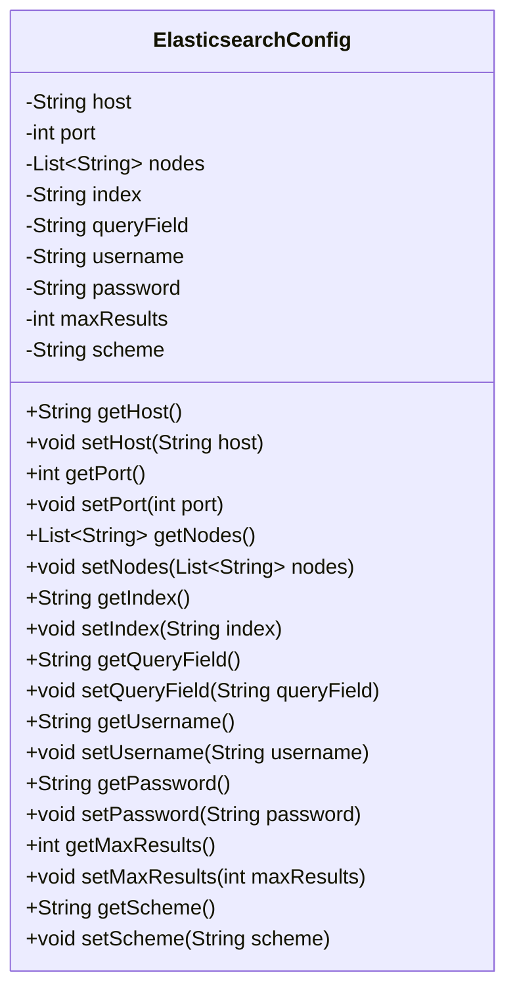

# 基础信息

|      |      |
|------|------|
| 名称 | ElasticsearchConfig |
| 编码语言 | .java |
| 代码路径 | spring-ai-alibaba/community/document-readers/spring-ai-alibaba-starter-document-reader-elasticsearch/src/main/java/com/alibaba/cloud/ai/document/reader/es/ElasticsearchConfig.java |
| 包名 | com.alibaba.cloud.ai.document.reader.es |
| 依赖项 | ['java.util.ArrayList', 'java.util.List'] |
| 概述说明 | Elasticsearch配置类包含主机、端口、节点、索引、查询字段、认证信息及最大结果数。 |

# 说明

Elasticsearch配置类是一个用于管理和存储Elasticsearch相关参数的类，包含多个关键属性。这些属性包括主机地址、端口号、节点信息、索引名称、查询字段、认证信息以及最大结果数。通过此类，用户可以方便地配置和访问Elasticsearch的各种设置，确保与Elasticsearch集群的连接和查询操作能够顺利进行。

# 类列表 Class Summary

| 名称   | 类型  | 说明 |
|-------|------|-------------|
| ElasticsearchConfig | class | Elasticsearch配置类，包含主机、端口、节点、索引、查询字段、认证信息及最大结果数等属性。 |

## 类 ElasticsearchConfig

|      |      |
|------|------|
| 访问范围 | public |
| 类型 | class |
| 名称 | ElasticsearchConfig |
| 说明 | Elasticsearch配置类，包含主机、端口、节点、索引、查询字段、认证信息及最大结果数等属性。 |

### UML类图

### 描述
`ElasticsearchConfig` 类用于配置与 Elasticsearch 相关的参数，包括主机地址、端口、节点列表、索引名称、查询字段、认证信息、最大结果数以及连接协议。该类提供了默认值，并通过一系列的 `getter` 和 `setter` 方法来访问和修改这些配置参数。该类的主要作用是集中管理 Elasticsearch 的连接和查询配置，便于在应用程序中进行统一配置和调整。

### 内部方法调用关系图

```mermaid
graph TD
    A["类ElasticsearchConfig"]
    B["属性: String host = 'localhost'"]
    C["属性: int port = 9200"]
    D["属性: List<String> nodes = new ArrayList<>()"]
    E["属性: String index"]
    F["属性: String queryField = 'content'"]
    G["属性: String username"]
    H["属性: String password"]
    I["属性: int maxResults = 10"]
    J["属性: String scheme = 'http'"]
    K["方法: String getHost()"]
    L["方法: void setHost(String host)"]
    M["方法: int getPort()"]
    N["方法: void setPort(int port)"]
    O["方法: List<String> getNodes()"]
    P["方法: void setNodes(List<String> nodes)"]
    Q["方法: String getIndex()"]
    R["方法: void setIndex(String index)"]
    S["方法: String getQueryField()"]
    T["方法: void setQueryField(String queryField)"]
    U["方法: String getUsername()"]
    V["方法: void setUsername(String username)"]
    W["方法: String getPassword()"]
    X["方法: void setPassword(String password)"]
    Y["方法: int getMaxResults()"]
    Z["方法: void setMaxResults(int maxResults)"]
    AA["方法: String getScheme()"]
    AB["方法: void setScheme(String scheme)"]

    A --> B
    A --> C
    A --> D
    A --> E
    A --> F
    A --> G
    A --> H
    A --> I
    A --> J
    A --> K
    A --> L
    A --> M
    A --> N
    A --> O
    A --> P
    A --> Q
    A --> R
    A --> S
    A --> T
    A --> U
    A --> V
    A --> W
    A --> X
    A --> Y
    A --> Z
    A --> AA
    A --> AB
```

**描述：**
该流程图展示了`ElasticsearchConfig`类的结构，包括其属性和方法。类中包含多个属性，如`host`、`port`、`nodes`等，用于配置Elasticsearch连接的相关参数。每个属性都有对应的`getter`和`setter`方法，用于获取和设置这些属性的值。流程图清晰地展示了类中各个属性与方法之间的关系，便于理解类的整体结构和功能。

### 字段列表 Field List

| 名称  | 类型  | 说明 |
|-------|-------|------|
| host = "localhost" | String | 私有字符串变量host初始化为"localhost"。 |
| username | String | 定义私有字符串类型变量username。 |
| scheme = "http" | String | 私有字符串变量scheme初始化为"http"。 |
| index | String | 定义私有字符串变量index。 |
| maxResults = 10 | int | 私有整型变量maxResults默认值为10。 |
| password | String | 声明一个私有字符串变量用于存储密码。 |
| port = 9200 | int | 私有整型变量port默认值为9200。 |
| nodes = new ArrayList<>() | List<String> | 声明并初始化一个存储字符串的列表变量nodes。 |
| queryField = "content" | String | 定义私有字符串变量queryField，初始值为"content"。 |

### 方法列表 Method List

| 名称  | 类型  | 说明 |
|-------|-------|------|
| setPort | void | 设置端口号的公共方法。 |
| getIndex | String | 获取index值的公共方法。 |
| getMaxResults | int | 获取最大结果值的方法。 |
| setIndex | void | 该方法用于设置字符串类型的索引值。 |
| getNodes | List<String> | 该方法返回节点列表。 |
| setNodes | void | 设置节点列表的方法。 |
| getHost | String | 获取主机地址的公共方法。 |
| getScheme | String | 获取scheme值的Java方法。 |
| getQueryField | String | 获取查询字段的方法。 |
| getPort | int | 该方法返回整型变量port的值。 |
| setScheme | void | 设置scheme属性的方法。 |
| getUsername | String | 获取用户名的方法，返回用户名变量。 |
| setPassword | void | 设置密码方法，将输入密码赋值给类成员变量。 |
| setUsername | void | 设置用户名的Java方法，将传入参数赋值给成员变量。 |
| getPassword | String | 该方法返回存储的密码字符串。 |
| setMaxResults | void | 设置最大结果数量的方法。 |
| setHost | void | 该方法用于设置主机地址。 |
| setQueryField | void | 设置查询字段的方法，将输入参数赋值给内部变量。 |

