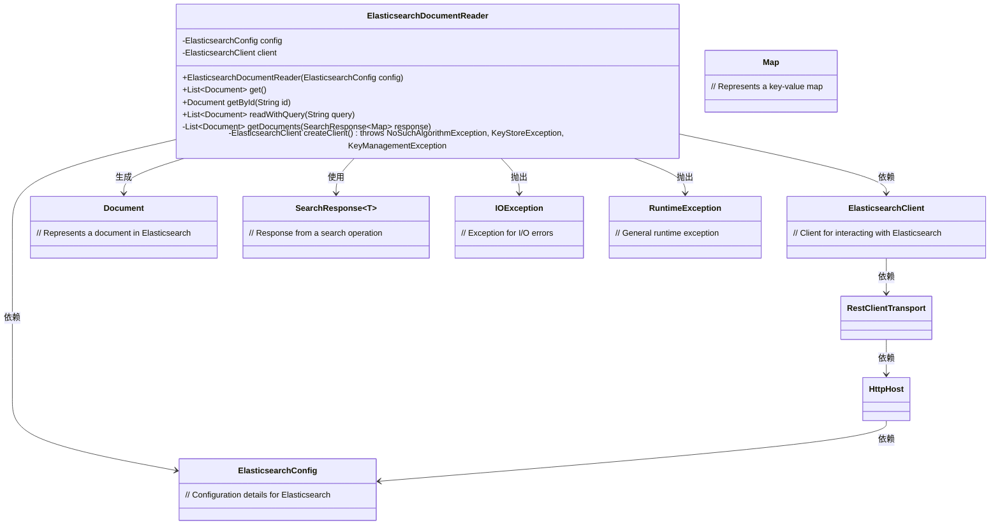
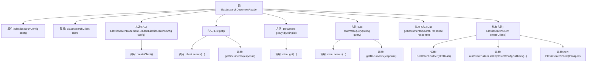

# 基础信息

|      |      |
|------|------|
| 名称 | ElasticsearchDocumentReader |
| 编码语言 | .java |
| 代码路径 | spring-ai-alibaba/community/document-readers/spring-ai-alibaba-starter-document-reader-elasticsearch/src/main/java/com/alibaba/cloud/ai/document/reader/es/ElasticsearchDocumentReader.java |
| 包名 | com.alibaba.cloud.ai.document.reader.es |
| 依赖项 | ['co.elastic.clients.elasticsearch.ElasticsearchClient', 'co.elastic.clients.elasticsearch._types.query_dsl.MatchQuery', 'co.elastic.clients.elasticsearch.core.SearchResponse', 'co.elastic.clients.json.jackson.JacksonJsonpMapper', 'co.elastic.clients.transport.ElasticsearchTransport', 'co.elastic.clients.transport.rest_client.RestClientTransport', 'org.apache.http.HttpHost', 'org.apache.http.auth.AuthScope', 'org.apache.http.auth.UsernamePasswordCredentials', 'org.apache.http.client.CredentialsProvider', 'org.apache.http.conn.ssl.NoopHostnameVerifier', 'org.apache.http.impl.client.BasicCredentialsProvider', 'org.apache.http.ssl.SSLContextBuilder', 'org.elasticsearch.client.RestClient', 'org.springframework.ai.document.Document', 'org.springframework.ai.document.DocumentReader', 'org.springframework.util.CollectionUtils', 'org.springframework.util.StringUtils', 'javax.net.ssl.SSLContext', 'javax.validation.constraints.NotNull', 'java.io.IOException', 'java.security.KeyManagementException', 'java.security.KeyStoreException', 'java.security.NoSuchAlgorithmException', 'java.util.ArrayList', 'java.util.Arrays', 'java.util.List', 'java.util.Map'] |
| 概述说明 | ElasticsearchDocumentReader类初始化客户端，支持文档获取、查询及ID检索。 |

# 说明

ElasticsearchDocumentReader类负责初始化Elasticsearch客户端，支持通过配置进行设置。该类提供了多种功能，包括获取文档、执行查询操作以及根据文档ID检索特定文档。这些功能使得用户可以高效地与Elasticsearch进行交互，实现文档的读取和查询需求。

# 类列表 Class Summary

| 名称   | 类型  | 说明 |
|-------|------|-------------|
| ElasticsearchDocumentReader | class | ElasticsearchDocumentReader类通过配置初始化Elasticsearch客户端，支持获取、查询文档及按ID检索文档。 |

## 类 ElasticsearchDocumentReader

|      |      |
|------|------|
| 访问范围 | public |
| 类型 | class |
| 名称 | ElasticsearchDocumentReader |
| 说明 | ElasticsearchDocumentReader类通过配置初始化Elasticsearch客户端，支持获取、查询文档及按ID检索文档。 |

### UML类图

**描述**：  
`ElasticsearchDocumentReader` 类是一个用于从 Elasticsearch 读取文档的工具类。它依赖于 `ElasticsearchConfig` 来获取配置信息，并使用 `ElasticsearchClient` 与 Elasticsearch 进行交互。该类提供了多个方法，如 `get()`、`getById()` 和 `readWithQuery()`，用于从 Elasticsearch 中检索文档。`getDocuments()` 方法用于将 Elasticsearch 的响应转换为 `Document` 对象列表。`createClient()` 方法负责创建并配置 Elasticsearch 客户端，支持多种认证和 SSL 配置。

### 内部方法调用关系图

这段代码定义了一个`ElasticsearchDocumentReader`类，用于从Elasticsearch中读取文档。类中包含多个方法，如`get()`用于获取所有文档，`getById(String id)`用于通过ID获取单个文档，`readWithQuery(String query)`用于根据查询条件获取文档。私有方法`getDocuments(SearchResponse<Map> response)`用于处理搜索结果并返回文档列表，`createClient()`用于创建Elasticsearch客户端。整个流程从初始化客户端开始，逐步执行搜索、获取和处理文档的操作。

### 字段列表 Field List

| 名称  | 类型  | 说明 |
|-------|-------|------|
| config | ElasticsearchConfig | 私有且不可变的Elasticsearch配置对象。 |
| client | ElasticsearchClient | 私有Elasticsearch客户端实例。 |

### 方法列表 Method List

| 名称  | 类型  | 说明 |
|-------|-------|------|
| get | List<Document> | 从Elasticsearch获取所有文档，异常时抛出运行时错误。 |
| getDocuments | List<Document> | 从搜索响应中提取文档并返回列表。 |
| getById | Document | 通过ID从Elasticsearch获取文档，若未找到或源为空则返回null，否则返回Document对象。 |
| createClient | ElasticsearchClient | 创建Elasticsearch客户端，支持多节点配置和HTTPS认证。 |
| readWithQuery | List<Document> | 方法根据查询从Elasticsearch读取文档，处理异常并返回结果。 |

