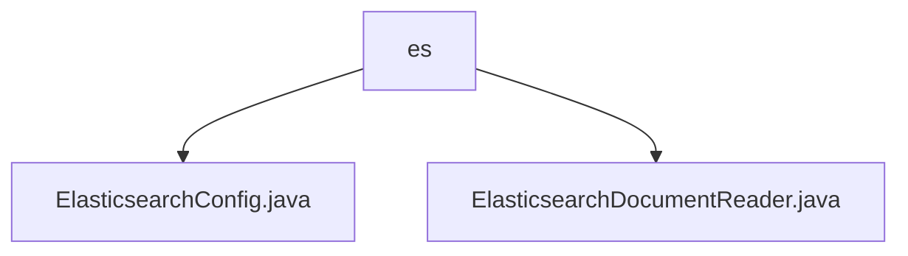

# 基础信息

|      |      |
|------|------|
| 名称 | es |
| 编码语言 | .java |
| 代码路径 | spring-ai-alibaba/community/document-readers/spring-ai-alibaba-starter-document-reader-elasticsearch/src/main/java/com/alibaba/cloud/ai/document/reader/es |
| 包名 | spring-ai-alibaba.community.document-readers.spring-ai-alibaba-starter-document-reader-elasticsearch.src.main.java.com.alibaba.cloud.ai.document.reader.es |
| 概述说明 | Elasticsearch配置类管理参数，DocumentReader类初始化客户端并支持查询操作。 |

# 说明

## 概述
该代码模块主要用于与Elasticsearch集群进行交互，提供了配置管理和文档读取的核心功能。模块包含两个主要类：`ElasticsearchConfig`和`ElasticsearchDocumentReader`。`ElasticsearchConfig`类负责管理和存储Elasticsearch的相关配置参数，如主机地址、端口号、节点信息、索引名称等，确保与Elasticsearch集群的连接和查询操作能够顺利进行。`ElasticsearchDocumentReader`类则负责初始化Elasticsearch客户端，并提供了多种功能，包括获取文档、执行查询操作以及根据文档ID检索特定文档，使用户能够高效地与Elasticsearch进行交互。

## 主要业务场景
1. **配置管理**：通过`ElasticsearchConfig`类，用户可以方便地配置和访问Elasticsearch的各种设置，确保与Elasticsearch集群的连接和查询操作能够顺利进行。
2. **文档读取**：`ElasticsearchDocumentReader`类提供了多种功能，包括获取文档、执行查询操作以及根据文档ID检索特定文档，满足用户对Elasticsearch中文档的读取和查询需求。
3. **客户端初始化**：`ElasticsearchDocumentReader`类支持通过配置初始化Elasticsearch客户端，确保用户能够与Elasticsearch集群建立连接并进行后续操作。

### 包内部结构视图

该流程图展示了`spring-ai-alibaba-starter-document-reader-elasticsearch`模块中`es`目录下的文件层级关系。`es`目录包含两个文件：`ElasticsearchConfig.java`和`ElasticsearchDocumentReader.java`，分别用于配置和读取Elasticsearch文档。

# 文件列表 File List

| 名称   | 类型  | 说明 |
|-------|------|-------------|
| [ElasticsearchDocumentReader.java](ElasticsearchDocumentReader.md) | file | ElasticsearchDocumentReader类初始化客户端，支持文档获取、查询及ID检索。 |
| [ElasticsearchConfig.java](ElasticsearchConfig.md) | file | Elasticsearch配置类包含主机、端口、节点、索引、查询字段、认证信息及最大结果数。 |

