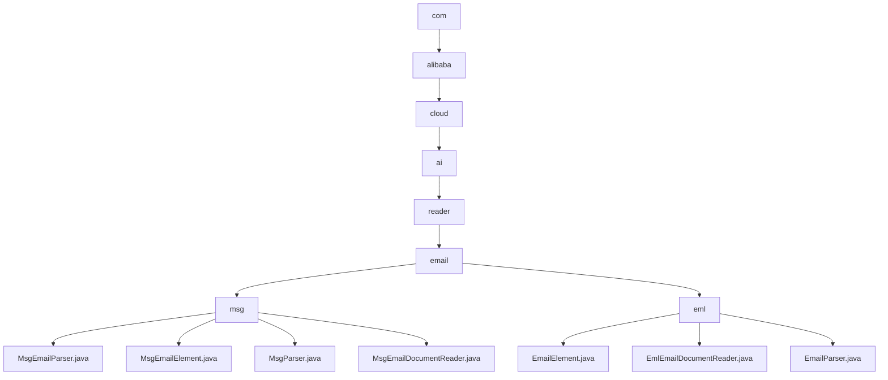

# 基础信息

|      |      |
|------|------|
| 名称 | com |
| 编码语言 | .java |
| 代码路径 | spring-ai-alibaba/community/document-readers/spring-ai-alibaba-starter-document-reader-email/src/main/java/com |
| 包名 | spring-ai-alibaba.community.document-readers.spring-ai-alibaba-starter-document-reader-email.src.main.java.com |
| 概述说明 | 模块用于解析MSG和EML邮件文件，提取邮件内容、元数据和附件，适用于邮件数据分析与处理。 |

# 说明

## 概述
该代码模块是一个用于处理电子邮件文件的工具集，支持解析和转换MSG和EML格式的邮件文件。模块的核心功能是将邮件文件中的信息（如邮件内容、元数据、附件等）提取并转换为结构化的`Document`对象，便于后续处理和分析。模块通过多个类协同工作，实现了从邮件文件中提取关键信息，并将其转换为统一格式，适用于邮件数据分析、内容检索、自动化处理等场景。

## 主要业务场景
1. **邮件文件读取与解析**：
   - 对于MSG文件，使用`MsgParser`类解析邮件内容，提取属性、正文和附件信息，并通过`MsgEmailDocumentReader`类将MSG文件转换为`Document`对象。
   - 对于EML文件，使用`EmlEmailDocumentReader`类读取邮件文件，处理附件和内容，并通过`EmailParser`类解析邮件头部和内容，提取发件人、收件人、主题等关键信息。

2. **邮件数据结构化**：
   - 对于MSG文件，`MsgEmailElement`类用于表示邮件的完整信息结构，包括主题、发件人、收件人、日期、内容类型、内容以及附件等。
   - 对于EML文件，`EmailElement`类及其子类（如Subject、Sender、Recipient、MetaData）用于处理邮件中的文本内容、元数据、发件人信息、收件人信息等。

3. **邮件数据转换**：
   - 对于MSG文件，`MsgEmailParser`类将`MsgEmailElement`对象转换为`Document`对象，保留邮件的所有关键信息。
   - 对于EML文件，`EmlEmailDocumentReader`类将解析后的邮件内容转换为`Document`对象，支持HTML和纯文本格式的解析。

4. **格式支持与异常处理**：
   - 模块在处理邮件内容时，优先考虑HTML格式的内容，同时支持纯文本格式的解析，确保邮件的全面解析和信息提取。
   - 模块在解析过程中处理可能的异常情况，确保解析过程的可靠性和稳定性。

该模块适用于需要从MSG和EML文件中提取邮件信息并进行结构化处理的场景，如邮件数据分析、邮件内容检索、自动化邮件处理等。

### 包内部结构视图

该流程图展示了Spring AI Alibaba项目中电子邮件文档读取模块的层级结构。从`com`开始，逐级深入到`alibaba`、`cloud`、`ai`、`reader`，最终分为`msg`和`eml`两个子模块。`msg`模块包含多个与电子邮件解析相关的Java类，而`eml`模块则包含与Eml格式解析相关的类。

# 文件列表 File List

| 名称   | 类型  | 说明 |
|-------|------|-------------|
| [alibaba](alibaba/_module.md) | package | 模块用于解析MSG和EML邮件文件，提取邮件内容、元数据和附件，适用于邮件数据分析与处理。 |

