# 基础信息

|      |      |
|------|------|
| 名称 | EmailElement |
| 编码语言 | .java |
| 代码路径 | spring-ai-alibaba/community/document-readers/spring-ai-alibaba-starter-document-reader-email/src/main/java/com/alibaba/cloud/ai/reader/email/eml/EmailElement.java |
| 包名 | com.alibaba.cloud.ai.reader.email.eml |
| 依赖项 | ['java.time.ZonedDateTime', 'java.util.HashMap', 'java.util.Map', 'java.util.regex.Pattern', 'java.io.UnsupportedEncodingException', 'javax.mail.internet.MimeUtility'] |
| 概述说明 | EmailElement类及其子类提供邮件元素处理功能，包含获取和设置方法。 |

# 说明

EmailElement类作为基类，包含文本内容和元数据，并提供获取和设置方法。Subject类继承EmailElement，专门用于解码Q编码和Base64编码的邮件主题文本。Sender类继承EmailElement，包含name属性和getName方法，用于处理发件人信息。Recipient类继承EmailElement，包含name属性和获取方法，用于处理收件人信息。MetaData类继承EmailElement，包含name属性和获取方法，用于处理邮件元数据。接收信息类包含名称、时间戳和文本，并提供相应的获取方法，用于处理接收到的邮件信息。

# 类列表 Class Summary

| 名称   | 类型  | 说明 |
|-------|------|-------------|
| EmailElement | class | EmailElement类包含文本内容和元数据，提供获取和设置方法。 |
| Subject | class | Subject类继承EmailElement，解码Q编码和Base64编码的邮件主题文本。 |
| Sender | class | Sender类继承EmailElement，包含name属性和getName方法。 |
| Recipient | class | Recipient类继承EmailElement，包含name属性和获取方法。 |
| MetaData | class | MetaData类继承EmailElement，包含name属性和获取方法。 |
| ReceivedInfo | class | 接收信息类包含名称、时间戳和文本，提供获取方法。 |

## 类 EmailElement

|      |      |
|------|------|
| 访问范围 | public abstract |
| 类型 | class |
| 名称 | EmailElement |
| 说明 | EmailElement类包含文本内容和元数据，提供获取和设置方法。 |

### UML类图

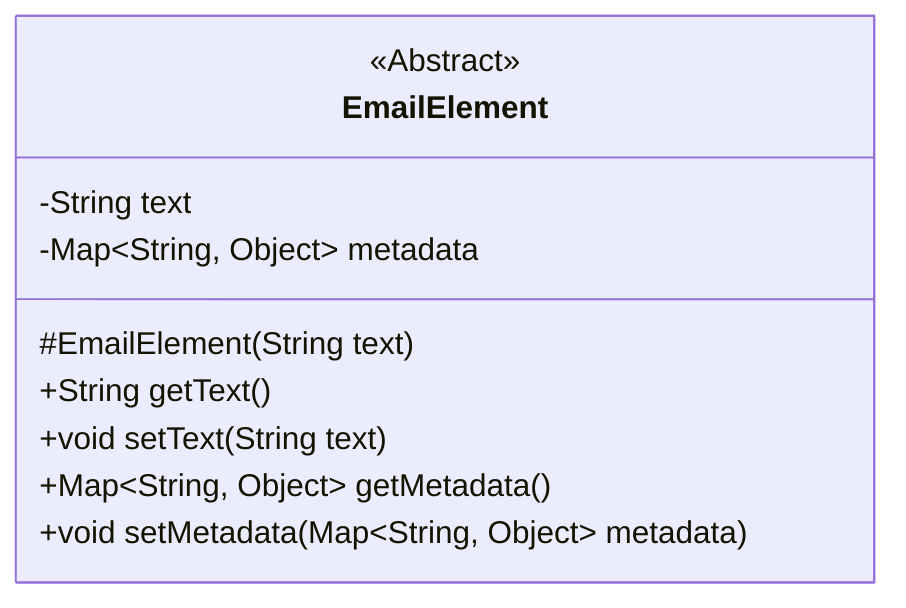

这段代码定义了一个抽象类 `EmailElement`，它包含两个受保护的成员变量：`text` 和 `metadata`。`text` 表示元素的文本内容，`metadata` 是一个键值对映射，用于存储与元素相关的元数据。类中提供了获取和设置这两个成员变量的公有方法。构造函数 `EmailElement` 用于初始化 `text` 和 `metadata`。由于 `EmailElement` 是一个抽象类，它不能被直接实例化，必须通过子类来实现。

### 内部方法调用关系图

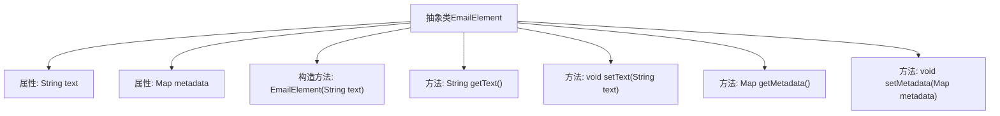

这段代码定义了一个抽象类`EmailElement`，该类包含两个受保护的属性：`text`和`metadata`。`text`用于存储元素的文本内容，`metadata`是一个键值对映射，用于存储与元素相关的元数据。类中提供了构造方法`EmailElement(String text)`用于初始化`text`属性并创建一个空的`metadata`映射。此外，类中还提供了四个方法：`getText()`和`setText(String text)`用于获取和设置`text`属性，`getMetadata()`和`setMetadata(Map<String, Object> metadata)`用于获取和设置`metadata`属性。这些方法使得外部代码可以访问和修改`EmailElement`对象的文本内容和元数据。

### 字段列表 Field List

| 名称  | 类型  | 说明 |
|-------|-------|------|
| text | String | 定义了一个受保护的字符串类型变量text。 |
| metadata | Map<String, Object> | metadata为受保护的Map类型，键为String，值为Object。 |

### 方法列表 Method List

| 名称  | 类型  | 说明 |
|-------|-------|------|
| getText | String | 获取字符串类型变量text的值。 |
| getMetadata | Map<String, Object> | 方法`getMetadata`返回类型为`Map<String, Object>`的`metadata`。 |
| setMetadata | void | 设置元数据的方法，接受字符串到对象的映射。 |
| setText | void | 该方法用于设置文本内容，将传入的字符串赋值给类成员变量text。 |

## 类 Subject

|      |      |
|------|------|
| 访问范围 | None |
| 类型 | class |
| 名称 | Subject |
| 说明 | Subject类继承EmailElement，解码Q编码和Base64编码的邮件主题文本。 |

### UML类图

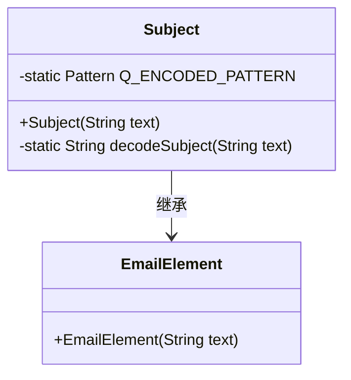

类图描述：
`Subject` 类继承自 `EmailElement` 类，并包含一个静态的正则表达式模式 `Q_ENCODED_PATTERN` 用于匹配 Q-encoded 内容。`Subject` 类的构造函数接受一个字符串参数，并通过 `decodeSubject` 方法对其进行解码，处理 Q-encoded 和 Base64 编码的内容。`decodeSubject` 方法使用 JavaMail 的 `MimeUtility.decodeText` 进行解码，若解码失败则返回原始文本。

### 内部方法调用关系图

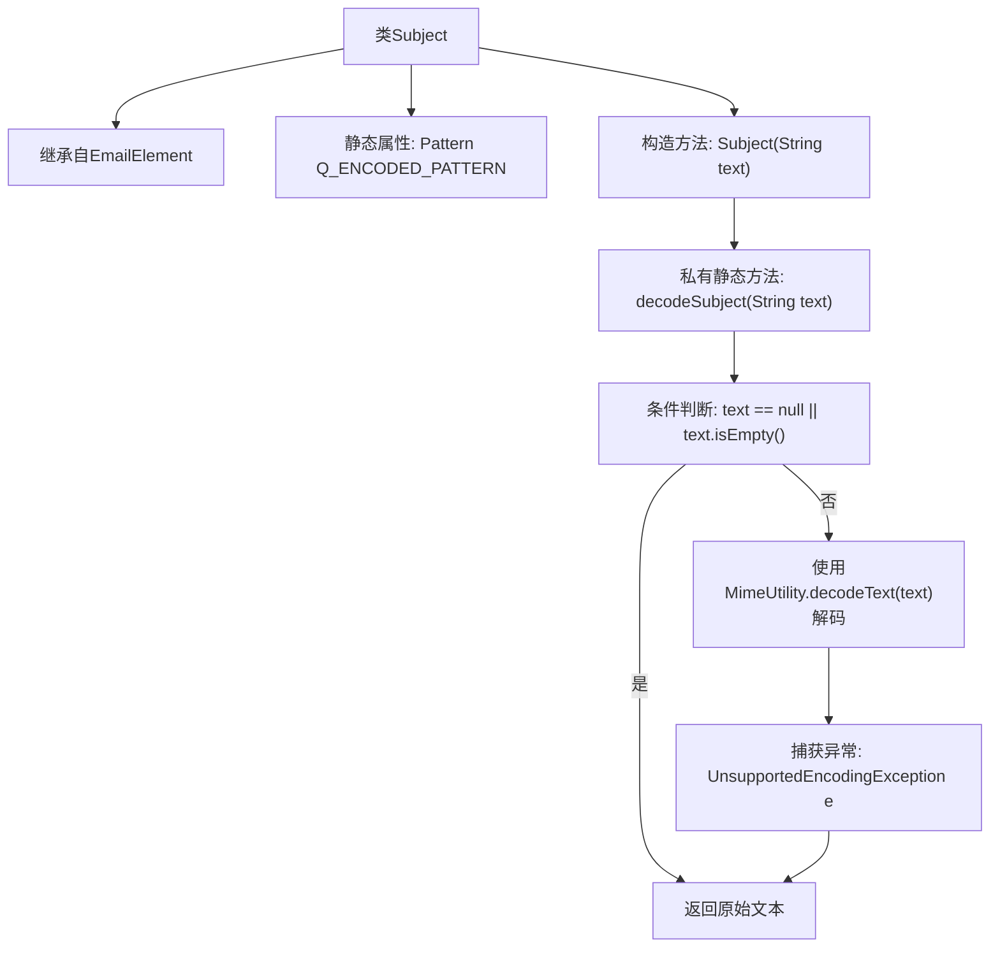

这段代码定义了一个名为`Subject`的类，继承自`EmailElement`。该类包含一个静态的正则表达式模式`Q_ENCODED_PATTERN`，用于匹配Q编码的内容。构造方法`Subject(String text)`调用私有静态方法`decodeSubject(String text)`来解码传入的文本。`decodeSubject`方法首先检查文本是否为空或null，如果是则直接返回原始文本；否则，尝试使用`MimeUtility.decodeText`进行解码。如果解码过程中抛出`UnsupportedEncodingException`异常，则返回原始文本。

### 字段列表 Field List

| 名称  | 类型  | 说明 |
|-------|-------|------|
| Q_ENCODED_PATTERN = Pattern.compile("=\\?[^?]+\\?[qQbB]\\?[^?]+\\?=") | Pattern | 定义私有静态正则表达式模式，用于匹配编码字符串。 |

### 方法列表 Method List

| 名称  | 类型  | 说明 |
|-------|-------|------|
| decodeSubject | String | 解码文本，失败返回原文本。 |

## 类 Sender

|      |      |
|------|------|
| 访问范围 | None |
| 类型 | class |
| 名称 | Sender |
| 说明 | Sender类继承EmailElement，包含name属性和getName方法。 |

### UML类图

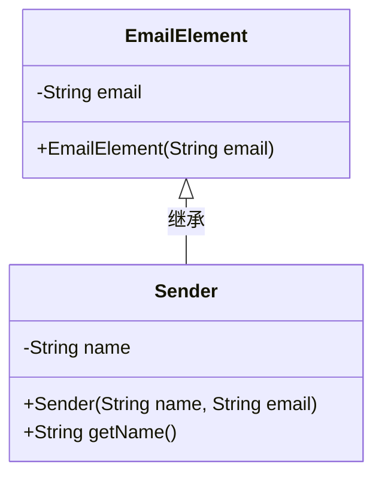

这段代码定义了一个 `Sender` 类，该类继承自 `EmailElement` 类。`EmailElement` 类包含一个私有属性 `email` 和一个构造函数 `EmailElement(String email)`。`Sender` 类包含一个私有属性 `name`，一个构造函数 `Sender(String name, String email)`，以及一个公有方法 `getName()`，用于获取 `name` 属性的值。`Sender` 类通过继承 `EmailElement` 类，扩展了其功能，使其能够处理与发送者相关的信息。

### 内部方法调用关系图

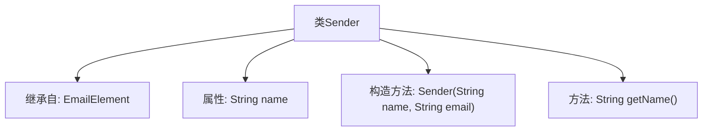

这段代码定义了一个名为 `Sender` 的类，该类继承自 `EmailElement`。`Sender` 类包含一个私有属性 `name`，并通过构造方法 `Sender(String name, String email)` 进行初始化。此外，`Sender` 类还提供了一个公共方法 `getName()`，用于返回 `name` 属性的值。该类的结构清晰，主要功能是封装发送者的名称和电子邮件地址，并提供了获取名称的方法。

### 字段列表 Field List

| 名称  | 类型  | 说明 |
|-------|-------|------|
| name | String | 声明了一个私有且不可变的字符串变量name。 |

### 方法列表 Method List

| 名称  | 类型  | 说明 |
|-------|-------|------|
| getName | String | 返回name字符串的公共方法。 |

## 类 Recipient

|      |      |
|------|------|
| 访问范围 | None |
| 类型 | class |
| 名称 | Recipient |
| 说明 | Recipient类继承EmailElement，包含name属性和获取方法。 |

### UML类图

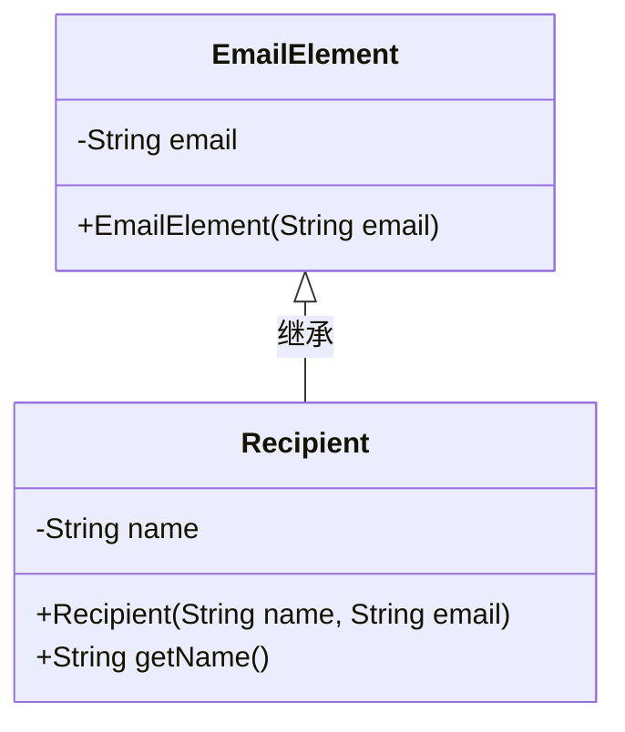

这段代码定义了一个 `Recipient` 类，它继承自 `EmailElement` 类。`EmailElement` 类包含一个私有的 `email` 属性和一个构造函数，用于初始化 `email`。`Recipient` 类扩展了 `EmailElement`，添加了一个私有的 `name` 属性，并提供了一个构造函数来初始化 `name` 和 `email`，以及一个公有方法 `getName()` 来获取 `name` 的值。通过继承，`Recipient` 类能够复用 `EmailElement` 类的功能，同时扩展了自己的特性。

### 内部方法调用关系图

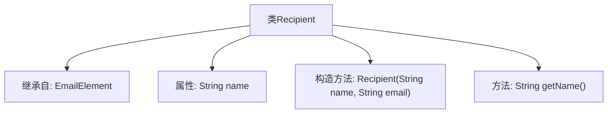

这段代码定义了一个名为 `Recipient` 的类，该类继承自 `EmailElement`。`Recipient` 类包含一个私有属性 `name`，并通过构造方法 `Recipient(String name, String email)` 初始化该属性。此外，`Recipient` 类提供了一个公共方法 `getName()`，用于返回 `name` 属性的值。代码展示了类的继承关系、属性初始化以及方法的定义。

### 字段列表 Field List

| 名称  | 类型  | 说明 |
|-------|-------|------|
| name | String | 私有不可变的字符串变量name。 |

### 方法列表 Method List

| 名称  | 类型  | 说明 |
|-------|-------|------|
| getName | String | 该方法返回对象的名称属性值。 |

## 类 MetaData

|      |      |
|------|------|
| 访问范围 | None |
| 类型 | class |
| 名称 | MetaData |
| 说明 | MetaData类继承EmailElement，包含name属性和获取方法。 |

### UML类图

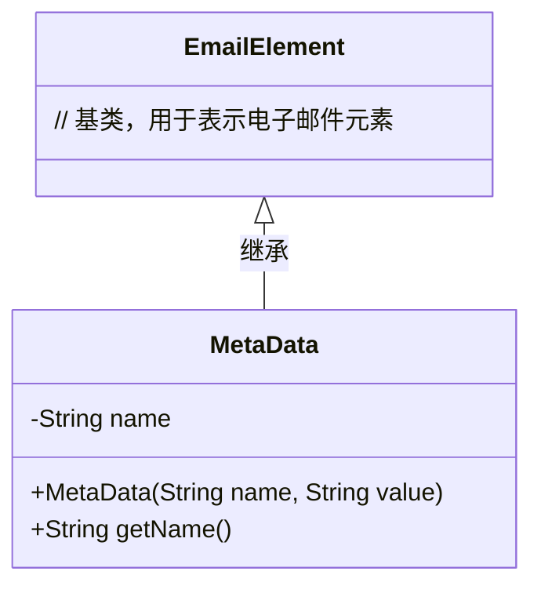

这段代码定义了一个`MetaData`类，它继承自`EmailElement`类。`MetaData`类包含一个私有成员`name`，并通过构造函数初始化。它还提供了一个公有方法`getName()`来获取`name`的值。`MetaData`类的主要作用是封装元数据信息，并通过继承`EmailElement`类来扩展其功能。

### 内部方法调用关系图

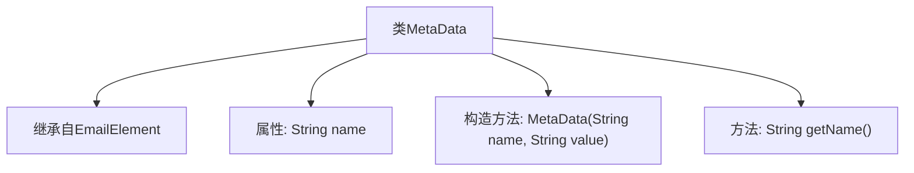

这段代码定义了一个名为 `MetaData` 的类，该类继承自 `EmailElement`。`MetaData` 类包含一个私有属性 `name`，并通过构造方法 `MetaData(String name, String value)` 进行初始化。此外，类中还提供了一个公共方法 `getName()`，用于返回 `name` 属性的值。代码结构清晰，主要用于封装元数据信息，并通过继承机制扩展了 `EmailElement` 的功能。

### 字段列表 Field List

| 名称  | 类型  | 说明 |
|-------|-------|------|
| name | String | 声明了一个私有的最终字符串变量name。 |

### 方法列表 Method List

| 名称  | 类型  | 说明 |
|-------|-------|------|
| getName | String | 方法返回对象的名称属性。 |

## 类 ReceivedInfo

|      |      |
|------|------|
| 访问范围 | None |
| 类型 | class |
| 名称 | ReceivedInfo |
| 说明 | 接收信息类包含名称、时间戳和文本，提供获取方法。 |

### UML类图

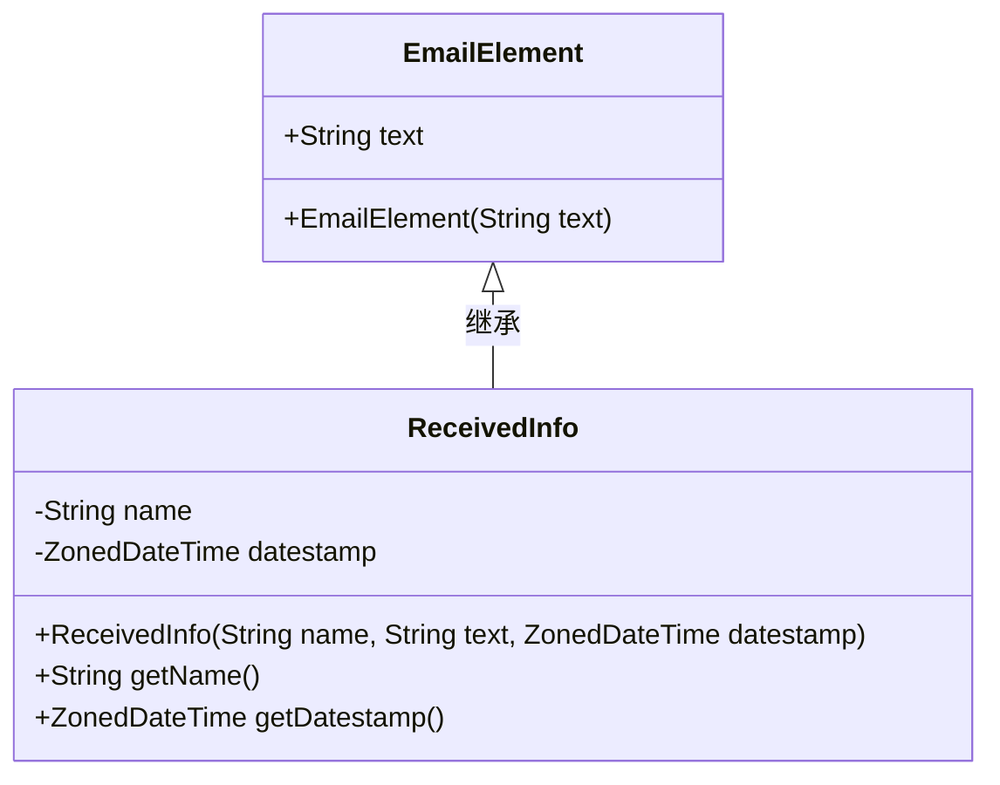

这段代码定义了一个`ReceivedInfo`类，它继承自`EmailElement`类。`ReceivedInfo`类包含两个私有成员变量：`name`和`datestamp`，分别表示接收信息的名称和时间戳。构造函数接收`name`、`text`和`datestamp`三个参数，并将`text`传递给父类`EmailElement`的构造函数。此外，`ReceivedInfo`类提供了两个公有方法`getName`和`getDatestamp`，用于获取`name`和`datestamp`的值。通过继承，`ReceivedInfo`类扩展了`EmailElement`类的功能，增加了对接收信息名称和时间戳的管理。

### 内部方法调用关系图

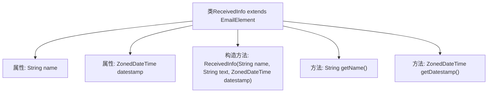

这段代码定义了一个名为 `ReceivedInfo` 的类，该类继承自 `EmailElement`。`ReceivedInfo` 类包含两个私有属性：`name` 和 `datestamp`，分别表示名称和时间戳。类中定义了一个构造方法，用于初始化这些属性，并提供了两个公共方法 `getName` 和 `getDatestamp`，分别用于获取 `name` 和 `datestamp` 的值。代码结构清晰，功能明确，主要用于封装接收信息的相关数据。

### 字段列表 Field List

| 名称  | 类型  | 说明 |
|-------|-------|------|
| name | String | 声明一个私有的不可变字符串变量name。 |
| datestamp | ZonedDateTime | 私有不可变的时区日期时间变量datestamp。 |

### 方法列表 Method List

| 名称  | 类型  | 说明 |
|-------|-------|------|
| getDatestamp | ZonedDateTime | 获取ZonedDateTime类型的datestamp值。 |
| getName | String | 该方法返回对象的名称属性值。 |

