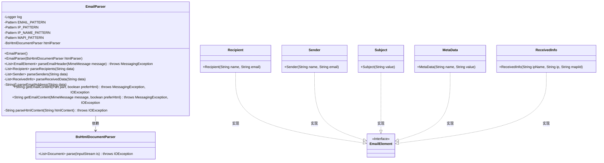
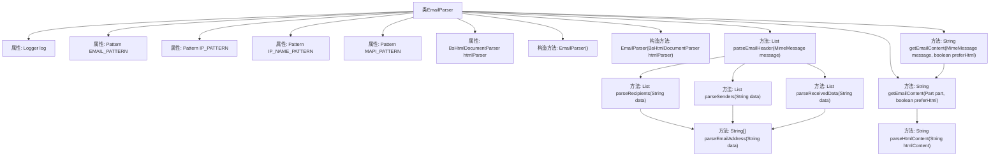

# 基础信息

|      |      |
|------|------|
| 名称 | EmailParser |
| 编码语言 | .java |
| 代码路径 | spring-ai-alibaba/community/document-readers/spring-ai-alibaba-starter-document-reader-email/src/main/java/com/alibaba/cloud/ai/reader/email/eml/EmailParser.java |
| 包名 | com.alibaba.cloud.ai.reader.email.eml |
| 依赖项 | ['com.alibaba.cloud.ai.parser.bshtml.BsHtmlDocumentParser', 'org.slf4j.Logger', 'org.slf4j.LoggerFactory', 'org.springframework.ai.document.Document', 'org.springframework.util.StringUtils', 'javax.mail.Header', 'javax.mail.MessagingException', 'javax.mail.Multipart', 'javax.mail.Part', 'javax.mail.internet.MimeMessage', 'java.io.ByteArrayInputStream', 'java.io.IOException', 'java.io.InputStream', 'java.nio.charset.StandardCharsets', 'java.util.ArrayList', 'java.util.Enumeration', 'java.util.List', 'java.util.regex.Matcher', 'java.util.regex.Pattern', 'java.util.Base64'] |
| 概述说明 | EmailParser类解析邮件头和内容，提取发件人、收件人、主题等信息，支持HTML和纯文本格式。 |

# 说明

EmailParser类主要用于解析邮件的头部和内容，能够从中提取出发件人、收件人、主题等关键信息。该类支持处理HTML和纯文本两种格式的邮件，确保能够全面准确地获取邮件中的各类信息。

# 类列表 Class Summary

| 名称   | 类型  | 说明 |
|-------|------|-------------|
| EmailParser | class | EmailParser类用于解析邮件头和内容，提取发件人、收件人、主题等信息，支持HTML和纯文本格式。 |

## 类 EmailParser

|      |      |
|------|------|
| 访问范围 | public |
| 类型 | class |
| 名称 | EmailParser |
| 说明 | EmailParser类用于解析邮件头和内容，提取发件人、收件人、主题等信息，支持HTML和纯文本格式。 |

### UML类图

### 描述
`EmailParser` 类用于解析电子邮件，提取邮件头、收件人、发件人、主题、日期等信息，并支持解析邮件内容为HTML或纯文本格式。它依赖于 `BsHtmlDocumentParser` 来解析HTML内容。`EmailElement` 是一个接口，`Recipient`、`Sender`、`Subject`、`MetaData` 和 `ReceivedInfo` 是其实现类，分别表示不同的邮件元素。

### 内部方法调用关系图

这段代码定义了一个`EmailParser`类，用于解析电子邮件内容。类中包含多个正则表达式模式，用于提取电子邮件地址、IP地址、主机名和MAPI ID等信息。类提供了多个方法，包括解析邮件头、解析收件人和发件人信息、解析接收数据、解析电子邮件地址以及获取邮件内容等功能。流程图展示了类中各属性和方法之间的调用关系，帮助理解代码的执行流程。

### 字段列表 Field List

| 名称  | 类型  | 说明 |
|-------|-------|------|
| log = LoggerFactory.getLogger(EmailParser.class) | Logger | 私有日志记录器实例化，用于EmailParser类。 |
| EMAIL_PATTERN = Pattern.compile("<([^>]+)>") | Pattern | 私有正则表达式匹配电子邮件格式。 |
| htmlParser | BsHtmlDocumentParser | 私有最终变量htmlParser为BsHtmlDocumentParser类型。 |
| MAPI_PATTERN = Pattern.compile("MapiId=([^;]+)") | Pattern | 私有模式匹配MAPI_PATTERN用于提取MapiId值。 |
| IP_PATTERN = Pattern.compile("\\b(?:\\d{1,3}\\.){3}\\d{1,3}\\b") | Pattern | 定义私有正则表达式，用于匹配IP地址。 |
| IP_NAME_PATTERN = Pattern.compile("\\b[a-zA-Z0-9.-]+\\.[a-zA-Z]{2,}\\b") | Pattern | 定义私有正则表达式，用于匹配域名格式。 |

### 方法列表 Method List

| 名称  | 类型  | 说明 |
|-------|-------|------|
| parseRecipients | List<Recipient> | 解析字符串生成收件人列表。 |
| getEmailContent | String | 获取邮件内容，支持HTML格式。 |
| parseSenders | List<Sender> | 解析字符串生成发件人列表。 |
| getEmailContent | String | 获取邮件内容，优先返回HTML或纯文本。 |
| parseReceivedData | List<ReceivedInfo> | 解析数据，提取IP主机名、IP地址和MAPI ID，生成ReceivedInfo对象列表。 |
| parseEmailHeader | List<EmailElement> | 解析邮件头部信息，提取收件人、发件人、主题、日期等元素并返回列表。 |
| parseEmailAddress | String[] | 解析电子邮件地址，处理Base64编码和普通格式，返回名称和地址。 |
| parseHtmlContent | String | 解析HTML内容并返回纯文本，若解析失败则返回原内容。 |

