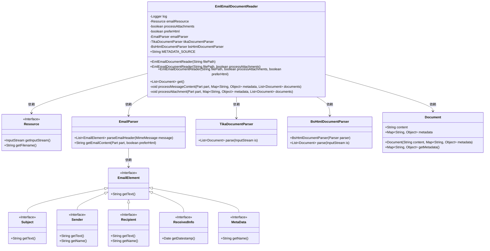
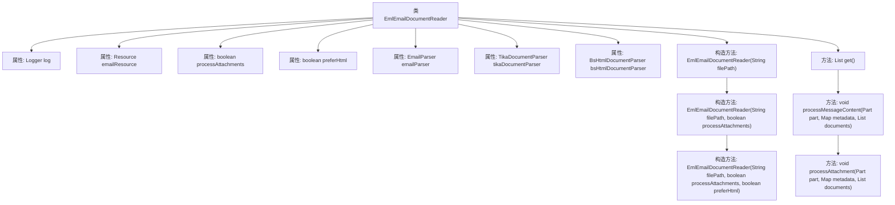

# 基础信息

|      |      |
|------|------|
| 名称 | EmlEmailDocumentReader |
| 编码语言 | .java |
| 代码路径 | spring-ai-alibaba/community/document-readers/spring-ai-alibaba-starter-document-reader-email/src/main/java/com/alibaba/cloud/ai/reader/email/eml/EmlEmailDocumentReader.java |
| 包名 | com.alibaba.cloud.ai.reader.email.eml |
| 依赖项 | ['com.alibaba.cloud.ai.parser.tika.TikaDocumentParser', 'com.alibaba.cloud.ai.parser.bshtml.BsHtmlDocumentParser', 'org.slf4j.Logger', 'org.slf4j.LoggerFactory', 'org.springframework.ai.document.Document', 'org.springframework.ai.document.DocumentReader', 'org.springframework.core.io.Resource', 'org.springframework.util.Assert', 'javax.mail.Session', 'javax.mail.internet.MimeMessage', 'javax.mail.Multipart', 'javax.mail.Part', 'java.io.File', 'java.io.InputStream', 'java.nio.file.Files', 'java.util'] |
| 概述说明 | EmlEmailDocumentReader类用于读取处理EML邮件文件，支持附件和HTML内容优先。 |

# 说明

EmlEmailDocumentReader类是一个用于读取和处理EML邮件文件的工具，具备处理邮件附件的能力，并且在解析邮件内容时优先考虑HTML格式的内容。

# 类列表 Class Summary

| 名称   | 类型  | 说明 |
|-------|------|-------------|
| EmlEmailDocumentReader | class | EmlEmailDocumentReader类用于读取和处理EML邮件文件，支持附件处理和HTML内容优先。 |

## 类 EmlEmailDocumentReader

|      |      |
|------|------|
| 访问范围 | public |
| 类型 | class |
| 名称 | EmlEmailDocumentReader |
| 说明 | EmlEmailDocumentReader类用于读取和处理EML邮件文件，支持附件处理和HTML内容优先。 |

### UML类图

**描述：**
`EmlEmailDocumentReader` 是一个用于读取 `.eml` 格式邮件的类，它通过解析邮件内容和附件生成 `Document` 对象。该类依赖于 `EmailParser` 解析邮件头，`TikaDocumentParser` 和 `BsHtmlDocumentParser` 分别用于解析附件中的非 HTML 和 HTML 内容。`Resource` 接口用于获取邮件文件的输入流和文件名。`EmailElement` 及其子接口用于表示邮件的各个元素，如主题、发件人、收件人等。

### 内部方法调用关系图

这段代码定义了一个名为`EmlEmailDocumentReader`的类，用于读取和解析Eml格式的电子邮件文档。类中包含多个构造方法，用于初始化邮件资源、处理附件和偏好HTML内容的选项。`get()`方法负责读取邮件内容并返回文档列表，`processMessageContent()`方法递归处理邮件内容，`processAttachment()`方法处理邮件附件。代码通过多个解析器（如`EmailParser`、`TikaDocumentParser`和`BsHtmlDocumentParser`）来解析邮件内容，并根据内容类型选择合适的解析器。

### 字段列表 Field List

| 名称  | 类型  | 说明 |
|-------|-------|------|
| processAttachments | boolean | 处理附件的私有布尔变量。 |
| tikaDocumentParser | TikaDocumentParser | 私有且不可变的Tika文档解析器实例。 |
| preferHtml | boolean | 私有布尔变量preferHtml用于标识偏好HTML格式。 |
| emailResource | Resource | 私有且不可变的邮件资源实例。 |
| log = LoggerFactory.getLogger(EmlEmailDocumentReader.class) | Logger | EmlEmailDocumentReader类中定义了静态日志记录器log。 |
| bsHtmlDocumentParser | BsHtmlDocumentParser | 私有变量bsHtmlDocumentParser为BsHtmlDocumentParser类型。 |
| emailParser | EmailParser | 私有且不可变的EmailParser实例。 |
| METADATA_SOURCE = "source" | String | 定义常量METADATA_SOURCE，值为"source"。 |

### 方法列表 Method List

| 名称  | 类型  | 说明 |
|-------|-------|------|
| get | List<Document> | 从输入流解析邮件头并生成元数据，处理邮件内容后返回文档列表。 |
| processAttachment | void | 处理附件，提取元数据并解析内容，根据类型选择解析器，更新文档元数据。 |
| processMessageContent | void | 处理邮件内容，支持多部分、文本和附件处理，生成文档并附加元数据。 |

