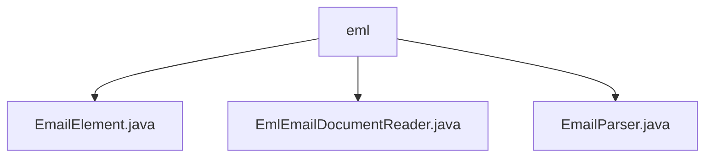

# 基础信息

|      |      |
|------|------|
| 名称 | eml |
| 编码语言 | .java |
| 代码路径 | spring-ai-alibaba/community/document-readers/spring-ai-alibaba-starter-document-reader-email/src/main/java/com/alibaba/cloud/ai/reader/email/eml |
| 包名 | spring-ai-alibaba.community.document-readers.spring-ai-alibaba-starter-document-reader-email.src.main.java.com.alibaba.cloud.ai.reader.email.eml |
| 概述说明 | EmailElement为基类，派生类处理邮件主题、发件人、收件人、元数据及接收信息。EmlEmailDocumentReader读取EML文件，优先处理HTML内容。EmailParser解析邮件头部和内容，支持HTML和纯文本。 |

# 说明

## 概述
该代码模块是一个用于读取、解析和处理EML邮件文件的工具集，主要包含以下几个核心类：

- **EmailElement**：作为基类，包含文本内容和元数据，并提供获取和设置方法。多个子类（如Subject、Sender、Recipient、MetaData）继承自该类，分别用于处理邮件主题、发件人、收件人和元数据等信息。
- **EmlEmailDocumentReader**：负责读取和处理EML邮件文件，具备处理邮件附件的能力，并在解析邮件内容时优先考虑HTML格式的内容。
- **EmailParser**：主要用于解析邮件的头部和内容，能够从中提取出发件人、收件人、主题等关键信息。支持处理HTML和纯文本两种格式的邮件，确保全面准确地获取邮件中的各类信息。

## 主要业务场景
该模块的主要业务场景包括：

1. **邮件文件读取**：通过`EmlEmailDocumentReader`类读取EML格式的邮件文件，并处理其中的附件和内容。
2. **邮件内容解析**：使用`EmailParser`类解析邮件的头部和内容，提取发件人、收件人、主题等关键信息。
3. **邮件信息处理**：通过`EmailElement`及其子类（如Subject、Sender、Recipient、MetaData）处理邮件中的文本内容、元数据、发件人信息、收件人信息等。
4. **格式支持**：在处理邮件内容时，优先考虑HTML格式的内容，同时支持纯文本格式的解析，确保邮件的全面解析和信息提取。

该模块适用于需要处理和分析EML邮件文件的场景，如邮件归档、邮件内容分析、邮件自动化处理等。

### 包内部结构视图

该流程图展示了`eml`文件夹与其内部文件之间的层级关系。`eml`文件夹下包含三个文件：`EmailElement.java`、`EmlEmailDocumentReader.java`和`EmailParser.java`。这些文件均直接位于`eml`文件夹中，没有进一步的子文件夹嵌套。

# 文件列表 File List

| 名称   | 类型  | 说明 |
|-------|------|-------------|
| [EmailParser.java](EmailParser.md) | file | EmailParser类解析邮件头和内容，提取发件人、收件人、主题等信息，支持HTML和纯文本格式。 |
| [EmlEmailDocumentReader.java](EmlEmailDocumentReader.md) | file | EmlEmailDocumentReader类用于读取处理EML邮件文件，支持附件和HTML内容优先。 |
| [EmailElement.java](EmailElement.md) | file | EmailElement类及其子类提供邮件元素处理功能，包含获取和设置方法。 |

