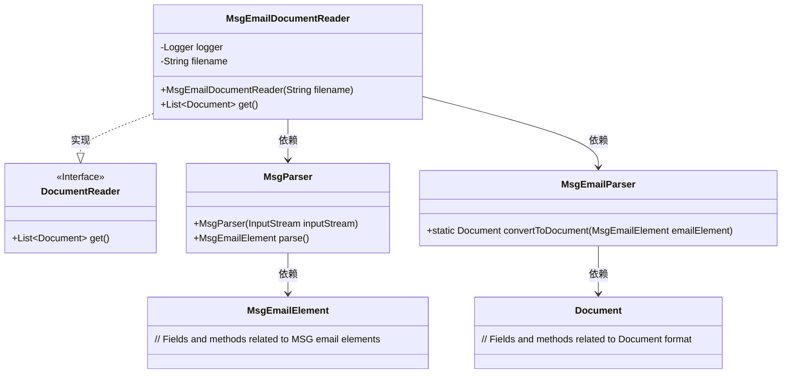
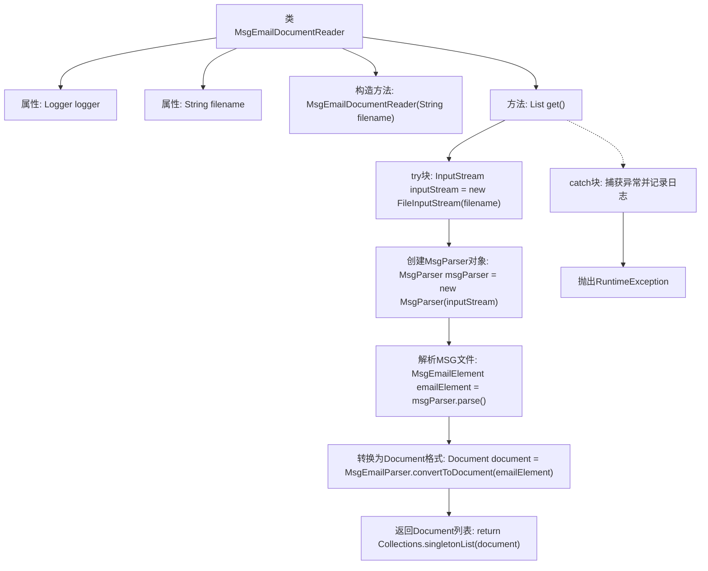

# 基础信息

|      |      |
|------|------|
| 名称 | MsgEmailDocumentReader |
| 编码语言 | .java |
| 代码路径 | spring-ai-alibaba/community/document-readers/spring-ai-alibaba-starter-document-reader-email/src/main/java/com/alibaba/cloud/ai/reader/email/msg/MsgEmailDocumentReader.java |
| 包名 | com.alibaba.cloud.ai.reader.email.msg |
| 依赖项 | ['org.apache.commons.io.IOUtils', 'org.slf4j.Logger', 'org.slf4j.LoggerFactory', 'org.springframework.ai.document.Document', 'org.springframework.ai.document.DocumentReader', 'java.io.File', 'java.io.FileInputStream', 'java.io.IOException', 'java.io.InputStream', 'java.util.Collections', 'java.util.List'] |
| 概述说明 | MsgEmailDocumentReader类将MSG文件转换为Document格式。 |

# 说明

MsgEmailDocumentReader类专门用于读取MSG文件并将其转换为Document格式。该类的主要功能是解析MSG文件的内容，提取其中的关键信息，并将其转换为结构化的Document对象，以便后续处理和使用。通过这种方式，用户可以方便地访问和操作MSG文件中的数据，实现高效的文件管理和信息提取。

# 类列表 Class Summary

| 名称   | 类型  | 说明 |
|-------|------|-------------|
| MsgEmailDocumentReader | class | MsgEmailDocumentReader类读取MSG文件并转换为Document格式。 |

## 类 MsgEmailDocumentReader

|      |      |
|------|------|
| 访问范围 | public |
| 类型 | class |
| 名称 | MsgEmailDocumentReader |
| 说明 | MsgEmailDocumentReader类读取MSG文件并转换为Document格式。 |

### UML类图

**描述：**  
`MsgEmailDocumentReader` 类实现了 `DocumentReader` 接口，用于从 MSG 文件中读取电子邮件内容并将其转换为统一的 `Document` 格式。该类依赖于 `MsgParser` 来解析 MSG 文件结构，并通过 `MsgEmailParser` 将解析后的 `MsgEmailElement` 转换为 `Document`。如果解析过程中发生异常，`MsgEmailDocumentReader` 会记录错误并抛出运行时异常。

### 内部方法调用关系图

**描述：**  
`MsgEmailDocumentReader`类用于读取并解析MSG格式的电子邮件文件，将其转换为统一的`Document`格式。首先，通过`FileInputStream`读取文件，然后使用`MsgParser`解析文件内容，生成`MsgEmailElement`对象，接着将其转换为`Document`对象并返回。若在解析过程中发生异常，会记录错误日志并抛出`RuntimeException`。

### 字段列表 Field List

| 名称  | 类型  | 说明 |
|-------|-------|------|
| logger = LoggerFactory.getLogger(MsgEmailDocumentReader.class) | Logger | MsgEmailDocumentReader类中定义了一个私有的静态Logger对象。 |
| filename | String | 定义了一个不可变的私有字符串变量filename。 |

### 方法列表 Method List

| 名称  | 类型  | 说明 |
|-------|-------|------|
| get | List<Document> | 方法解析MSG文件并转换为统一文档格式，出错时记录日志并抛出异常。 |

