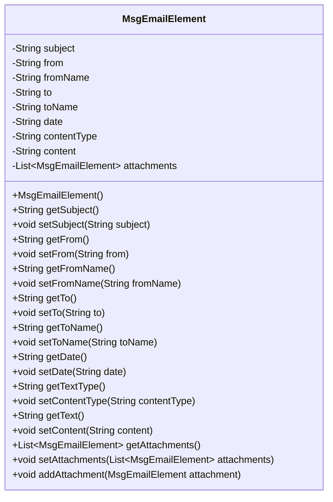

# 基础信息

|      |      |
|------|------|
| 名称 | MsgEmailElement |
| 编码语言 | .java |
| 代码路径 | spring-ai-alibaba/community/document-readers/spring-ai-alibaba-starter-document-reader-email/src/main/java/com/alibaba/cloud/ai/reader/email/msg/MsgEmailElement.java |
| 包名 | com.alibaba.cloud.ai.reader.email.msg |
| 依赖项 | ['java.util.ArrayList', 'java.util.List'] |
| 概述说明 | MsgEmailElement类包含邮件主题、发件人、收件人、日期、内容类型、内容及附件属性。 |

# 说明

MsgEmailElement类是一个用于表示邮件信息的类，包含多个关键属性。这些属性包括邮件主题，用于描述邮件的主要内容；发件人，表示发送邮件的个体或实体；收件人，表示接收邮件的个体或实体；日期，记录邮件发送的具体时间；内容类型，指明邮件内容的格式或类型；内容，即邮件的主体信息；以及附件，包含邮件中附加的文件或数据。这些属性共同构成了完整的邮件信息结构。

# 类列表 Class Summary

| 名称   | 类型  | 说明 |
|-------|------|-------------|
| MsgEmailElement | class | MsgEmailElement类包含邮件主题、发件人、收件人、日期、内容类型、内容及附件等属性。 |

## 类 MsgEmailElement

|      |      |
|------|------|
| 访问范围 | public |
| 类型 | class |
| 名称 | MsgEmailElement |
| 说明 | MsgEmailElement类包含邮件主题、发件人、收件人、日期、内容类型、内容及附件等属性。 |

### UML类图

**描述：**  
`MsgEmailElement` 类用于表示电子邮件的基本元素，包括邮件的主题、发件人、收件人、日期、内容类型、内容以及附件列表。该类提供了多个私有属性来存储这些信息，并通过公有方法进行访问和修改。此外，`MsgEmailElement` 类还支持通过 `addAttachment` 方法动态添加附件，附件本身也是 `MsgEmailElement` 类型的对象，形成一个递归结构。

### 内部方法调用关系图

```mermaid
graph TD
    A["类MsgEmailElement"]
    B["属性: String subject"]
    C["属性: String from"]
    D["属性: String fromName"]
    E["属性: String to"]
    F["属性: String toName"]
    G["属性: String date"]
    H["属性: String contentType"]
    I["属性: String content"]
    J["属性: List<MsgEmailElement> attachments"]
    K["构造方法: MsgEmailElement()"]
    L["方法: String getSubject()"]
    M["方法: void setSubject(String subject)"]
    N["方法: String getFrom()"]
    O["方法: void setFrom(String from)"]
    P["方法: String getFromName()"]
    Q["方法: void setFromName(String fromName)"]
    R["方法: String getTo()"]
    S["方法: void setTo(String to)"]
    T["方法: String getToName()"]
    U["方法: void setToName(String toName)"]
    V["方法: String getDate()"]
    W["方法: void setDate(String date)"]
    X["方法: String getTextType()"]
    Y["方法: void setContentType(String contentType)"]
    Z["方法: String getText()"]
    AA["方法: void setContent(String content)"]
    AB["方法: List<MsgEmailElement> getAttachments()"]
    AC["方法: void setAttachments(List<MsgEmailElement> attachments)"]
    AD["方法: void addAttachment(MsgEmailElement attachment)"]

    A --> B
    A --> C
    A --> D
    A --> E
    A --> F
    A --> G
    A --> H
    A --> I
    A --> J
    A --> K
    A --> L
    A --> M
    A --> N
    A --> O
    A --> P
    A --> Q
    A --> R
    A --> S
    A --> T
    A --> U
    A --> V
    A --> W
    A --> X
    A --> Y
    A --> Z
    A --> AA
    A --> AB
    A --> AC
    A --> AD
```

这段代码定义了一个名为`MsgEmailElement`的类，用于表示电子邮件的基本元素。类中包含多个属性，如邮件主题、发件人、收件人、日期、内容类型、内容以及附件列表。类提供了相应的getter和setter方法来访问和修改这些属性，并且还提供了一个方法用于添加附件。该类的设计使得可以方便地构建和管理电子邮件的各个组成部分。

### 字段列表 Field List

| 名称  | 类型  | 说明 |
|-------|-------|------|
| subject | String | 定义了一个私有字符串类型变量subject。 |
| toName | String | 定义私有字符串变量toName。 |
| contentType | String | 定义私有字符串变量contentType。 |
| attachments | List<MsgEmailElement> | 私有列表变量attachments存储邮件附件元素。 |
| to | String | 该代码定义了一个私有字符串变量`to`。 |
| date | String | 声明一个私有字符串变量date。 |
| from | String | 定义了一个私有字符串变量"from"。 |
| content | String | 定义了一个私有字符串变量`content`。 |
| fromName | String | 定义私有字符串变量fromName。 |

### 方法列表 Method List

| 名称  | 类型  | 说明 |
|-------|-------|------|
| setContent | void | 设置内容属性的方法，将传入值赋给类变量。 |
| getToName | String | 该方法返回字符串类型的toName值。 |
| setFromName | void | 该方法用于设置对象的fromName属性，参数为String类型。 |
| setSubject | void | 设置主题属性的方法。 |
| setAttachments | void | 设置邮件附件列表的方法。 |
| setFrom | void | 设置from属性的方法。 |
| getFrom | String | 方法返回字符串变量from的值。 |
| getAttachments | List<MsgEmailElement> | 获取邮件附件列表的方法。 |
| setContentType | void | 设置内容类型的方法，接受字符串参数。 |
| getFromName | String | 获取fromName属性的字符串值。 |
| getText | String | 该方法返回字符串类型的内容。 |
| getTo | String | 方法返回字符串类型的变量to。 |
| getDate | String | 该方法返回日期字符串。 |
| getSubject | String | 获取主题字符串的方法。 |
| addAttachment | void | 方法addAttachment用于向attachments列表添加附件。 |
| setDate | void | 设置日期方法，将传入字符串赋值给类变量date。 |
| setToName | void | 设置接收者名称的方法。 |
| getTextType | String | 该方法返回文本类型，具体内容存储在contentType变量中。 |
| setTo | void | 该方法用于设置字符串变量"to"的值。 |

