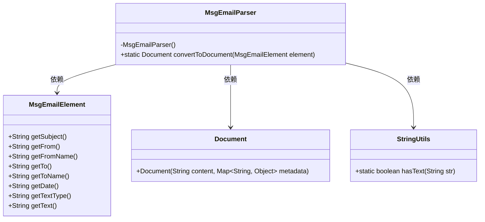
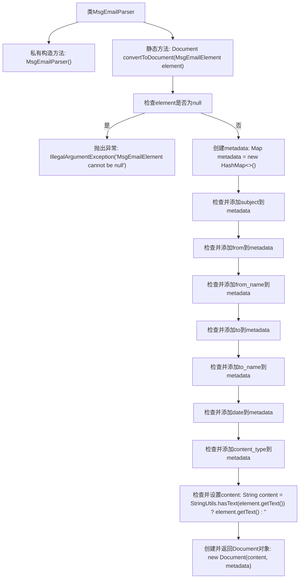

# 基础信息

|      |      |
|------|------|
| 名称 | MsgEmailParser |
| 编码语言 | .java |
| 代码路径 | spring-ai-alibaba/community/document-readers/spring-ai-alibaba-starter-document-reader-email/src/main/java/com/alibaba/cloud/ai/reader/email/msg/MsgEmailParser.java |
| 包名 | com.alibaba.cloud.ai.reader.email.msg |
| 依赖项 | ['org.apache.commons.io.IOUtils', 'org.apache.poi.hmef.Attachment', 'org.springframework.ai.document.Document', 'org.springframework.ai.document.DocumentMetadata', 'org.springframework.ai.document.MetadataMode', 'org.springframework.util.StringUtils', 'java.io.ByteArrayInputStream', 'java.io.IOException', 'java.util.ArrayList', 'java.util.HashMap', 'java.util.List', 'java.util.Map'] |
| 概述说明 | MsgEmailParser类将MsgEmailElement转换为包含邮件元数据和内容的Document对象。 |

# 说明

MsgEmailParser类的主要功能是将MsgEmailElement对象转换为Document对象。该转换过程不仅包含邮件的内容，还涵盖了邮件的元数据信息。通过这一转换，邮件的所有关键信息得以完整保留，便于后续处理和分析。

# 类列表 Class Summary

| 名称   | 类型  | 说明 |
|-------|------|-------------|
| MsgEmailParser | class | MsgEmailParser类将MsgEmailElement转换为Document对象，包含邮件元数据和内容。 |

## 类 MsgEmailParser

|      |      |
|------|------|
| 访问范围 | public |
| 类型 | class |
| 名称 | MsgEmailParser |
| 说明 | MsgEmailParser类将MsgEmailElement转换为Document对象，包含邮件元数据和内容。 |

### UML类图

**描述：**  
`MsgEmailParser` 是一个工具类，用于将 `MsgEmailElement` 对象转换为 `Document` 对象。它通过检查 `MsgEmailElement` 中的各个字段（如主题、发件人、收件人等）是否为空，并将非空字段添加到元数据中，最终生成一个包含内容和元数据的 `Document` 对象。`StringUtils` 用于辅助检查字符串是否为空。整个过程通过静态方法 `convertToDocument` 实现，且 `MsgEmailParser` 的构造函数为私有，防止实例化。

### 内部方法调用关系图

这段代码定义了一个名为 `MsgEmailParser` 的类，其中包含一个私有构造方法和一个静态方法 `convertToDocument`。该方法接收一个 `MsgEmailElement` 对象作为参数，首先检查该对象是否为 `null`，如果是则抛出异常。接着，它创建一个 `metadata` 映射，并逐一检查 `MsgEmailElement` 对象中的各个字段，如果字段非空则将其添加到 `metadata` 中。最后，该方法创建一个 `Document` 对象，并将 `content` 和 `metadata` 作为参数传递给它，最终返回该 `Document` 对象。

### 字段列表 Field List

| 名称  | 类型  | 说明 |
|-------|-------|------|

### 方法列表 Method List

| 名称  | 类型  | 说明 |
|-------|-------|------|
| convertToDocument | Document | 将MsgEmailElement转换为Document，包含内容和元数据，元数据包括主题、发件人、收件人等。 |

