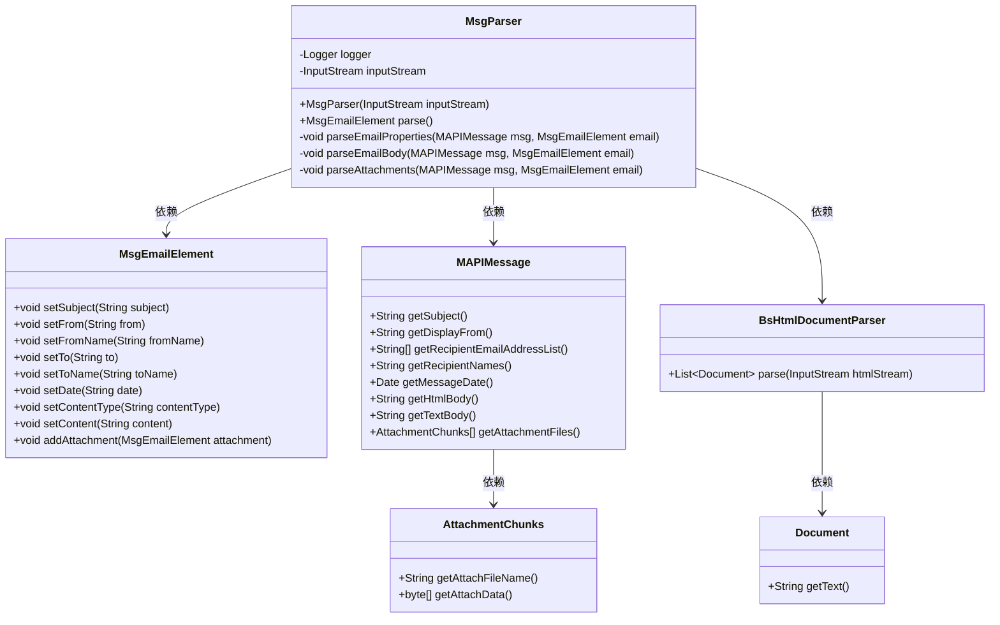
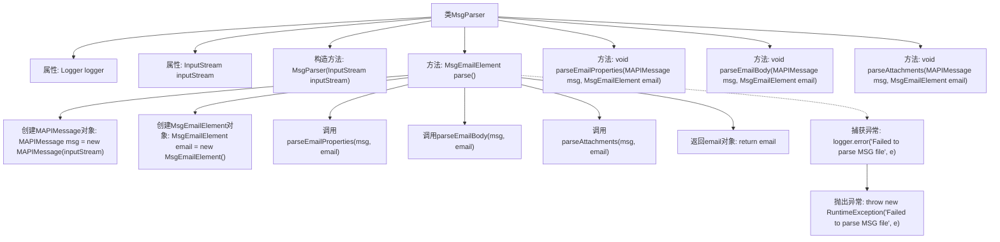

# 基础信息

|      |      |
|------|------|
| 名称 | MsgParser |
| 编码语言 | .java |
| 代码路径 | spring-ai-alibaba/community/document-readers/spring-ai-alibaba-starter-document-reader-email/src/main/java/com/alibaba/cloud/ai/reader/email/msg/MsgParser.java |
| 包名 | com.alibaba.cloud.ai.reader.email.msg |
| 依赖项 | ['org.apache.poi.hsmf.MAPIMessage', 'org.apache.poi.hsmf.exceptions.ChunkNotFoundException', 'org.slf4j.Logger', 'org.slf4j.LoggerFactory', 'java.io.IOException', 'java.io.InputStream', 'java.io.ByteArrayInputStream', 'java.nio.charset.StandardCharsets', 'java.util.List', 'com.alibaba.cloud.ai.parser.bshtml.BsHtmlDocumentParser', 'org.springframework.ai.document.Document'] |
| 概述说明 | MsgParser类解析MSG文件，提取邮件属性、正文和附件，并处理异常。 |

# 说明

MsgParser类用于解析MSG文件，提取邮件的属性、正文和附件内容，同时具备处理异常情况的功能。该类的核心功能是读取MSG文件中的数据，并从中分离出邮件的各个组成部分，包括邮件头信息、正文内容以及可能存在的附件。在处理过程中，MsgParser类还能够检测并处理可能出现的错误或异常情况，确保解析过程的稳定性和可靠性。通过这种方式，MsgParser类为后续的邮件数据处理提供了基础支持。

# 类列表 Class Summary

| 名称   | 类型  | 说明 |
|-------|------|-------------|
| MsgParser | class | MsgParser类解析MSG文件，提取邮件属性、正文和附件，并处理异常。 |

## 类 MsgParser

|      |      |
|------|------|
| 访问范围 | public |
| 类型 | class |
| 名称 | MsgParser |
| 说明 | MsgParser类解析MSG文件，提取邮件属性、正文和附件，并处理异常。 |

### UML类图

### 描述
`MsgParser` 类负责解析 MSG 文件，并将其转换为 `MsgEmailElement` 对象。它依赖于 `MAPIMessage` 类来读取 MSG 文件的内容，并通过 `parseEmailProperties`、`parseEmailBody` 和 `parseAttachments` 方法分别解析邮件的属性、正文和附件。`MsgEmailElement` 类用于存储解析后的邮件信息，而 `BsHtmlDocumentParser` 类则用于解析 HTML 格式的邮件正文。整个解析过程通过捕获和处理异常来确保代码的健壮性。

### 内部方法调用关系图

这段代码定义了一个`MsgParser`类，用于解析MSG文件并提取电子邮件内容。主要流程包括创建`MAPIMessage`和`MsgEmailElement`对象，然后分别调用`parseEmailProperties`、`parseEmailBody`和`parseAttachments`方法来解析电子邮件的属性、正文和附件。如果解析过程中出现异常，代码会记录错误日志并抛出运行时异常。

### 字段列表 Field List

| 名称  | 类型  | 说明 |
|-------|-------|------|
| logger = LoggerFactory.getLogger(MsgParser.class) | Logger | MsgParser类中定义了一个私有的静态Logger实例。 |
| inputStream | InputStream | 私有且不可变的输入流实例。 |

### 方法列表 Method List

| 名称  | 类型  | 说明 |
|-------|-------|------|
| parse | MsgEmailElement | 解析MSG文件，提取邮件属性、正文及附件，处理异常。 |
| parseEmailBody | void | 解析邮件内容，优先提取HTML正文，若失败则提取纯文本正文。 |
| parseAttachments | void | 解析邮件附件并添加到邮件元素中，处理异常并记录错误。 |
| parseEmailProperties | void | 解析邮件属性，包括主题、发件人、收件人、日期等，处理缺失数据并记录错误。 |

