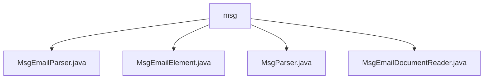

# 基础信息

|      |      |
|------|------|
| 名称 | msg |
| 编码语言 | .java |
| 代码路径 | spring-ai-alibaba/community/document-readers/spring-ai-alibaba-starter-document-reader-email/src/main/java/com/alibaba/cloud/ai/reader/email/msg |
| 包名 | spring-ai-alibaba.community.document-readers.spring-ai-alibaba-starter-document-reader-email.src.main.java.com.alibaba.cloud.ai.reader.email.msg |
| 概述说明 | MsgEmailParser将MsgEmailElement转为Document，保留邮件内容及元数据。MsgEmailElement包含邮件主题、发件人、收件人等属性。MsgParser解析MSG文件，提取邮件属性、正文和附件。MsgEmailDocumentReader将MSG文件转为Document格式，便于后续处理。 |

# 说明

## 概述
该代码模块是一个用于处理MSG文件的工具集，主要功能是将MSG文件中的邮件信息解析并转换为结构化的`Document`对象。模块通过多个类协同工作，实现了从MSG文件中提取邮件内容、元数据以及附件信息，并将其转换为便于后续处理和分析的格式。该模块的核心目标是为邮件数据的处理提供高效、稳定的支持，适用于需要解析和操作MSG文件内容的业务场景。

## 主要业务场景
1. **邮件信息解析**：通过`MsgParser`类解析MSG文件，提取邮件的属性、正文和附件内容，并处理可能的异常情况，确保解析过程的可靠性。
2. **邮件数据结构化**：`MsgEmailElement`类用于表示邮件的完整信息结构，包括主题、发件人、收件人、日期、内容类型、内容以及附件等关键属性。
3. **邮件数据转换**：`MsgEmailParser`类将`MsgEmailElement`对象转换为`Document`对象，保留邮件的所有关键信息，便于后续处理和分析。
4. **MSG文件读取与转换**：`MsgEmailDocumentReader`类专门用于读取MSG文件并将其转换为`Document`格式，实现高效的文件管理和信息提取。

该模块适用于需要从MSG文件中提取邮件信息并进行结构化处理的场景，例如邮件数据分析、邮件内容检索、自动化邮件处理等。

### 包内部结构视图

该流程图展示了`msg`目录下的文件层级关系。`msg`作为根目录，包含了四个文件：`MsgEmailParser.java`、`MsgEmailElement.java`、`MsgParser.java`和`MsgEmailDocumentReader.java`。这些文件都属于`msg`目录，且没有进一步的子目录结构。流程图清晰地表示了文件与目录之间的从属关系，便于理解项目结构。

# 文件列表 File List

| 名称   | 类型  | 说明 |
|-------|------|-------------|
| [MsgEmailParser.java](MsgEmailParser.md) | file | MsgEmailParser类将MsgEmailElement转换为包含邮件元数据和内容的Document对象。 |
| [MsgEmailDocumentReader.java](MsgEmailDocumentReader.md) | file | MsgEmailDocumentReader类将MSG文件转换为Document格式。 |
| [MsgParser.java](MsgParser.md) | file | MsgParser类解析MSG文件，提取邮件属性、正文和附件，并处理异常。 |
| [MsgEmailElement.java](MsgEmailElement.md) | file | MsgEmailElement类包含邮件主题、发件人、收件人、日期、内容类型、内容及附件属性。 |

