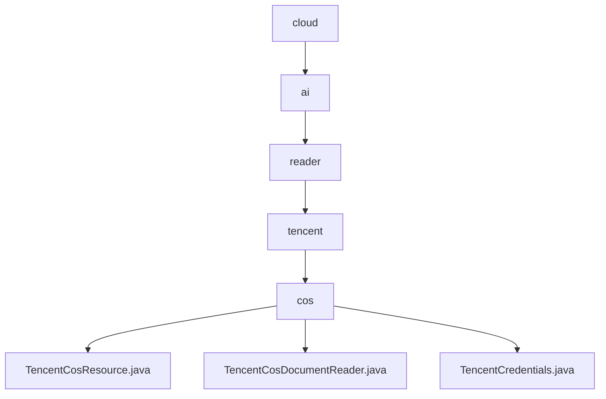

# 基础信息

|      |      |
|------|------|
| 名称 | cloud |
| 编码语言 | .java |
| 代码路径 | spring-ai-alibaba/community/document-readers/spring-ai-alibaba-starter-document-reader-encent-cos/src/main/java/com/alibaba/cloud |
| 包名 | spring-ai-alibaba.community.document-readers.spring-ai-alibaba-starter-document-reader-encent-cos.src.main.java.com.alibaba.cloud |
| 概述说明 | TencentCosResource类管理腾讯云COS资源，TencentCosDocumentReader类读取解析文档，TencentCredentials类处理凭证转换。 |

# 说明

## 概述
该代码模块主要围绕腾讯云对象存储服务（COS）的资源管理和文档读取功能展开。模块中的核心类包括`TencentCosResource`、`TencentCosDocumentReader`和`TencentCredentials`，分别负责资源的统一管理、文档内容的读取与解析，以及身份验证和授权凭证的管理。通过这些类的协同工作，模块提供了对腾讯云COS资源的高效管理和文档数据的准确提取，确保了与腾讯云服务的无缝集成和操作便捷性。

## 主要业务场景
1. **资源管理**：`TencentCosResource`类实现了`Resource`接口，提供了对腾讯云COS资源的创建、读取、更新和删除等操作。用户可以通过该类方便地管理COS中的资源，确保资源的高效利用和维护。
2. **文档读取与解析**：`TencentCosDocumentReader`类专门用于从腾讯云COS中读取资源，解析文档内容并生成文档列表。该功能适用于需要从COS中提取文档数据进行进一步处理的场景，如数据分析、文档转换等。
3. **身份验证与授权**：`TencentCredentials`类管理腾讯云凭证，包括密钥ID、密钥和会话令牌。该类支持将凭证转换为COS凭证提供者，确保用户在使用腾讯云对象存储服务时的身份验证和授权过程的安全性和便捷性。

### 包内部结构视图

该流程图展示了从`cloud`到`cos`的层级关系，最终在`cos`目录下包含三个文件：`TencentCosResource.java`、`TencentCosDocumentReader.java`和`TencentCredentials.java`。每个节点代表路径中的最后一级元素，清晰地展示了文件的组织结构。

# 文件列表 File List

| 名称   | 类型  | 说明 |
|-------|------|-------------|
| [ai](ai/_module.md) | package | TencentCosResource类管理腾讯云COS资源，TencentCosDocumentReader类读取解析文档，TencentCredentials类处理凭证转换。 |

