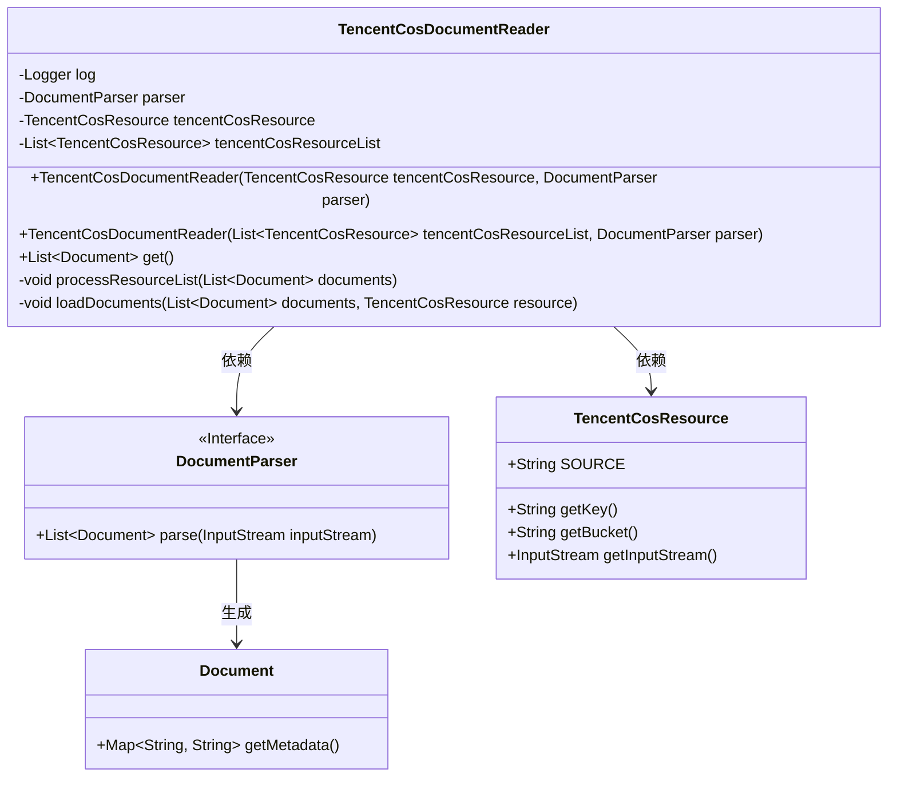
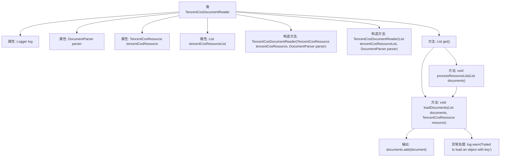

# 基础信息

|      |      |
|------|------|
| 名称 | TencentCosDocumentReader |
| 编码语言 | .java |
| 代码路径 | spring-ai-alibaba/community/document-readers/spring-ai-alibaba-starter-document-reader-encent-cos/src/main/java/com/alibaba/cloud/ai/reader/tencent/cos/TencentCosDocumentReader.java |
| 包名 | com.alibaba.cloud.ai.reader.tencent.cos |
| 依赖项 | ['com.alibaba.cloud.ai.document.DocumentParser', 'org.slf4j.Logger', 'org.slf4j.LoggerFactory', 'org.springframework.ai.document.Document', 'org.springframework.ai.document.DocumentReader', 'java.util.ArrayList', 'java.util.List', 'java.util.Objects', 'java.lang.String.format'] |
| 概述说明 | TencentCosDocumentReader类解析腾讯云COS文档并返回列表。 |

# 说明

TencentCosDocumentReader类用于读取腾讯云COS中的资源，解析文档内容并返回文档列表。该功能主要涉及从腾讯云存储服务中获取文档，进行解析处理，最终生成文档列表以供进一步使用。整个过程确保了文档数据的准确提取和高效处理。

# 类列表 Class Summary

| 名称   | 类型  | 说明 |
|-------|------|-------------|
| TencentCosDocumentReader | class | TencentCosDocumentReader类读取腾讯云COS资源，解析文档并返回文档列表。 |

## 类 TencentCosDocumentReader

|      |      |
|------|------|
| 访问范围 | public |
| 类型 | class |
| 名称 | TencentCosDocumentReader |
| 说明 | TencentCosDocumentReader类读取腾讯云COS资源，解析文档并返回文档列表。 |

### UML类图

### 描述
`TencentCosDocumentReader` 类实现了 `DocumentReader` 接口，用于从腾讯云COS资源中读取文档。它依赖于 `DocumentParser` 接口来解析文档，并使用 `TencentCosResource` 类来获取资源信息。类中包含两个构造函数，分别用于处理单个资源和资源列表。`get()` 方法根据资源类型调用不同的内部方法 `processResourceList()` 或 `loadDocuments()` 来加载文档，并将解析后的文档添加到返回列表中。`loadDocuments()` 方法处理单个资源，解析文档并添加元数据，同时捕获并记录异常。

### 内部方法调用关系图

这段代码定义了一个名为 `TencentCosDocumentReader` 的类，用于从腾讯云COS资源中读取文档。类中包含两个构造方法，分别用于初始化单个资源或资源列表。`get()` 方法根据资源类型调用 `processResourceList()` 或 `loadDocuments()` 方法来处理资源并生成文档列表。`loadDocuments()` 方法负责从资源中读取文档并添加元数据，同时处理可能的异常情况。

### 字段列表 Field List

| 名称  | 类型  | 说明 |
|-------|-------|------|
| parser | DocumentParser | 私有且不可变的文档解析器实例。 |
| tencentCosResourceList | List<TencentCosResource> | 包含腾讯云存储资源列表的私有变量。 |
| log = LoggerFactory.getLogger(TencentCosDocumentReader.class) | Logger | TencentCosDocumentReader类中定义了日志记录器log。 |
| tencentCosResource | TencentCosResource | 声明了一个私有的TencentCosResource对象变量。 |

### 方法列表 Method List

| 名称  | 类型  | 说明 |
|-------|-------|------|
| processResourceList | void | 处理资源列表，加载文档到指定资源。 |
| loadDocuments | void | 方法加载腾讯云COS文档，解析后添加元数据并存入列表，失败时记录日志。 |
| get | List<Document> | 重写get方法，根据资源列表或单个资源加载文档并返回。 |

